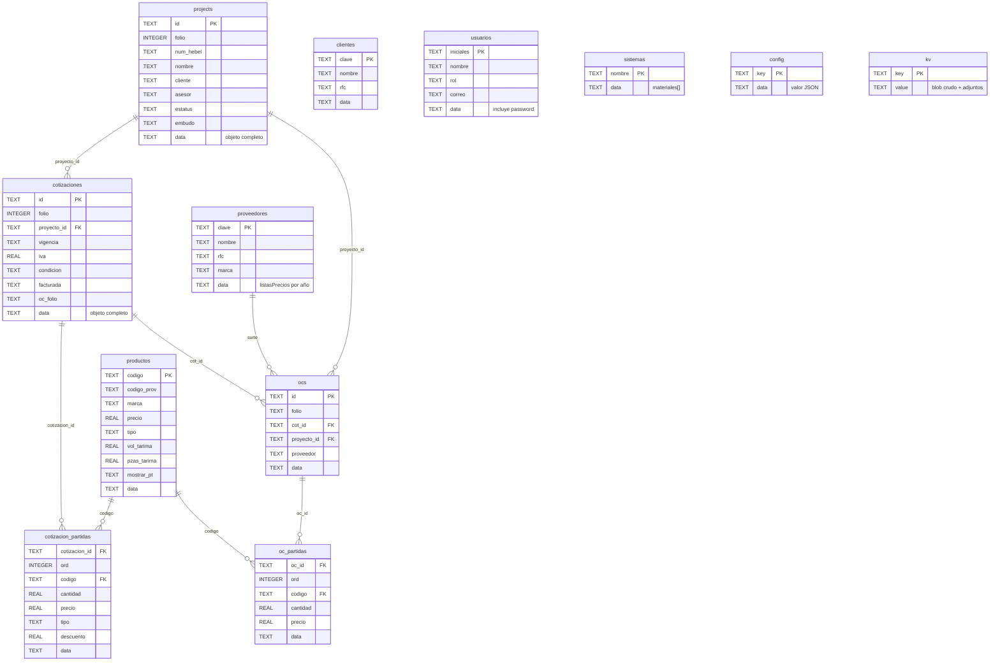

# Requerimientos — Sistema Hauscrete (CRM/ERP)

> **Documento vivo.** Es la fuente única de requerimientos del proyecto. Se
> actualiza cada vez que se agrega, cambia o completa una funcionalidad.
> Cada requerimiento tiene un **ID** estable y un **estado**.
>
> **Última actualización:** 2026-07-13
> **Versión del documento:** 4.0

## Leyenda de estado

| Símbolo | Significado |
|---|---|
| ✅ | Implementado y funcionando |
| 🔄 | En progreso |
| ⏳ | Pendiente (backlog) |
| ❌ | No aplica / descartado |

Convención de IDs: **RF** funcional · **RN** regla de negocio · **RD** dato/modelo · **RT** técnico/no funcional · **RM** migración.

---

## 1. Visión general

**Sistema Hauscrete** es un CRM/ERP comercial a medida para **Hauscrete**
(comercializa bloques Hebel / concreto celular AAC en Sonora, México). Sustituye
al ERP anterior (Admintotal 7.1).

**Flujo de negocio central:**

```
Proyecto → Seguimiento → Cotización → PDF al cliente → Orden de Compra (OC) a Litecrete
```

La facturación real (timbrado CFDI con PAC) es una fase posterior, aún no implementada.

**Idioma:** todo el sistema (interfaz, datos, documentos) en **español**.

---

## 2. Estado actual del proyecto

| Fase | Estado | Nota |
|---|---|---|
| App original (HTML de un archivo, datos en navegador) | ✅ | `modulo-proyectos.html`, ~4700 líneas, JS vanilla |
| **Migración Ruta A** (SQLite local + servidor Node) | ✅ | Datos separados del código en `hauscrete.sqlite`. Ver §7 |
| **Tablas normalizadas** (esquema por colección + SQL) | ✅ | Descomposición/reensamblado en el servidor, app intacta. Ver §7.3 |
| Importar historial real del usuario | ⏳ | Falta el respaldo JSON; la base tiene solo catálogo semilla |
| Migración a nube multiusuario (Turso/Supabase) | ⏳ | Fase futura. Ver §8 |
| Módulo de facturación CFDI (PAC) | ⏳ | Fase mayor. Ver §6 backlog |

---

## 3. Requerimientos funcionales

### 3.1 Módulo de Proyectos

| ID | Requerimiento | Estado |
|---|---|---|
| RF-01 | Alta/edición/baja de proyectos con folio interno consecutivo | ✅ |
| RF-02 | Campo `numHebel`: provisional `IN-####` que se vuelve `10-####` cuando la planta asigna número | ✅ |
| RF-03 | Semáforo de estatus por proyecto (6 estados, ver RN-04) | ✅ |
| RF-04 | Filtros: por asesor, por estatus, por "cotizado", por rango de fechas y por texto libre | ✅ |
| RF-05 | Contadores de resumen: total, en proceso, por cerrar, sin # de planta | ✅ |
| RF-06 | Exportar proyectos a Excel (SheetJS) | ✅ |
| RF-07 | Ficha de cliente, promotor, asesor, ciudad/estado, teléfono, % desc. cliente | ✅ |
| RF-08 | Valor estimado manual para proyectos sin cotizaciones | ⏳ |

### 3.2 Módulo de Seguimiento

| ID | Requerimiento | Estado |
|---|---|---|
| RF-10 | Bitácora de comentarios con fecha, hora y usuario (iniciales) | ✅ |
| RF-11 | Adjuntar archivos e imágenes (máx 3 MB c/u), guardados por separado | ✅ |
| RF-12 | Miniatura y descarga de adjuntos | ✅ |
| RF-13 | Sección "Cotizaciones ligadas al proyecto": seleccionar cuáles cuentan para valor y m³ | ✅ |
| RF-14 | Indicador ✓ verde si la cotización ligada está facturada | ✅ |

### 3.3 Módulo de Cotizaciones

| ID | Requerimiento | Estado |
|---|---|---|
| RF-20 | Alta de cotización con folio consecutivo, vínculo a proyecto | ✅ |
| RF-21 | Partidas: código, descripción, cantidad, unidad, precio, tipo, % descuento | ✅ |
| RF-22 | Tipos de partida: Block, Panel, Mortero, Laminilla, Periféricos, Otros | ✅ |
| RF-23 | Vigencia por defecto = hoy + 21 días | ✅ |
| RF-24 | IVA 16 %, condición Contado/Crédito, % de pago | ✅ |
| RF-25 | Cálculo automático de m² y precio por m² | ✅ |
| RF-26 | Marcar cotización como facturada con datos de factura (fecha, PDF, XML) | ✅ |
| RF-27 | Selección de sistemas constructivos y observaciones del catálogo | ✅ |
| RF-28 | Generar PDF de cotización (ver §4) | ✅ |
| RF-29 | Exportar cotizaciones a Excel | ✅ |
| RF-30 | Botón "Enviar por correo" (cotización) | ⏳ |
| RF-31 | Generar QR en el PDF (espacio reservado) | ⏳ |

### 3.4 Módulo de Órdenes de Compra (OC)

| ID | Requerimiento | Estado |
|---|---|---|
| RF-40 | Generar OC a proveedor (Litecrete) desde una cotización | ✅ |
| RF-41 | Folio consecutivo `OC-###` | ✅ |
| RF-42 | Aplicar costos de proveedor por familia y % de descuento por defecto | ✅ |
| RF-43 | PDF de OC (7 columnas, incluye Impuesto y datos fiscales del proveedor) | ✅ |
| RF-44 | Botón "Enviar por correo" (OC) | ⏳ |

### 3.4b Módulo de Reportes (nuevo)

| ID | Requerimiento | Estado |
|---|---|---|
| RF-45 | Sección "Reportes" en el menú + vista (scaffold) | ✅ |
| RF-46 | Contenido de reportes (ventas por asesor, proyectos por estatus, m³, etc.) — **por definir** | ⏳ |

### 3.4c Módulo de Pago a Proveedores (nuevo) — dos niveles como Proyectos

Nivel 1: **tabla de semanas**. Nivel 2: **reporte** de la semana (replica el Excel).

| ID | Requerimiento | Estado |
|---|---|---|
| RF-47 | Sección "Pago Proveedores": **tabla de semanas** (Semana N°, fechas, proveedores pagados, **Saldo antes de pagos** = dinero en bancos, programado, pagado, **Saldo después de pagos** = Bancos − Pagado, estado, "Ver reporte") | ✅ |
| RF-48 | **Semana ISO** lunes-domingo con número (ej. Semana 27 = 29/jun–05/jul/2026); "Agregar semana" usa la semana actual | ✅ |
| RF-49 | **Reporte** (modal): saldo en varios bancos + tabla de facturas/pagos | ✅ |
| RF-50 | Captura (admin): tipo (Factura/Nómina/Anticipo), proveedor (con **lista de proveedores + colaboradores**, o escribir uno nuevo), folio, **fecha de emisión**, saldo que se debe | ✅ |
| RF-50b | **Saldo en banco con fecha**: se registran saldos fechados (varios en la semana, con historial); el cálculo usa el **último** saldo. Disponible = último saldo − programado | ✅ |
| RF-53b | Cada **abono** guarda la **fecha de la transferencia/pago** | ✅ |
| RF-58 | Columna **Concepto** en la tabla; campo **Concepto general** (obligatorio). Obligatorios en factura: proveedor, folio, fecha de emisión, saldo | ✅ |
| RF-59 | **Título con semana y periodo** visible en el reporte | ✅ |
| RF-60 | **Programado con Fijar/Editar**: al fijar el monto se pone **navy** (solo lectura), al editar **gris** (editable); solo super | ✅ |
| RF-61 | **Historial de saldos** con Banco · Fecha · **Hora** · Saldo (varios por semana; el cálculo usa el último) | ✅ |
| RF-62 | Resumen superior: **Total en bancos** + tabla con filas **Programado** y **Pagado**, columnas **Monto** (en rojo) y **Disponible** (= Bancos − Monto) | ✅ |
| RF-63 | Historial de saldos: tabla con **Banco · Saldo · Fecha · Hora** de cada registro (1 a N por semana; el cálculo usa el último) | ✅ |
| RF-64 | Botones **"Editar"/"Fijar" alineados** en la columna Programado (monto de ancho fijo) | ✅ |
| RF-65 | **Folio de la factura obligatorio** (validado + asterisco) | ✅ |
| RF-66 | Lista de Proveedor/Concepto **según el tipo**: Nómina→colaboradores, Factura→proveedores, Anticipo→ambos | ✅ |
| RF-67 | Bancos: se quitó la edición inline y "Agregar banco"; los **bancos vienen del catálogo de Cuentas (Ajustes)** y se eligen al "Registrar saldo". Total en bancos = suma del último saldo por banco | ✅ |
| RF-51 | **Días sin pagar** automáticos (desde emisión a hoy) | ✅ |
| RF-52 | **Programación** del monto a pagar por factura — **solo super** (columna editable) | ✅ |
| RF-53 | **Abonos** (pagos parciales): cada abono baja el **saldo actual** de la factura | ✅ |
| RF-53c | Modal "Abonar" lista los abonos existentes: **editar monto** y **borrar** cada uno, además de agregar nuevos | ✅ |
| RF-54 | Resumen del reporte: Total en bancos, Programado, Pagado, Disponible (bancos − programado) | ✅ |
| RF-55 | **Cerrar semana** (super): marca cerrada (solo lectura) y crea la **siguiente semana** heredando las **facturas con saldo>0** (nómina/anticipos no se heredan) | ✅ |
| RF-56 | Persistencia en tabla `pagos_semanas`; borrar semana/pago = solo super | ✅ |
| RF-57 | Agrupar por proveedor y export a Excel — refinamiento | ⏳ |

Datos: `state.pagosSemanas` `[{id, semanaNum, lunes, domingo, estado, saldos:[{banco, fecha, hora, monto}], pagos:[{tipo, proveedor, concepto, folio, fechaEmision, saldoInicial, montoProgramado, programadoFijo, abonos:[{fecha,monto}]}]}]`. Bancos = catálogo `cuentasCat` (Ajustes). Visible para **super** y **administrativo**.

### 3.5 Catálogos y Ajustes

| ID | Requerimiento | Estado |
|---|---|---|
| RF-50 | Productos: código, código proveedor, marca, descripción, unidad, precio, tipo, factores de tarima | ✅ |
| RF-51 | Proveedores: ficha fiscal + listas de precios por año + marca | ✅ |
| RF-52 | Clientes: ficha fiscal | ✅ |
| RF-53 | Asesores/usuarios: ficha completa + rol + contraseña | ✅ |
| RF-54 | Catálogo de sistemas constructivos (nombre + lista de materiales) | ✅ |
| RF-55 | Catálogos auxiliares: segmentaciones, cuentas, observaciones, entregas, etapas de embudo | ✅ |
| RF-56 | Datos fiscales de Hauscrete para el PDF | ✅ |
| RF-57 | Ajuste de consecutivos (folios) | ✅ |
| RF-58 | Respaldo/exportación del estado a JSON | ✅ |
| RF-59 | Pantalla para editar precios por familia directamente | ⏳ |
| RF-60 | Catálogos SAT CFDI 4.0 (Régimen fiscal, Uso CFDI) precargados | ✅ |

### 3.6 Embudo (funnel)

| ID | Requerimiento | Estado |
|---|---|---|
| RF-70 | Vista Kanban por etapas: Prospectos → Visitado → Cotizado → Venta | ✅ |
| RF-71 | Etapa automática: cotización → Cotizado; OC o cotización facturada → Venta (ver RN-05) | ✅ |
| RF-72 | Valor y m³ por tarjeta y totalizados por columna | ✅ |
| RF-73 | Filtros por asesor y por año de ingreso (default: año en curso) | ✅ |
| RF-74 | Recordar filtros del embudo entre sesiones | ⏳ |
| RF-75 | Agregar etapas de embudo personalizadas | ✅ |

### 3.7 Autenticación y sesión

| ID | Requerimiento | Estado |
|---|---|---|
| RF-80 | Login por iniciales + contraseña (cliente) | ✅ |
| RF-81 | Tres roles con permisos diferenciados (ver RN-06) | ✅ |
| RF-82 | Mostrar/ocultar módulos y botones según rol | ✅ |
| RF-83 | Login real con autenticación de servidor (Supabase Auth) | ⏳ (fase nube) |

---

## 4. PDF de cotización (machote — NO alterar visualmente)

| ID | Requerimiento | Estado |
|---|---|---|
| RN-10 | Función `construirDocCot(c)`. Formato verificado centavo por centavo vs. cotización 222 | ✅ |
| RN-11 | Fuente Verdana, ancho fijo 760 px dentro de marco negro | ✅ |
| RN-12 | Encabezado con dos logos (Hauscrete + Hebel, base64), datos fiscales y recuadro "COTIZACIÓN NO." franja verde `#2E7D46` | ✅ |
| RN-13 | Bloque de info en dos columnas (Proyecto/Ref/Fecha/Vigencia/Sistema \| Pago/Entrega/Lugar/Precio×m²/Condición/Referencia) | ✅ |
| RN-14 | Tabla de 6 columnas: CÓDIGO, DESCRIPCIÓN, CANTIDAD, UNIDAD, PRECIO, SUBTOTAL | ✅ |
| RN-15 | Sub-renglón por block/panel (`infoLinea`): "41.0 tarimas, 3,444 piezas \| 420.168 M² \| $1,480.32". Respeta `mostrarPT==="no"` | ✅ |
| RN-16 | Totales: Subtotal, IVA 16 %, Total. Importe en letra (`numeroALetras`, termina en "M.N.") | ✅ |
| RN-17 | "Cotejar m2 cotizados" al pie | ✅ |
| RN-18 | Generación con html2pdf.js 0.10.1, A4, márgenes [12,10,12,10] mm | ✅ |
| RN-19 | Vista previa en modal con `transform: scale()` para que quepa completo | ✅ |
| RN-20 | QR en el PDF (pendiente, hay espacio reservado) | ⏳ |
| RN-21 | PDF de OC `construirDocOC(o)` (7 columnas) | ✅ |

---

## 5. Reglas de negocio críticas (NO cambiar)

### RN-01 · Folios / consecutivos
Valores semilla en el código: `nextFolio: 177`, `nextCot: 223`, `nextOC: 1`,
`nextIN: 199`, `nextSeg: 118`. Todos ajustables en Ajustes → Generales.
`IN-####` es provisional; se vuelve `10-####` cuando la planta asigna número.

### RN-02 · Precios por FAMILIA (prefijo) — clave del sistema
- `precioPorFamilia(precios, codigo)`: busca precio exacto; si no, usa **el prefijo más largo que coincida** (ej. `BL4154061` → `BL4`; `BLO4152061` → `BLO4`).
- `codNorm()` normaliza códigos quitando sufijos `-HEBEL` / `-HEB`.
- **Precio de venta**: del producto o heredado de su familia (`preciosVentaFamilia`).
- **Costo de proveedor**: de la lista del proveedor (por año) menos su % de descuento, también por familia.

### RN-03 · Catálogo Litecrete 2026 (migración `litecrete2026v2`)
- ~59 familias con precio de venta (PL Sonora 2026) y costo (precio Monterrey).
- **Costo Litecrete = precio Monterrey − 42 %** (ej. BL4 $6,300 → $3,654; MACX $453 → $262.74).
- 26 medidas de block (BL4, BLO4, BLU4), código proveedor `30131507`, marca `HEBEL`, cada una con sus factores (volTarima, espesor, pzasTarima) y heredando el precio de venta de su familia.
- Verificado en la migración en vivo: **85 productos, 59 familias**.

### RN-04 · Semáforo del proyecto (ESTATUS)
Orden, IDs y colores (del código, `const ESTATUS`) — 9 estatus:
1. `seguimiento` — Seguimiento — **rosa** `#E64980`
2. `proceso` — En proceso — **azul claro** `#4DABF7`
3. `cerrar` — Por cerrar — **azul** `#1C7ED6`
4. `pagado` — Pagado por surtir — **azul fuerte** `#0B3D91`
5. `pagadoventa` — Pagado + venta — **negro** `#212529`
6. `concluido` — Concluido — morado `#9C36B5`
7. `baja` — Baja probabilidad — amarillo `#F5C400`
8. `perdido` — Perdido — rojo `#E03131`
9. `norealizado` — No se realizó — gris `#868E96`

Los colores del semáforo son variables propias (`--st-*` / `--est-*`); el verde `--st-proceso` se mantiene para otros usos (insignia facturada, ✓, saldo disponible).
**Solo el rol `super` cambia el semáforo.** Proyecto nuevo nace sin semáforo (RT-33).

### RN-05 · Embudo
- Etapas base: `["Prospectos","Visitado","Cotizado","Venta"]`.
- `etapaDe(p)` = máximo entre etapa manual y automática: cotización → **Cotizado**; OC o cotización facturada → **Venta**.
- Valor y m³ del proyecto se derivan de las cotizaciones ligadas seleccionadas (`valorProyecto(p)`, respeta `p.seg.factSel`; por defecto todas).
- Formatos: `$1,000,000.00` (2 dec) y `78.5354` m³ (4 dec), color azul `#1D4ED8`.

### RN-06 · Roles y permisos (`PERMISOS`, del código)

| Rol | Vistas | Crear proyecto | Crear cotización | Generar OC | Ajustes | Subir factura | Cambiar semáforo | **Borrar** |
|---|---|---|---|---|---|---|---|---|
| **asesor** | proyectos, embudo, cotizaciones | ✅ | ✅ | ❌ | ❌ | ❌ | ❌ | ❌ |
| **administrativo** | + oc | ❌ | ❌ | ✅ | ✅ | ✅ | ❌ | ❌ |
| **super** | + oc | ✅ | ✅ | ✅ | ✅ | ✅ | ✅ (único) | ✅ (único) |

Sin sesión/ficha ⇒ sin restricciones (`rolActual()` cae a `super`).

**Permiso `borrar` (solo super):** vía `puedeBorrar()`, bloquea eliminar
cotizaciones, órdenes de compra, comentarios/archivos de seguimiento, proyectos
y catálogos (productos, clientes, proveedores, asesores, cuentas, sistemas), y
reordenar/agregar listas del embudo. Mover tarjetas entre etapas queda libre
(trabajo diario del asesor).
Usuarios semilla: **JAST**=super (Jose Adolfo Seldner), **EK**=administrativo (Edna Kiyota), **BENT**=asesor (Briayan Esteban Noperi).

---

## 6. Modelo de datos (colecciones de `state`, clave `modulo-proyectos-v1`)

| ID | Colección | Descripción | Estado |
|---|---|---|---|
| RD-01 | `projects` | Proyectos (folio, cliente, promotor, asesor, semáforo, embudo, seguimiento) | ✅ |
| RD-02 | `cotizaciones` | Cotizaciones (partidas, IVA, condición, referencia, facturada) | ✅ |
| RD-03 | `ocs` | Órdenes de compra a proveedor | ✅ |
| RD-04 | `productos` | Base de productos (código, factores de tarima, `volPieza`, `areaPieza`, `mostrarPT`) | ✅ |
| RD-05 | `proveedores` | Proveedores + listas de precios por año | ✅ |
| RD-06 | `clientes` | Clientes (ficha fiscal) | ✅ |
| RD-07 | `asesores` | Usuarios (ficha + rol + password) | ✅ |
| RD-08 | `preciosVentaFamilia` | Mapa {códigoFamilia: precioVenta} | ✅ |
| RD-09 | `sistemasCat` | Catálogo de sistemas constructivos | ✅ |
| RD-10 | `segmentaciones`, `cuentasCat`, `observacionesCat`, `entregasCat`, `etapasEmbudo` | Catálogos auxiliares | ✅ |
| RD-11 | `empresaInfo` | Datos fiscales de Hauscrete para el PDF | ✅ |
| RD-12 | `next*` | Consecutivos de folios | ✅ |
| RD-13 | `migraciones` | Flags de migraciones aplicadas (lógica de arranque) | ✅ |
| RD-14 | `usuarioActual` | Sesión activa | ✅ |

**Migraciones de datos (`state.migraciones`, corren una vez al cargar):**
`litecreteFiscal`, `litecrete2026v2`, `limpiaDuplicados`, `prodFactores`,
`prodPerif222`, `obsDescargaObra`. (Verificadas aplicadas en la migración Ruta A.)

---

## 6.1 Modelo físico de la base de datos (tablas normalizadas)

Esquema real en `hauscrete.sqlite`, generado por `db.mjs`. El servidor
**descompone** el `state` en estas tablas al guardar y lo **reensambla** al leer.

### Diagrama entidad-relación

> Se renderiza en GitHub y en VS Code (extensión "Markdown Preview Mermaid").
> Las relaciones son *lógicas* (por columnas id); no hay `FOREIGN KEY` declaradas.



> **Sin relación de id declarada:** `clientes` y `usuarios` se ligan a proyectos
> **por nombre** (no por clave), tal como en la app original; `sistemas`, `config`,
> `kv` y los catálogos son independientes.
>
> **Nota:** en el diagrama, `PK` marca la **clave de negocio** (código, folio,
> iniciales…) por claridad. La clave primaria **física** real de cada tabla de
> colección es `_rowid` (autoincremental); las de negocio son columnas indexadas.

**Convenciones comunes a todas las tablas de colección:**

| Columna | Tipo | Descripción |
|---|---|---|
| `_rowid` | INTEGER PK AUTOINCREMENT | Identificador interno de fila (no es del negocio) |
| `ord` | INTEGER | Posición del elemento en el array original (preserva el orden) |
| `data` | TEXT (JSON) | **Objeto original completo** de ese registro. Fuente del reensamblado; garantiza cero pérdida |

Las demás columnas son **tipadas y derivadas del `data`**, solo para consultas
SQL e índices. `data` es siempre la verdad para reconstruir el `state`.

### Tabla `projects` (proyectos)
| Columna | Tipo | Descripción |
|---|---|---|
| `id` | TEXT | ID del proyecto (timestamp `Date.now()`) |
| `folio` | INTEGER | Folio interno consecutivo |
| `num_hebel` | TEXT | `IN-####` provisional o `10-####` de planta |
| `nombre` | TEXT | Nombre del proyecto/obra |
| `cliente` | TEXT | Cliente |
| `promotor` | TEXT | Promotor |
| `asesor` | TEXT | Asesor/vendedor asignado |
| `estatus` | TEXT | Semáforo: `seguimiento`/`proceso`/`cerrar`/`concluido`/`baja`/`perdido` |
| `embudo` | TEXT | Etapa manual del embudo |
| `ciudad` | TEXT | Ciudad |
| `estado` | TEXT | Estado (entidad) |
| `creado` | TEXT | Fecha-hora de alta `YYYY-MM-DD HH:MM:SS` |
| `fecha_solicitud` | TEXT | Fecha de solicitud |
| `data` | TEXT | Proyecto completo (incluye `seg`: valor, m³, `factSel`, bitácora, archivos) |

### Tabla `cotizaciones`
| Columna | Tipo | Descripción |
|---|---|---|
| `id` | TEXT | ID de la cotización |
| `folio` | INTEGER | Folio consecutivo |
| `proyecto_id` | TEXT | Proyecto ligado (FK lógica a `projects.id`) |
| `fecha` | TEXT | Fecha de emisión |
| `vigencia` | TEXT | Vigencia (por defecto hoy + 21 días) |
| `iva` | REAL | % de IVA (16) |
| `pago` | REAL | % de pago |
| `condicion` | TEXT | `Contado` / `Crédito` |
| `referencia` | TEXT | Referencia |
| `facturada` | TEXT | `si` / `no` |
| `oc_folio` | TEXT | Folio de OC generada (si existe) |
| `data` | TEXT | Cotización completa (partidas, sistemas, `facturaInfo`, notas, etc.) |

### Tabla `cotizacion_partidas` (renglones de cotización)
| Columna | Tipo | Descripción |
|---|---|---|
| `cotizacion_id` | TEXT | Cotización a la que pertenece (FK lógica a `cotizaciones.id`) |
| `ord` | INTEGER | Orden de la partida |
| `codigo` | TEXT | Código del producto |
| `descripcion` | TEXT | Descripción |
| `cantidad` | REAL | Cantidad |
| `unidad` | TEXT | Unidad |
| `precio` | REAL | Precio unitario |
| `tipo` | TEXT | `Block`/`Panel`/`Mortero`/`Laminilla`/`Periféricos`/`Otros` |
| `descuento` | REAL | % de descuento (campo `desc` del objeto) |
| `data` | TEXT | Partida completa |

### Tabla `ocs` (órdenes de compra)
| Columna | Tipo | Descripción |
|---|---|---|
| `id` | TEXT | ID de la OC |
| `folio` | TEXT | Folio `OC-###` |
| `cot_id` | TEXT | Cotización origen (FK lógica a `cotizaciones.id`) |
| `proyecto_id` | TEXT | Proyecto ligado |
| `fecha` | TEXT | Fecha |
| `proveedor` | TEXT | Proveedor (Litecrete) |
| `data` | TEXT | OC completa |

### Tabla `oc_partidas` (renglones de OC)
| Columna | Tipo | Descripción |
|---|---|---|
| `oc_id` | TEXT | OC a la que pertenece (FK lógica a `ocs.id`) |
| `ord` | INTEGER | Orden de la partida |
| `codigo` | TEXT | Código del producto |
| `descripcion` | TEXT | Descripción |
| `cantidad` | REAL | Cantidad |
| `unidad` | TEXT | Unidad |
| `precio` | REAL | Costo unitario del proveedor |
| `tipo` | TEXT | Tipo de partida |
| `data` | TEXT | Partida completa |

### Tabla `productos`
| Columna | Tipo | Descripción |
|---|---|---|
| `codigo` | TEXT | Código del producto |
| `codigo_prov` | TEXT | Código del proveedor (ej. `30131507`) |
| `marca` | TEXT | Marca (ej. `HEBEL`) |
| `descripcion` | TEXT | Descripción |
| `unidad` | TEXT | Unidad (M³, Bulto, Pieza…) |
| `precio` | REAL | Precio de venta |
| `tipo` | TEXT | Tipo de partida |
| `vol_tarima` | REAL | Volumen por tarima (m³) |
| `espesor_cm` | REAL | Espesor (cm) |
| `pzas_tarima` | REAL | Piezas por tarima |
| `vol_pieza` | REAL | Volumen por pieza (derivado = volTarima/pzasTarima) |
| `area_pieza` | REAL | Área por pieza (derivado = volPieza/(espesorCm/100)) |
| `mostrar_pt` | TEXT | `si`/`no`: mostrar sub-renglón de tarimas/piezas en el PDF |
| `data` | TEXT | Producto completo |

### Tabla `proveedores`
| Columna | Tipo | Descripción |
|---|---|---|
| `clave` | TEXT | Clave del proveedor |
| `nombre` | TEXT | Razón social |
| `rfc` | TEXT | RFC |
| `marca` | TEXT | Marca que surte |
| `regimen_fiscal` | TEXT | Régimen fiscal SAT |
| `cp` | TEXT | Código postal |
| `email` | TEXT | Correo |
| `telefono` | TEXT | Teléfono |
| `data` | TEXT | Ficha completa (incluye **`listasPrecios` por año**, dirección, CIF, etc.) |

### Tabla `clientes`
| Columna | Tipo | Descripción |
|---|---|---|
| `clave` | TEXT | Clave del cliente |
| `nombre` | TEXT | Nombre / razón social |
| `rfc` | TEXT | RFC |
| `rfc_receptor` | TEXT | RFC receptor (si aplica) |
| `email` | TEXT | Correo |
| `telefono` | TEXT | Teléfono |
| `data` | TEXT | Ficha fiscal completa |

### Tabla `usuarios` (proviene de `state.asesores`)
| Columna | Tipo | Descripción |
|---|---|---|
| `nombre` | TEXT | Nombre(s) |
| `apellidos` | TEXT | Apellidos |
| `iniciales` | TEXT | Iniciales de login (ej. `JAST`) |
| `rol` | TEXT | `asesor` / `administrativo` / `super` |
| `correo` | TEXT | Correo |
| `celular` | TEXT | Celular |
| `data` | TEXT | Ficha completa (incluye `password`, `nacimiento`) — mover a auth real en la nube |

### Tabla `sistemas` (proviene de `state.sistemasCat`)
| Columna | Tipo | Descripción |
|---|---|---|
| `nombre` | TEXT | Nombre del sistema constructivo |
| `data` | TEXT | Sistema completo (incluye lista de `materiales`) |

### Tablas de catálogo simple
`segmentaciones`, `observaciones_cat`, `entregas_cat`, `cuentas_cat`, `etapas_embudo`
solo tienen `_rowid`, `ord` y `data` (cada elemento, string u objeto).

### Tabla `config` (escalares y objetos del `state` que no son colecciones)
| Columna | Tipo | Descripción |
|---|---|---|
| `key` | TEXT PK | Nombre del campo del `state` |
| `data` | TEXT (JSON) | Valor |

Claves guardadas aquí: `nextFolio`, `nextCot`, `nextOC`, `nextIN`, `nextSeg`,
`nextCliente`, `nextProveedor` (consecutivos); `preciosVentaFamilia` (mapa
familia→precio); `migraciones` (flags); `empresaInfo` (datos fiscales del PDF);
`usuarioActual` (sesión); `descPerif`, `descBlock` (descuentos por defecto).
Cualquier clave nueva del `state` no prevista cae aquí automáticamente (sin pérdida).

### Tabla `kv` (respaldo y adjuntos)
| Columna | Tipo | Descripción |
|---|---|---|
| `key` | TEXT PK | Clave |
| `value` | TEXT | Valor (string) |
| `updated_at` | TEXT | Fecha-hora de última escritura |

Guarda: (1) un **respaldo del blob crudo** del estado bajo `modulo-proyectos-v1`
(recuperación ante desastre), y (2) los **adjuntos** — archivos/imágenes (`arch-*`)
y PDFs/XML de factura (`fact-*`) — como data-URLs.

> **Nota sobre relaciones:** las FK son *lógicas* (no hay `FOREIGN KEY` declaradas)
> para no bloquear el reensamblado ni el orden de carga. Las columnas
> `proyecto_id`, `cot_id`, `cotizacion_id`, `oc_id` permiten los `JOIN` de reportes.

---

## 7. Requerimientos técnicos y de arquitectura

### 7.1 App original
| ID | Requerimiento | Estado |
|---|---|---|
| RT-01 | JS vanilla, sin framework ni build | ✅ |
| RT-02 | Persistencia vía `window.storage` (get/set/delete/list async), clave `modulo-proyectos-v1` | ✅ |
| RT-03 | Modales propios (`confirmar`, `pedirTexto`), no `alert/confirm` nativos | ✅ |
| RT-04 | Dependencias CDN: html2pdf.js 0.10.1, SheetJS (xlsx) 0.18.5 | ✅ |

### 7.2 Migración Ruta A — SQLite local (implementada)
| ID | Requerimiento | Estado |
|---|---|---|
| RT-10 | Servidor local `server.mjs` (Node 24, `node:sqlite`, sin dependencias npm) | ✅ |
| RT-11 | Datos en archivo `hauscrete.sqlite`, separados del código | ✅ |
| RT-12 | Shim inyectado al vuelo que provee `window.storage` **sin modificar el HTML** | ✅ |
| RT-13 | Contrato exacto respetado: `get`→`{value:"<string>"}`, `set`→truthy, `delete`, `list` | ✅ |
| RT-14 | Importador de respaldo JSON `import-json.mjs` (llena tablas normalizadas) | ✅ (código listo; falta correr con datos reales) |
| RT-15 | Lanzador de doble clic `Iniciar Hauscrete.bat` | ✅ |
| RT-16 | Validado end-to-end en navegador (carga, migraciones, persiste y relee) | ✅ |
| RT-17 | Estrategia de respaldo: `backup.mjs` exporta un `.json` restaurable a `backups/` (incluye todo Ajustes); lanzador `Respaldar Hauscrete.bat`; además `hauscrete.sqlite` se sincroniza por OneDrive | ✅ |

### 7.3 Tablas normalizadas (implementadas — `db.mjs`)
| ID | Requerimiento | Estado |
|---|---|---|
| RT-20 | Esquema normalizado: `projects`, `cotizaciones` (+`cotizacion_partidas`), `ocs` (+`oc_partidas`), `productos`, `proveedores`, `clientes`, `usuarios`, `sistemas`, catálogos (`segmentaciones`, `observaciones_cat`, `entregas_cat`, `cuentas_cat`, `etapas_embudo`) y `config` | ✅ |
| RT-21 | **Descomposición** `state → tablas` al guardar y **reensamblado** `tablas → state` al leer, en el servidor | ✅ |
| RT-22 | App **intacta**: sigue usando `window.storage` con su `state` completo; el servidor traduce | ✅ |
| RT-23 | Columnas tipadas para consultas SQL + columna `data` (JSON original) por fila = reensamblado sin pérdida | ✅ |
| RT-24 | Orden de arrays preservado (columna `ord`); subtablas de partidas ligadas por `cotizacion_id`/`oc_id` | ✅ |
| RT-25 | **Auto-test de fidelidad** en cada guardado (round-trip `state↔tablas`); avisa y conserva respaldo si hay diferencias | ✅ |
| RT-26 | Respaldo del blob crudo en tabla `kv` (recuperación ante desastre) + adjuntos `arch-*`/`fact-*` en `kv` | ✅ |
| RT-27 | Migración automática al arrancar: si hay blob viejo en `kv` y las tablas están vacías, se descompone una vez | ✅ |
| RT-28 | Validado: round-trip fiel (estado real + sintético), consultas SQL reales, escritura desde la app aterriza en tablas | ✅ |

### 7.4 Personalizaciones de interfaz (ediciones al HTML, post-migración)
| ID | Requerimiento | Estado |
|---|---|---|
| RT-30 | Barra lateral: "Usuario en sesión" muestra solo las iniciales (sin rol); "Cerrar sesión" (⏻) y "Ajustes" (⚙) como botones de icono con tooltip | ✅ |
| RT-31 | **Formato de fecha dd/mm/aaaa** en TODOS los campos de captura (`fDesde/fHasta`, `fcDesde/fcHasta`, `pFechaSol`, `cFechaCot`, `cVigencia`, `oFecha`, `asNacimiento`), independiente del navegador/PC. El usuario ve/escribe dd/mm/aaaa con máscara; internamente el campo sigue entregando ISO `yyyy-mm-dd`, sin cambiar ningún cálculo | ✅ |
| RT-32 | **Calendario visual restaurado:** ícono 📅 junto a cada campo abre el calendario nativo del navegador (vía `showPicker()` sobre un `input date` oculto); al elegir, el campo se escribe en dd/mm/aaaa y la app lo lee en ISO. Se puede teclear o usar el calendario | ✅ |
| RT-33 | Proyecto nuevo nace **sin semáforo** (`estatus:""`). El punto de color en la tabla aparece **solo cuando se elige el estatus** dentro del Seguimiento | ✅ |
| RT-34 | Botón **"Seguimiento" en gris** (`#94A3B2`) cuando el proyecto no tiene seguimiento (sin bitácora ni estatus); vuelve a azul (navy) al ingresar seguimiento | ✅ |
| RT-35 | **Bug corregido:** las formas ya no se cierran al seleccionar texto dentro de un campo y soltar el mouse en el fondo. Cierran solo si el clic empieza Y termina en el fondo (aplica a todas las formas) | ✅ |
| RT-36 | Botón de la columna Cotizado renombrado a **"Quote"**: **gris** (`#94A3B2`) cuando el proyecto no tiene cotización, **naranja** (`--accent`) cuando ya tiene una guardada (cuenta en el tooltip) | ✅ |
| RT-37 | **Atribución al usuario en sesión:** proyecto nuevo toma como **Asesor** al usuario en sesión (editable) y guarda `usuario` (creado por). Cotizaciones, OC y bitácora de seguimiento ya estampaban `usuario`=usuarioActual | ✅ |
| RT-38 | **Borrar = solo super:** permiso `borrar` (super only) + helper `puedeBorrar()`; candado en todos los borrados (cotización, OC, seguimiento, proyecto, catálogos) y en reordenar/agregar listas del embudo (ver RN-06) | ✅ |
| RT-39 | **Botones de la cotización con color-estado:** "Generar OC", "Subir factura" y "Crear similar" quedan **grises** mientras está pendiente y **navy** al completarse (antes se ocultaban). "Generar OC" navy abre la OC existente; "Crear similar" marca la original con `similarCreada` | ✅ |
| RT-40 | Campo **# Proyecto Hebel** con guion automático: inserta `-` tras los 2 primeros caracteres → soporta interno `IN-####` y de planta `##-####` (ej. `104204`→`10-4204`); mayúsculas automáticas | ✅ |

---

## 8. Requerimientos de migración a nube (fase futura)

| ID | Requerimiento | Estado |
|---|---|---|
| RM-01 | Elegir destino: Turso/libSQL (SQLite en nube) o Supabase (Postgres) | ⏳ |
| RM-02 | Multiusuario: 2–5 personas acceden al mismo dato desde cualquier lado | ⏳ |
| RM-03 | Login real con roles (Supabase Auth u equivalente), 3 roles de RN-06 | ⏳ |
| RM-04 | Tablas normalizadas por colección (opcional; hoy es KV) con relaciones | ⏳ |
| RM-05 | Adjuntos y PDFs/XML de factura → almacenamiento de archivos en nube | ⏳ |
| RM-06 | Importador del respaldo/archivo local → nube | ⏳ |
| RM-07 | Deploy del frontend (Vercel/Netlify), opcional dominio `sistema.hauscrete.mx` | ⏳ |
| RM-08 | Costo objetivo $0–25 USD/mes | ⏳ |

**Regla de oro:** no perder ninguna regla de negocio; mantener el sistema local
funcionando hasta que la versión nube esté validada.

---

## 9. Backlog priorizado (pendientes)

**Datos por capturar**
- ⏳ Precio de venta de Hebel Fence (`PH9595001001` / `PH9595005001`) quedó en $0.

**Funcionalidad**
- ✅ **Guardado por fusión (multiusuario)** — hecho 2026-07-14 (RT-40). Cada sesión manda solo SUS cambios (deltas por registro) al endpoint `/api/storage/merge`; el servidor fusiona. Una pestaña vieja ya no borra lo que capturaron los demás; los contadores `next*` nunca retroceden. Requiere que todas las sesiones recarguen tras el deploy para tomar el código nuevo.
- ✅ **Cotización de Totorame recapturada** — el usuario la volvió a capturar el 2026-07-15 como folio 6 (MRCX, MACX, HC63836, HSER0002, PM150; total $1,272,146.48 con los precios corregidos) y su PDF ya sale completo en una hoja con los m² del panel. Cierra el incidente de datos del 2026-07-13.
- ✅ **Editar cláusulas del catálogo de observaciones** (botón ✎ con edición en línea, también en tipos de entrega) — hecho 2026-07-14 (RF-76). Los acentos `�` en los DATOS ya se habían reparado con `reparar-acentos.mjs`.
- ✅ **Confirmación uniforme "¿Seguro que deseas borrar?"** en TODOS los borrados del programa (15 puntos unificados con `confirmarBorrar`, detalle de qué se borra en la segunda línea) — hecho 2026-07-14 (RF-75).
- ✅ **Unificar "Periféricos"/"Periférico" y "Otros"/"Otro"** — hecho 2026-07-14 (RD-15). Canónico: plural; migración automática al cargar que también auto-repara variantes corruptas (`Perif�rico`, `Perif��rico`). De paso se corrigió el cálculo "precio x m2" del PDF, que no reconocía la herramienta capturada como "Periféricos".
- ✅ **PDF ya no sale mutilado del lado izquierdo** — hecho 2026-07-14 (RT-41). Causa: html2canvas recorta contenido cuando el host está fuera de pantalla (`left:-10000px`); ahora se captura en 0,0 detrás de la app.
- ✅ **Sincronización en vivo entre sesiones (RF-77)** — hecho 2026-07-14. El servidor lleva una revisión (`__rev` en kv, endpoint `/api/storage/rev`) que sube con cada escritura; cada sesión sondea cada 10 s y, si cambió, baja el estado y **adopta los cambios ajenos registro por registro** (`adoptarRemoto`): lo que esta sesión no tocó se actualiza (altas, cambios y borrados de otros); lo que tiene editado/creado sin guardar se conserva; `usuarioActual` nunca se adopta (la sesión es de cada quien); contadores `next*` por máximo. Re-dibuja solo si hubo cambios. Verificado: alta y borrado ajenos aparecen solos en ~10 s sin recargar, y una edición local sin guardar sobrevive a la sincronización.
- ✅ **Forma "Editar asesor": usuario y contraseña al mismo nivel (RT-46)** — hecho 2026-07-14. La etiqueta se acortó a "Usuario (iniciales)" y ambos campos se alinean por abajo (`align-self:end`). Verificado al pixel.
- ✅ **RN-22c/22d — Visibilidad del asesor** — hecho 2026-07-15. Embudo: solo SUS proyectos. Lista de Proyectos y KPIs: ve TODOS, pero en los ajenos no puede editar (candado en `openProj`: "Solo puedes editar tus proyectos") ni abrir Seguimiento (botón gris + candado en `openSeg`). Cotizaciones: solo las suyas. Super/administrativo ven y tocan todo.
- ✅ **Varias órdenes de compra por cotización — surtido parcial con OC automática (RF-82)** — HECHO 2026-07-15 (caso real: cotización #4, parte surtida de inventario con OC-003 y falta material por surtir). Diseño acordado: al GUARDAR una OC ligada a una cotización, el sistema calcula el faltante (`cotizado − pedido en todas las OCs de esa cotización` por partida); si hay faltante, **crea automáticamente la siguiente OC en estatus "Borrador"** con las cantidades pendientes precargadas y avisa ("se generó la OC-00X en borrador con el faltante"). La OC borrador se puede mandar tal cual, ajustar o eliminar. La cadena se repite hasta cubrir el 100%. La cotización guarda LISTA de OCs ligadas (`ocFolios[]`) y su botón muestra avance ("OC (2) — 60% pedido"), navy al 100%. "Generar OC" manual también disponible mientras haya pendiente. **Convención de inventario (definida 2026-07-14): OC con proveedor "Hauscrete" = salida del inventario propio** — todo surtido se documenta como OC (Litecrete = compra a planta, Hauscrete = almacén propio) y AMBOS cuentan para el faltante; con esto el surtido de inventario deja rastro y ya no se necesita la fase 2 de captura aparte. Requiere dar de alta "Hauscrete" en el catálogo de proveedores; las OCs a Hauscrete no aplican la lista/descuento de Litecrete y **por ahora van SIN precio (costo $0)** — decidido 2026-07-14. La OC-003 existente no se toca. Permisos igual que hoy (administrativo/super).
- ⏳ **Definir cómo se valorará el costo del inventario (RN-26)** — pendiente 2026-07-14. Mientras se decide, las OCs con proveedor Hauscrete (salidas de inventario, RF-82) van sin precio ($0). Opciones a evaluar en su momento: costo de la lista Litecrete vigente, costo de la OC con la que ENTRÓ el material (histórico/PEPS), o costo promedio. Impacta reportes de margen y el futuro módulo de inventario.
- ⏳ Rol de EK → administrativo (hoy aparece como super); cambiar contraseña de acceso de la nube (Hauscrete2026 es temporal).
- ⏳ QR en el PDF de cotización (RN-20).
- ⏳ Botón "Enviar por correo" para cotización y OC (RF-30, RF-44).
- ⏳ Recordar filtros del embudo entre sesiones (RF-74).
- ⏳ Módulo de facturación CFDI con PAC (timbrado) — fase mayor, PAC por decidir.
- ✅ **Contabilidad — Excel del contador** — hecho 2026-07-18 (RF-116c): el reporte se renombró **Libro de Bancos** y su detalle sigue el machote del contador (`bancos Hauscrete junio 2026.xlsx`): # · Fecha · Descripción · Ref · Entrada · Salida · **Saldo corrido**, con fila SALDO inicial y exportación a Excel (CSV). La columna **Ref** (SPEI/TD/CONCENTRACION/DEPOSITO/PAGO) aún no se captura en los pagos — queda "—"; agregar el campo "vía de pago" al abono si se quiere llenar.
- ✅ **Contabilidad — Balance General, Estado de Resultados y Gastos** — hechos 2026-07-19 (RF-118) con la estructura del Excel del contador de Atelier. Pendiente siguiente fase: conectar los datos REALES de Hauscrete (captura o importación del Excel del contador) y quitar la constante `CTB_DEMO` de prueba.
- ⏳ **Banco en las salidas**: los abonos de Pago a Proveedores aún no capturan de qué banco salen; hoy Movimiento de Bancos los asigna a la cuenta única (o "(banco por asignar)" si hay varias). Cuando haya más de una cuenta habrá que agregar el campo banco al abono.
- ❌ Comentario automático en la bitácora al crear cotización — **descartado por el usuario 2026-07-14**.
- ❌ Valor estimado manual para proyectos sin cotizaciones (RF-08) — **descartado por el usuario 2026-07-14**.
- ❌ Pantalla para editar precios por familia (RF-59) — **descartado por el usuario 2026-07-14**.

**Migración (este esfuerzo)**
- ⏳ Importar el respaldo JSON real del usuario a `hauscrete.sqlite`.
- ⏳ Estrategia de respaldos del archivo SQLite (RT-17).
- ⏳ Todo lo de §8 (nube), cuando se decida.

---

## 10. Bitácora de cambios del documento

| Fecha | Versión | Cambio |
|---|---|---|
| 2026-07-04 | 1.0 | Documento inicial. Consolida el traspaso + estado real del código + migración Ruta A completada y validada. |
| 2026-07-04 | 1.1 | Tablas normalizadas implementadas (`db.mjs`): descomposición/reensamblado en el servidor con auto-test de fidelidad, app intacta. Nueva sección §7.3 (RT-20…RT-28). |
| 2026-07-04 | 1.2 | Agregado §6.1 "Modelo físico de la base de datos": todas las tablas con columnas, tipos y descripciones. |
| 2026-07-04 | 1.3 | Agregado diagrama entidad-relación (Mermaid) en §6.1 con entidades y relaciones lógicas. |
| 2026-07-05 | 1.4 | Nueva §7.4 (personalizaciones de UI): sesión separada (RT-30), respaldo `backup.mjs` (RT-17 ✅) y formato de fecha dd/mm/aaaa forzado en todos los campos de captura (RT-31). |
| 2026-07-05 | 1.5 | Proyecto nuevo sin semáforo por defecto (RT-33) y botón "Seguimiento" gris hasta ingresar seguimiento (RT-34). |
| 2026-07-05 | 1.6 | Bug corregido: las formas ya no se cierran al seleccionar texto y soltar el mouse fuera de la forma (RT-35). |
| 2026-07-05 | 1.7 | Botón "Quote" (columna Cotizado): gris sin cotización, naranja con cotización (RT-36). |
| 2026-07-05 | 1.8 | Calendario visual restaurado (ícono 📅) manteniendo el formato dd/mm/aaaa (RT-32 ✅). |
| 2026-07-05 | 1.9 | Proyecto nuevo se atribuye al usuario en sesión (Asesor + campo `usuario`); cotización/OC/seguimiento ya lo hacían (RT-37). |
| 2026-07-05 | 2.0 | Regla **borrar = solo super** en todos los módulos (RN-06 ampliado, RT-38). |
| 2026-07-05 | 2.1 | Nuevo semáforo **"No se realizó"** (gris) en estatus/seguimiento (RN-04). |
| 2026-07-05 | 2.2 | Botones de la cotización (Generar OC, Subir factura, Crear similar): gris pendiente → navy hecho (RT-39). |
| 2026-07-05 | 2.3 | Semáforo "Seguimiento" cambia a rosa; nuevo semáforo "Pagado por surtir" (navy) (RN-04). |
| 2026-07-05 | 2.4 | Dos secciones nuevas en el menú: **Reportes** y **Pago Proveedores** (scaffold; contenido por definir) (RF-45…RF-48). |
| 2026-07-05 | 2.5 | Campo # Proyecto Hebel con guion automático (IN-#### / ##-####) (RT-40). |
| 2026-07-05 | 2.6 | **Módulo Pago Proveedores** (corte semanal): bancos, pagos factura/nómina/anticipo, saldo disponible, tabla `pagos_semanas` (RF-47…RF-53). Replica el Excel de relación de pagos. |
| 2026-07-05 | 2.7 | Semáforo rediseñado a 9 estatus con nuevo orden/colores; nuevo "Pagado + venta" (negro); 3 azules diferenciados (RN-04). |
| 2026-07-05 | 2.8 | Pago Proveedores rediseñado a 2 niveles (tabla de semanas ISO → reporte): programación (super), abonos parciales, días automáticos, cerrar semana con herencia de facturas pendientes (RF-47…RF-57). |
| 2026-07-05 | 2.9 | Pago Proveedores: proveedor con lista (proveedores+colaboradores), abono con fecha de transferencia, saldo de banco fechado con historial (usa el último) (RF-50, RF-50b, RF-53b). |
| 2026-07-05 | 3.0 | Pago Proveedores: columna Concepto + campo obligatorio, subtítulo semana/periodo, programado Fijar/Editar (navy/gris), historial de saldos con hora, Disponible = Bancos − Pagado (RF-58…RF-62). |
| 2026-07-05 | 3.1 | Pago Proveedores: Pagado en rojo, barra Programado·Bancos·(Bancos−Programado) arriba de la tabla, botones Editar alineados (RF-62…RF-64). |
| 2026-07-05 | 3.2 | Pago Proveedores: resumen con doble disponible (pagos y programación), historial de saldos Banco·Saldo·Fecha·Hora, folio obligatorio (RF-62, RF-63, RF-65). |
| 2026-07-05 | 3.3 | Pago Proveedores: lista de proveedor/concepto según tipo, bancos desde catálogo de Cuentas (Ajustes) al registrar saldo (RF-66, RF-67). |
| 2026-07-05 | 3.4 | Pago Proveedores: resumen superior como tabla Programado/Pagado × Monto/Disponible (RF-62). |
| 2026-07-05 | 3.5 | Tabla de semanas: columnas "Saldo antes de pagos" y "Saldo después de pagos" (deuda a proveedores antes/después de la semana) (RF-47). |
| 2026-07-05 | 3.6 | Modal "Abonar" permite editar el monto y borrar abonos existentes, además de agregar (RF-53c). |
| 2026-07-05 | 3.7 | Barra lateral: usuario en sesión sin rol (solo iniciales); Cerrar sesión y Ajustes como iconos (RT-30). |
| 2026-07-05 | 3.8 | "Saldo después de pagos" positivo en azul (no rojo); verde solo cuando es $0.00. |
| 2026-07-13 | 3.9 | **Sistema migrado a la nube (Fly.io)** — hauscrete-crm.fly.dev, multiusuario, acceso con contraseña (ver [[proyecto-crm-nube-fly]]). Columnas "Saldo antes/después de pagos" ahora = dinero en bancos (Bancos − Pagado). |
| 2026-07-13 | 4.0 | Nombre del PDF de cotización = fecha + cliente + # proyecto + nombre de proyecto (`nombreArchivoCot`). Botón "Respaldar Nube" (respalda la nube y refresca la base local). |
| 2026-07-13 | 4.1 | **Paginación limpia del PDF**: las filas y bloques no se cortan entre hojas y el encabezado de la tabla se repite en cada página (CSS + config html2pdf). **Acentos `�` reparados en los datos de la nube** (`reparar-acentos.mjs`, con respaldo previo). |
| 2026-07-13 | 4.2 | **Incidente multiusuario**: una sesión vieja sobreescribió la base y borró capturas (Esteban Noperi). Restaurado con `restaurar-perdidos.mjs` desde el respaldo de las 17:50, salvo la cotización 2 de Totorame (sin respaldo; recapturar). Se prioriza el guardado por fusión como pendiente urgente. |
| 2026-07-14 | 4.3 | **Guardado por fusión** (RT-40): la app manda deltas por registro a `/api/storage/merge` y el servidor fusiona; contadores `next*` con máximo; respaldo al guardado clásico si el endpoint no existe. Fin del "el último pisa a todos". |
| 2026-07-14 | 4.4 | Confirmación uniforme "¿Seguro que deseas borrar?" en los 15 puntos de borrado (RF-75). Edición en línea (✎) de observaciones y tipos de entrega (RF-76). Tipos unificados a "Periféricos"/"Otros" con auto-reparación de variantes corruptas (RD-15) — corrige además el precio x m2 del PDF. |
| 2026-07-14 | 4.5 | **PDF mutilado corregido** (RT-41): html2canvas recortaba el lado izquierdo porque el host de captura estaba en `left:-10000px`; ahora se captura en pantalla detrás de la app (z-index negativo) y se agregó `scrollX/scrollY:0`. Descartados por el usuario: comentario automático en bitácora, valor estimado manual (RF-08) y editar precios por familia (RF-59). |
| 2026-07-14 | 4.6 | **Cotización desbordada corregida** (RT-42): el `min-width:1150px` global de las tablas del sistema se colaba a la tabla del PDF (por eso se iba en horizontal en pantalla y en el archivo); ahora `.pdf-tbl` lo anula. El escalador de la vista previa usa el ancho real del documento y tiene respaldo por `setTimeout`. Quitados los "(desc. %)" por partida en la cotización (en la OC se conservan). El botón XML solo aparece al ver facturas (una cotización no tiene XML). |
| 2026-07-14 | 4.7 | **PDF descargado mutilado — causa raíz real** (RT-43): html2pdf centra su contenedor con `margin:auto` según el ancho de la ventana, pero el `windowWidth:820` forzado desalineaba el recorte en `(anchoVentana−820)/2` px (≈500 px en monitores anchos). Arreglo: contenedor anclado a la izquierda (`margin:0`), sin `windowWidth`, y el documento se captura a 718px (área imprimible A4). Verificado: geometría idéntica en ventanas de 910 y 1280 px, tinta de borde a borde. |
| 2026-07-14 | 4.8 | **Botón XML invisible de verdad** (RT-44): regla global `[hidden]{display:none !important}` — el `display:inline-flex` de `.btn` anulaba el atributo `hidden` (afectaba XML y otros botones que el código ocultaba). **Folio de cotización auto-sanador** (RN-21): nunca repite — usa el mayor entre el contador y el folio máximo existente + 1 (hubo dos folio 3 por el contador desincronizado tras la restauración; la de San José HMO se renumeró a folio 4 y `nextCot`=5). |
| 2026-07-14 | 4.9 | **Sincronización en vivo (RF-77)**: revisión en el servidor + sondeo cada 10 s + adopción de cambios ajenos por registro sin recargar y sin tocar lo editado. Verificado con altas/bajas externas y ediciones locales sin guardar. |
| 2026-07-14 | 5.0 | **Seguimiento**: el asesor ya puede cambiar el semáforo (RF-78); botón 📄 por cotización ligada para ver su PDF (RF-79); subida de VARIOS archivos a la vez (RF-80). **Visibilidad por asesor** (RN-22): el rol asesor solo ve SUS proyectos (lista, KPIs, embudo, cotizaciones y selector de proyecto). **Cotización**: sin la opción "Sin IVA" (RN-23) y "+ Agregar proyecto" debajo del selector, que abre la forma de proyecto y regresa con el nuevo ya seleccionado (RF-81). **Proyecto**: "¿Cotizado?" ahora es solo lectura Sí/No derivado (RN-24); los proyectos nuevos entran a Prospectos sin selector de etapa (RN-25); **ninguna forma se cierra ya al hacer clic fuera del recuadro** (RT-45) — solo ✕, Cancelar o Escape. |
| 2026-07-19 | 10.0 | **Ajuste del saldo de cierre en el Libro de Bancos (RF-119)**: el **super usuario** puede modificar el número con el que termina la cuenta de bancos al último día del mes anterior — botón **✎ Ajustar** en la fila SALDO del reporte del mes. El ajuste vive en `state.ctbAnclas` (viaja por fusión y sincronización) y **manda sobre el ancla de fábrica** (`CTB_ANCLAS`); los meses siguientes encadenan a partir de él. **Queda especificado ahí mismo si hubo modificación**: la fila SALDO muestra "✎ Ajustado por (usuario) el (fecha) · antes $X" — conservando el valor ORIGINAL aunque se ajuste varias veces — y la nota sale también en el CSV de Exportar a Excel. Validación: solo números (texto sin número no se convierte en $0). Cambio aplicado **también en A2M-ERP (Atelier)**, donde además se quitó el ancla de fábrica de Hauscrete ($47,741.08) que mostraba un saldo ajeno. |
| 2026-07-21 | 13.3 | **Alta de CLIENTE sin CIF, Código ni Régimen societario + ventana del corte más ancha (RT-59)**: la v5.2 ya había quitado **CIF** y **Régimen societario** del alta de proveedor; ahora se ocultan **siempre**, también en la de cliente, porque no los usa ningún módulo. El **"Código (opcional)"** se oculta en cliente pero **se conserva en proveedor**, donde es su **Alias** —el nombre corto que aparece en las listas de pagos, el selector de OC y Ajustes—, así que la etiqueta queda fija en "Alias (nombre corto para las listas)". Los campos siguen en el DOM y **el valor que ya tuviera el registro se conserva al guardar** (verificado: cif, codigo y regimenSocietario intactos tras guardar un cliente con los campos ocultos). El alta de cliente queda en RFC · Clave · Régimen fiscal · Razón Social · Segmentación · Uso CFDI + Domicilio. **Ventana del corte semanal de 1180px a 1400px**: la tabla de Facturas/Pagos llega hasta la columna de acciones y el botón **Editar** quedaba cortado; ahora la tabla cabe completa sin barra horizontal (probado a 1600px de pantalla: modal 1400, tabla 1360, sin desbordamiento y el botón visible). **También aplicado en el A2M-ERP.** |
| 2026-07-21 | 13.2 | **Lote de ajustes visuales (RT-58)**: (1) **Base de productos sin la columna "Info"** — el ✓/— de "tiene información específica" se quitó de la tabla; el dato se sigue capturando y usando en el PDF, solo deja de ocupar columna. (2) **Descripción completa en las partidas** de cotización, OC y prefactura: la columna pasa de 24% a **31%** (Código baja de 16% a 13%), la letra del campo baja a **11.5px** y los tres modales se ensanchan de **900px a 1060px**, porque a 900 no cabían: se probó con las 8 descripciones más largas de la base (hasta 39 caracteres, "Ranurador Circular Socket 80mm eje 10cm") y **ahora entran todas**; la caja pasó de 153px a 273px y quedaron 0 de 11 partidas truncadas. (3) **Tabla del corte semanal**: se quita el encabezado **"Monto"** (queda en blanco), las cifras suben de 14px a **24px —el mismo tamaño de la cadena de arriba— y dejan de ir en negrita** (peso 400), y el disponible del renglón **Pagado** lleva debajo la leyenda **"Saldo en bancos al día"**, que es justo lo que representa: el saldo real que hay hoy en el banco. Verificado en ambos sistemas. **También aplicado en el A2M-ERP.** |
| 2026-07-21 | 13.1 | **RT-57 — BUG: "Ya existe otro producto con ese código" al guardar MODIFICACIONES (y riesgo de escribir sobre el registro equivocado)**: al editar un producto y guardar, el sistema lo tomaba por duplicado de sí mismo. Causa: la validación era `state.productos.find(p => p !== prodEditActual && …)`, una comparación por **identidad de objeto**, pero la sincronización en vivo (RF-77) **rearma los arreglos** en `adoptarRemoto` sustituyendo los registros por los que llegan del servidor; si el sondeo de 10 s caía con la forma abierta, la referencia del modal quedaba huérfana y (a) el producto chocaba consigo mismo y (b) los cambios se escribían en un objeto que ya nadie leía. Ahora el producto **se vuelve a resolver por CÓDIGO** al guardar (`prodEditCodOrig`), el mismo criterio que se aplicó a las listas de precios en la v5.2. **Se encontró y corrigió el mismo defecto, más grave, en Clientes/Proveedores y Cuentas bancarias**: ahí el guardado escribía **por índice** (`arr[clienteEditIdx] = …`), así que si el arreglo se recorría por un registro que llegaba de otra sesión, la edición caía **encima de otro cliente o de otra cuenta** — corrupción silenciosa, sin ningún aviso. Ahora se reubican por **clave** y por **alias** antes de escribir, y si el registro ya no existe se avisa ("lo borró otra sesión") en vez de guardar a ciegas. Verificado reproduciendo el fallo exacto en ambos sistemas: referencia huérfana → guarda bien; arreglo recorrido con un registro intruso → se edita el correcto y **el vecino queda intacto**; y los duplicados de verdad se siguen bloqueando. Datos de prueba creados y eliminados, bases sin residuo. **También aplicado en el A2M-ERP.** |
| 2026-07-21 | 13.0 | **RN-40 — la columna COTIZADO del embudo se acomoda sola por semáforo y monto**: las tarjetas de Cotizado salen agrupadas por semáforo en el orden **Por cerrar → En proceso → Baja probabilidad** (los demás semáforos y los proyectos sin semáforo, al final) y, dentro de cada grupo, de **mayor a menor monto cotizado**. Para lograrlo se reestructuró `renderEmbudo`: antes ordenaba todos los proyectos por `embOrden` y calculaba el importe dentro del `forEach`; ahora primero se arma `datos = [{p, etapa, valor, m3}]` y se ordena con un comparador cuyo primer criterio es la ETAPA (así el orden es transitivo y no se mezclan columnas), después el semáforo y el monto si la etapa es Cotizado, y `embOrden` en cualquier otra. **Las demás columnas conservan intacto el arrastre manual** — verificado columna por columna en Hauscrete (Prospectos, Visitado, Cotizados en Stand By, Venta, Seguimiento Post Venta, Baúl y Perdido siguen en su orden de `embOrden`). Con datos reales de Hauscrete la columna sale: Por cerrar $1,830,282 y $1,272,146; En proceso de $1,877,653 a $0; Baja probabilidad $604,736, $420,324 y $0. En A2M se probó con 6 proyectos de prueba insertados a propósito en desorden (embOrden 0–5) y salieron correctamente agrupados y descendentes; creados y eliminados sin dejar residuo. **También aplicado en el A2M-ERP.** |
| 2026-07-21 | 12.9 | **Quinta casilla de logo: "Pantalla sistema" (RF-131)**: cada logo gana el destino **Pantalla sistema** — la barra lateral y el ícono de la pestaña—, que antes estaba amarrado por código al Logo 1 y no se podía cambiar. Ahora `aplicarLogosUI()` toma el logo marcado con ese uso (`logosPara("sistema")[0]`, con el Logo 1 como respaldo si ninguno lo tiene) tanto para `logoApp` como para el favicon. Queda clara la diferencia entre los dos destinos de pantalla: **Pantalla de inicio** = la ventana de acceso; **Pantalla sistema** = la barra lateral. Migración automática: a las instalaciones que ya tenían logos configurados se les marca "sistema" en el **Logo 1**, que es el que se venía mostrando, así que nada cambia de aspecto al actualizar. Verificado en ambos: la casilla aparece en las 3 tarjetas, la migración marcó el Logo 1, y al mover el uso al Logo 3 la barra lateral cambia **al instante** al logo horizontal (y regresa al devolverlo). Logos restaurados a su configuración original en las dos bases. **También aplicado en el A2M-ERP.** |
| 2026-07-21 | 12.8 | **RN-39 — la fecha del saldo inicial ya se captura (antes se estampaba sola)**: el alta/edición de cuenta bancaria gana el campo **"Fecha de ese saldo"** junto a "Saldo inicial en banco". El dato `saldoInicialFecha` ya existía en el modelo y es el que decide **desde cuándo arranca el ledger** (`ledgerIncluye`: las semanas que terminan antes de esa fecha no entran al cálculo porque ya vienen reflejadas en el saldo), pero no había forma de capturarlo: se ponía `hoy()` automáticamente al cambiar el monto, así que el punto de partida quedaba amarrado al día en que se tecleó el saldo, no al día al que corresponde. Ahora se elige a mano; si se deja vacío se conserva la fecha que tenía y, en cuenta nueva, se usa la de hoy. La leyenda explicativa se movió abajo de los dos campos y advierte el efecto sobre las semanas. El **catálogo de cuentas** muestra ahora "Saldo inicial $193,063.32 al 13/07/2026" en la línea de detalle. Verificado en ambos: la casilla trae la fecha guardada al abrir, cambiarla solo a ella no toca el monto, y en Hauscrete se comprobó el efecto real — con fecha 01/06/2026 las semanas 27 y 28 (que hoy quedan fuera por terminar antes del 13/07) **sí entran al ledger**. Datos restaurados a su valor original en las dos bases. **También aplicado en el A2M-ERP.** |
| 2026-07-21 | 12.7 | **RN-38 — cada parte del corte lleva nombre y explicación; los INGRESOS pasan a ser un término aparte**: la cadena del resumen queda **`Saldo en bancos − Pagos de la semana − Total de acreedores + Ingresos = Disponible`**, con una leyenda debajo de cada cifra (mismo estilo `hint` que tenía el desglose de acreedores, que se elimina). **Cambio de fondo, no solo de etiquetas**: como los ingresos ahora se suman explícitamente, "Saldo en bancos" dejó de ser el saldo con los ingresos ya incluidos y pasa a ser **el saldo AL INICIO de la semana** (`saldoAntesTotal − entradasDe`), con el subtítulo dinámico **"Al 20 de julio"** tomado del lunes del corte; de lo contrario los ingresos se contarían dos veces. Leyendas: acreedores → "Compromisos pendientes"; ingresos → "Entrada de dinero en la semana"; disponible → "$ disponible después de compromisos"; pagos sin leyenda. El resultado no cambia: semana 30 = **$136,952.42 − $143,997.17 − $327,351.26 + $351,033.59 = $16,637.58**, igual que antes de la reestructura. La columna "Disponible" de la tabla sigue restando contra el dinero disponible antes de pagar (saldo del lunes + ingresos). Verificado en las 4 semanas de Hauscrete —la cadena cuadra en todas, los ingresos coinciden con los movimientos capturados y el subtítulo toma el lunes correcto de cada corte— y en A2M con una semana de prueba creada y eliminada. **También aplicado en el A2M-ERP**, que además gana el indicador de acreedores que no tenía. |
| 2026-07-21 | 12.6 | **RN-37 — el disponible se muestra como CADENA de restas: `saldo en bancos − pagos de la semana − acreedores = disponible en bancos`**: sustituye a RN-36. El encabezado "Total en bancos" mostraba el saldo **ya neto** (con los pagos de la semana descontados), así que restarle otra vez los pagos —como pedía la fórmula original— los habría contado **dos veces** (semana 30: habría dado $227,489.43 en vez de $339,489.43). Se resolvió cambiando el punto de partida: ahora el primer dato es **"Saldo en bancos" = saldo inicial + ingresos de la semana, ANTES de descontar pagos** (`saldoAntesTotal`), y los cuatro conceptos se muestran en fila con sus signos `−  −  =` para que se lea a dónde se fue el dinero. La columna **Disponible** de la tabla resta contra ese mismo saldo (Programado → saldo − programado; Pagado → saldo − pagado, que da justo el saldo neto real). Resultados en verde y negativos en rojo. Semana 30: **$487,986.01 − $112,359.67 − $36,147.58 = $339,478.76**. Verificado en las 3 semanas del espejo local: la cadena cuadra en todas, "Pagos de la semana" coincide con el "Pagado" de la tabla, y las semanas anteriores al saldo inicial (27 y 28, fuera del ledger) siguen mostrando sus pagos en cero como corresponde. |
| 2026-07-21 | 12.5 | **RN-36 — la columna "Disponible" es una resta directa contra bancos + nuevo "Bancos − acreedores"**: el resumen del corte semanal cambia a restas simples y explícitas. **Disponible (Programado) = total en bancos − lo programado** (antes era bancos − lo que faltaba por pagar de lo programado, es decir `prog − pag`, que confundía). **Disponible (Pagado) = total en bancos − lo pagado** (antes repetía el total en bancos, porque el saldo vivo ya traía descontados los pagos). Y junto a **Total de acreedores** se agrega el indicador **"Bancos − acreedores"** (`ctNeto`): lo que quedaría en bancos si se liquidara todo lo que se debe en la semana. Los tres resultados se pintan en **verde si son positivos y en rojo si son negativos**. Con los números de la semana 30: bancos $375,986.01 − acreedores $36,147.58 = **$339,838.43**; disponible programado $375,986.01 − $143,637.50 = **$232,348.51**; disponible pagado $375,986.01 − $112,000.00 = **$263,986.01**. Verificado en las 3 semanas del espejo local, incluidos los casos que dan negativo (semana 28 y 29), comparando cada cifra contra la resta esperada. |
| 2026-07-21 | 12.4 | **RN-35 — el movimiento de banco debe caer DENTRO de la semana del corte**: se detectó un ingreso de **$398,197.37 (PF-003 · ARCO) con fecha de movimiento 03/07/2026 registrado el 18/07 en la semana 29 (13 al 19 de julio)**, o sea contabilizado en una semana a la que no pertenece. Causa: `btnGuardarSaldo` empujaba el movimiento al corte abierto con la fecha que se tecleara, **sin comparar contra el lunes/domingo de esa semana**. Ahora se valida en el alta y en la corrección de ingresos: si la fecha queda fuera del rango se rechaza con un aviso que dice de qué fecha es el movimiento, qué rango cubre la semana y **a qué semana corresponde** ("Regístralo en la semana 27") o, si esa semana aún no existe, que la cree. Verificado en los bordes: lunes 13 y domingo 19 se aceptan; 12/07, 20/07, 03/07 y 25/07 se rechazan. **Dato corregido**: el ingreso de ARCO se eliminó de la semana 29 en la nube y en el espejo local (respaldo previo del estado completo guardado antes de tocar nada); la semana 29 queda con su único movimiento válido, $2,638.54 del 16/07 (PF-005), y sus 10 pagos intactos. Se revisaron las 4 semanas: no hay ningún otro movimiento fuera de rango. |
| 2026-07-21 | 12.3 | **RN-22e — el Plan de Demanda es COMPARTIDO: todos ven el de todos**: nueva excepción explícita a RN-22c. El Plan de Demanda no es información comercial privada de cada asesor sino el **programa de embarques de planta**, que se coordina entre todo el equipo; por eso aquí **cualquier colaborador ve el plan completo**, con los renglones de todos los vendedores, y puede abrirlos y sugerir desde cualquier OC. Se retiró el filtro por asesor que se había puesto en la v11.7 (y que en la v12.2 se había extendido por error a filtros, KPIs, resumen y exportación tras leer al revés el requerimiento). El acceso a los datos del plan queda centralizado en **`pdVisibles()`** —de ahí salen tabla, KPIs, resumen mensual, filtros y Excel—, así que si algún día se quiere volver a segmentar, se cambia en un solo lugar. **El resto del sistema NO cambia**: en Proyectos, embudo y cotizaciones el asesor sigue viendo solo lo suyo (RN-22c/22d intactas). Verificado con los tres perfiles: JAST (super), BENT y JAVZN (asesores) ven los **42 renglones, 1,323.10 m³ y 637 tarimas**, los dos vendedores en el filtro, los 8 meses, los 9 renglones del resumen, y el Excel exporta el plan completo; un asesor abre un renglón de otro vendedor y "Sugerir desde OCs" alcanza las 4 OCs. **No aplica al A2M-ERP**: ahí Reportes sigue siendo un placeholder en construcción. |
| 2026-07-21 | 12.2 | **Título del módulo al doble de tamaño (RT-56)**: el encabezado de cada vista (`.topbar h1` — "Proyectos", "Embudo de ventas", "Cotizaciones", "Órdenes de compra", "Facturas", "Reportes", "Pago a Proveedores", "Contabilidad") pasa de **18px a 36px**. El **menú lateral queda como estaba** (13.5px, barra de 190px): en una primera versión se había agrandado el menú por error y se revirtió por completo — nombres, subetiqueta `.mini` y el modo compacto de ≤860px vuelven a sus valores originales. Verificado en ambos sistemas recorriendo los 8 módulos: todos los títulos a 36px, sin desbordamiento horizontal y con los KPIs de la barra superior intactos. **También aplicado en el A2M-ERP.** |
| 2026-07-21 | 12.1 | **Representación impresa del CFDI 4.0 (RF-130) y prefactura sin "Cotejar m2" (RT-55)**: el recuadro naranja **"Cotejar m2 cotizados"** era útil en la cotización pero no en la prefactura/factura; ahora solo sale en la cotización (`!c._esFactura`). **La factura timbrada ya sale con el formato fiscal real**: nuevo machote `construirDocCFDI()` que replica la representación impresa — encabezado del emisor con su domicilio y régimen, recuadro **Serie y folio** con **código de barras Code 128-B** (generado en el sistema, sin librería externa), tabla del timbre (**UUID · No. serie del certificado del SAT · Fecha timbrado · No. serie del certificado del emisor · RfcProvCertif**), bloque de **Receptor / Clave de Régimen Fiscal / Expedido en**, bloque de **Uso CFDI · Tipo de comprobante · Fecha de emisión · Método y Forma de pago · Condición · Moneda y T.C.**, tabla de conceptos con **Cant · Unidad (con clave SAT) · No Identificación · C.ProdServ · Descripción · Precio u. · Importe**, **código QR de verificación del SAT** (liga `verificacfdi.facturaelectronica.sat.gob.mx` con id, re, rr, tt y los últimos 8 del sello — librería `qrcode-generator` por CDN), totales en azul, y los bloques de **Cadena Original del complemento de certificación, Sello digital del CFDI y Sello del SAT**, cerrando con la leyenda de representación impresa. **De dónde salen los datos**: la ventana de timbrado gana **"⬆ Cargar XML timbrado"** — se sube el XML que devuelve el PAC y `parseCFDI()` lo lee completo (busca por nombre local, así que da igual el prefijo `cfdi:`/`tfd:`), rellena UUID, serie y fecha, y guarda el CFDI en `pf.cfdi`; la cadena original del timbre se reconstruye con los atributos del TFD. El sello digital son ~350 caracteres, por eso **no se captura a mano**: sin XML la factura sigue marcándose como timbrada pero su PDF sale con el machote azul sencillo. Verificado E2E en ambos sistemas con un XML armado con los datos reales de la factura F35 (3 conceptos, $350,508.11): parseo exacto de los 20 campos fiscales, QR y código de barras generados, y el documento con las 4 tablas, totales, cadena original y ambos sellos. **También aplicado en el A2M-ERP.** |
| 2026-07-21 | 12.0 | **Timbrado de la factura (RF-129) y "Ver PDF" siempre en rojo (RT-54)**: el botón **Ver PDF** de la prefactura era el único azul; ahora los tres (cotización, orden de compra y prefactura) van en el mismo **rojo `--st-perdido` #E03131**. Nuevo botón **⚡ Timbrar factura** en el pie de la prefactura: **gris (#9AA8B5) mientras está Por timbrar** y **azul (#1C4E80) una vez timbrada**, momento en que cambia a **🧾 Ver factura timbrada** y abre directo el PDF. Al picarlo sin timbrar se abre una ventana que pide los datos que devuelve el PAC — **folio fiscal (UUID)**, serie y folio, y fecha de timbrado — con validación del formato del UUID (8-4-4-4-12); al guardarlos la prefactura pasa a estatus **Timbrada** (`uuid`, `serie`, `fechaTimbrado`, `timbradaPor`, `timbradaEn`), el encabezado del modal deja de decir "Prefactura PF-00X" y pasa a **"Factura <serie>"**, y en la lista de Facturas el estatus sale en **badge azul** con el UUID en el tooltip. El **PDF de la factura timbrada** cambia el encabezado de "PREFACTURA NO." a **"FACTURA NO."** con la serie, e imprime debajo del folio el **folio fiscal y la fecha de timbrado**; el archivo se llama `Factura_<serie>.pdf`. **Importante: el timbrado ante el SAT sigue siendo manual** — esto registra el CFDI ya timbrado con tu PAC, no lo genera (el timbrado automático sigue en el backlog). Verificado E2E en ambos sistemas con prefacturas de prueba creadas y eliminadas, base sin residuos. **También aplicado en el A2M-ERP.** |
| 2026-07-21 | 11.9 | **Logos configurables con destino por documento (RF-128)**: en Ajustes → Datos empresa se agregan **tres espacios de logo** (nueva lista `logos` en el estado: `{nombre, img, ancho, usos[]}`). Cada tarjeta muestra la vista previa, un botón **Sustituir** (carga PNG/JPG/WEBP/SVG; si pasa de 400 KB se reescala a 700 px de ancho para no inflar la base; tope de 5 MB), **Restaurar** al logo original del sistema, el **ancho en px** con que sale en el PDF (20–400) y **cuatro casillas** que deciden dónde aparece: **Factura · Cotización · Orden de Compra · Pantalla de inicio**. El PDF ya no trae los logos escritos a mano: `htmlLogosPDF(uso)` arma el encabezado con los que estén marcados, así que se pueden quitar, agregar o reordenar sin tocar código. El **Logo 1** manda además en la barra lateral y en el ícono de la pestaña (`generarFavicon` dejó de ser fijo). Semillas que **reproducen exactamente** lo que se imprimía antes — Hauscrete: 1 = isotipo cuadrado y 2 = Hebel, ambos en los tres documentos (110 px y 72 px), 3 = logo horizontal en la pantalla de acceso; A2M: 1 = Atelier en los tres documentos, 2 = **vacío, para cargar Mödul con "Sustituir"**, 3 = Atelier horizontal en el acceso. Verificado en ambos: marcar/desmarcar cambia el PDF al instante, el ancho se topa y se refleja, sustituir y restaurar funcionan, y el machote (§4) queda byte por byte igual al anterior con la configuración por defecto. **También aplicado en el A2M-ERP.** |
| 2026-07-21 | 11.8 | **Nueva pestaña "Datos empresa" en Ajustes (RT-53)**: se separa la identidad de la empresa de los catálogos de venta. De la pestaña **Cotización** se mudan tal cual —mismos ids, mismos listeners, misma persistencia— el **Catálogo de cuentas bancarias**, el **Domicilio fiscal — Matriz** y el **Domicilio fiscal — Sucursal** (con la casilla "La empresa tiene sucursal"). Cotización se queda solo con lo que arma la cotización: segmentaciones, tipos de entrega, observaciones estándar y sistemas. El aviso de la prefactura ahora manda a "Ajustes → **Datos empresa**". No cambia el modelo de datos (`cuentasCat`, `fiscalMatriz`, `fiscalSucursal`, `tieneSucursal`) ni el PDF. Verificado en ambos sistemas: la pestaña abre y oculta bien, "+ Agregar cuenta" y el toggle de sucursal siguen funcionando, y guardar Ajustes desde la nueva pestaña no altera ningún valor. **También aplicado en el A2M-ERP.** |
| 2026-07-21 | 11.7 | **Reportes para el asesor + buscador de proyecto en el Plan de Demanda (RF-127)**: el rol **asesor** ya ve el módulo **Reportes** (`vistas` de PERMISOS), y con la misma regla de visibilidad de siempre (RN-22c): **solo los renglones de sus proyectos** — se resuelven por el proyecto ligado y, si el renglón es captura manual sin proyecto, por el vendedor a su nombre; los KPIs, el conteo y el resumen mensual quedan filtrados igual (verificado: BENT ve 9 de 42 renglones, 270.81 m³ de 1,323.10). En la captura del plan, el selector **Proyecto** gana un campo **🔍 Buscar** idéntico al de Cliente (RF-126): filtra conforme se teclea por # de proyecto, obra, cliente o ciudad, muestra el conteo de coincidencias, ordena por # de proyecto y se autoselecciona cuando queda uno solo; el proyecto ya ligado se conserva aunque el filtro lo deje fuera y el buscador arranca limpio al abrir. **BUG corregido**: el campo **Probabilidad** salía vacío al abrir un renglón guardado — las opciones son "1.00"/"0.85" y se comparaba contra "1"/"0.85"; ahora se normaliza a 2 decimales. |
| 2026-07-21 | 11.6 | **Buscador de cliente en el alta de proyecto (RF-126)**: el selector de Cliente ahora sale **en orden alfabético** (antes en orden de captura) y trae abajo un campo **🔍 Buscar** que filtra la lista conforme se teclea — por nombre, clave o RFC — con el conteo de coincidencias en el encabezado; si queda un solo cliente, se selecciona solo. Mismo comportamiento que el buscador de proyectos de la cotización. El cliente ya capturado se conserva aunque el filtro lo deje fuera, y el buscador arranca limpio al abrir la forma o al dar de alta un cliente nuevo desde ahí. |
| 2026-07-21 | 11.5 | **Plan de Demanda: filtro por MES (RF-125c)**: nuevo selector de mes junto al de año. Solo lista los meses que tienen renglones en el año elegido (en orden natural, no alfabético) y se combina con los demás filtros (status, vendedor, búsqueda); los KPIs, el conteo y el resumen mensual responden al filtro. Si el mes elegido no existe en el año al que se cambia, el filtro se limpia solo. |
| 2026-07-21 | 11.4 | **Plan de Demanda: captura por catálogos y mes en curso sombreado (RF-125b)**: los renglones del **mes en curso** salen sombreados en gris, tanto en la tabla como en el resumen mensual (que además marca "(en curso)"). En la captura, los campos dejan de ser texto libre: **Producto** es un selector de los productos de marca **HEBEL**, agrupados en "Con m³ por tarima (block y panel)" y "Otros productos Hebel" y mostrando su factor; **Probabilidad** va en bloques de 5% (100% a 5%); **Flete** es un selector de los proveedores marcados como fletera (más los nombres ya usados en el plan, para no quedar vacío mientras se marcan); AAC sigue en 2/4/6, el # de proyecto se elige del catálogo (autollenando obra, ciudad y vendedor) y las tarimas se capturan a mano, con el m³ calculándose solo. Nuevo campo en el alta de proveedor: casilla **"¿Es fletera (transporte de material)?"** (`fletera`), análoga a la de mercancías; los proveedores sin la casilla se deducen por los fletes ya usados en el plan. Marcados en la nube **HEBEL (Litecrete) y Transportes Monterrey Ensenada** como fleteras. |
| 2026-07-21 | 11.3 | **Módulo REPORTES — primer reporte: PLAN DE DEMANDA (RF-125)**: nueva colección `planDemanda` (llave `id`, agregada al COL_ID de cliente y servidor para que se fusione por registro). La vista replica el Excel "Plan de Demanda Hebel 2026": tabla con Embarque · Recibido · Mes · Semana · **M³ · Tarimas** · Producto · AAC · # proyecto · Obra · Prob. · Ciudad · Status · Flete · Vendedor · Observaciones, con filtros (año, status, vendedor, texto), KPIs (m³ del año, tarimas, surtidos, por surtir y **m³ ponderados por probabilidad**), **resumen por mes** con totales y exportación a Excel. **Modelo híbrido**: "⚙ Sugerir desde OCs" propone renglones desde las órdenes de compra que aún no están en el plan (solo material de volumen — blocks y paneles; morteros, herramientas y servicios se excluyen), y el resto se captura a mano. El **m³ se calcula solo** con tarimas × `volTarima` de la base de productos; al elegir proyecto se autollenan # proyecto, obra, ciudad y vendedor; mes y semana se deducen de la fecha de embarque (o el mes, de la semana programada cuando aún no hay fecha). **Migrados los 42 renglones de 2026** (1,323.10 m³ · 637 tarimas · 28 surtidos y 14 proyectados), 28 ligados a su proyecto del CRM. Limpieza aplicada al importar: "surtido/sutido"→Surtido, status 46/70 → Proyectado (el valor original queda en observaciones), ciudades "Hermosilo"/"Cd. Obregon" normalizadas, vendedores "Esteban"/"Adolfo" mapeados a sus fichas, fechas basura de 1900 vaciadas y **m³ recalculados donde el Excel los traía vacíos o inconsistentes** (ej. IN-0183 tenía 2.20 m³ con 17 tarimas → 37.33). |
| 2026-07-20 | 11.2 | **El visor de PDF ya no se esconde detrás de la ventana que lo abrió (RT-52)**: `ovPDF` tenía z-index 58, menor que el de la prefactura (60), así que el PDF se abría DETRÁS y parecía no funcionar. Ahora `elevarPDF()` calcula el z-index más alto entre los overlays abiertos y coloca el visor justo encima (60 → 61), y `closeOv` lo resetea para que no se acumule. `ovLogin` (80) se excluye a propósito: la pantalla de acceso debe seguir tapando todo. Verificado: el visor queda al frente desde prefactura y desde cotización, y tras 3 aperturas seguidas el z-index se mantiene en 61. **También aplicado en el A2M-ERP.** |
| 2026-07-20 | 11.1 | **PDF de la factura, en AZUL (RF-124)**: el modal de prefactura gana el botón **Ver PDF** (azul), que arma el documento con lo que está en pantalla — partidas ya ajustadas, aunque no se haya guardado. El machote es el mismo de la cotización pero en **azul #1C4E80** (encabezado del folio, encabezados de tabla y filas alternas en #DCE7F5) para distinguir de un vistazo una factura de una cotización, que sigue en verde #2E7D46. Se aplica vía la clase `.pdf-factura` cuando el documento trae `_esFactura`, así que también sale azul el PDF que abre el botón 🧾 Facturar de una cotización ya facturada (RN-34). Encabezado "PREFACTURA NO. PF-00X"; archivo `Prefactura_PF-00X.pdf`. **También aplicado en el A2M-ERP.** |
| 2026-07-20 | 11.0 | **"Ver PDF" enseguida de "Guardar cotización" (RT-51)**: el pie de la cotización queda Guardar cotización · **Ver PDF** · Generar OC → · Crear cotización similar · Facturar · Eliminar. Solo cambia el orden visual; los botones conservan su comportamiento. **También aplicado en el A2M-ERP.** |
| 2026-07-20 | 10.9 | **Casilla "La empresa tiene sucursal" (RF-123)**: Ajustes → Generales gana la casilla que define si existe sucursal (`state.tieneSucursal`). Al desmarcarla se oculta el campo de su domicilio fiscal (el texto NO se borra, por si se reactiva) y **desaparece el selector "Facturar desde" de la cotización**: todo factura desde Matriz, incluidos el PDF y las prefacturas — aun si una cotización vieja quedó marcada como "sucursal". Retro-compatible: las instalaciones sin la bandera deducen que hay sucursal si su domicilio ya está capturado (Hauscrete sigue con sucursal; Atelier arranca sin ella). **También aplicado en el A2M-ERP.** |
| 2026-07-20 | 10.8 | **Alta de productos desde la lista de precios del proveedor — precio de COMPRA (RF-122)**: la Lista de precios gana el botón **+ Agregar producto**, que abre la misma forma de alta pero en modo compra: el título dice "Agregar producto — {proveedor}", el campo cambia a **"Precio de lista del proveedor (compra)"** con su nota, y el proveedor ya viene vinculado. Al guardar, el importe se escribe en `listasPrecios[año].precios[código]` del proveedor — **no toca el precio de venta del producto** (queda en 0 hasta que se capture en Ajustes → Productos). Si el código ya existe en la base, **no se duplica**: se vincula ese producto al proveedor y se le pone su precio. El mensaje de "sin productos" ahora explica el flujo. Verificado: producto nuevo con compra $250, venta $0 y costo neto $145 (−42%). **También aplicado en el A2M-ERP.** |
| 2026-07-20 | 10.7 | **Semáforo: "Baja probabilidad" antes de "En proceso" (RT-50)**: el orden queda Seguimiento · Baja probabilidad · En proceso · Por cerrar · Pagado por surtir · Pagado + venta · Concluido · Perdido · No se realizó. Solo cambia la posición visual; el id `baja` es el mismo, así que los proyectos ya marcados conservan su semáforo. **También aplicado en el A2M-ERP.** |
| 2026-07-20 | 10.6 | **Nuevo perfil CONTABILIDAD (RF-121)**: cuarto rol en la ficha de asesor — "Contabilidad — solo el módulo contable". Sus permisos: `vistas:["contabilidad"]` y todo lo demás en false. Al entrar, la navegación oculta los otros 7 módulos (Proyectos, Embudo, Cotizaciones, OC, Facturas, Reportes y Pago Proveedores), la vista salta sola a Contabilidad y quedan ocultos los botones de nuevo proyecto, nueva cotización y Ajustes. Pensado para el contador: ve Libro de Bancos y estados financieros, nada más. **También aplicado en el A2M-ERP.** |
| 2026-07-20 | 10.5 | **KPIs: solo "En proceso" y "Por cerrar" + refresco al cambiar de usuario (RT-49)**: se quitó el contador "Baja probabilidad" (el semáforo lo conserva). **Bug corregido**: al iniciar sesión NO se re-dibujaban listas, KPIs ni embudo (`btnLogin` solo llamaba `actualizarSesionUI()`), así que un asesor podía ver por un rato los totales del usuario anterior; ahora el login y el guardado de Ajustes ejecutan `renderAll()` y regresan la paginación a la página 1. Verificado entrando como BENT: KPIs 9 en proceso ($844,618) y 3 por cerrar ($2,223,727) — exactamente sus proyectos — y 39 tarjetas en el embudo, contra 16/5 y 65 tarjetas del super usuario. **También aplicado en el A2M-ERP** (probado con un asesor temporal: ve 1 de 2 proyectos). |
| 2026-07-31 | 17.2 | **Candado anti-pago-doble de facturas (RF-218)** — portado de Hauscrete. Al abonar una factura que ya tiene un pago en otra semana/corte (mismo folio + proveedor), el sistema avisa antes de duplicar y solo procede si confirmas. Evita el descuadre de bancos por una factura arrastrada y pagada dos veces. |
| 2026-08-03 | 17.2 | **Reporte de Ventas — tabla anual y m³ (RF-229)** — portado de Hauscrete. "Ventas por año — facturado sin IVA" (renglón por año, columnas Ene–Dic + TOTAL) y "m³ facturados vs entregados" por mes (entregados = facturas con remisión firmada). Al pie del reporte de Ventas. |
| 2026-07-31 | 17.1 | **Capacidad de carga por PROVEEDOR DE FLETE (RF-217)** — portado de Hauscrete. En 🚚 Fletes, la capacidad Sencillo/Full es por proveedor de flete (tabla que se auto-llena con los fletes del plan + "Agregar flete"). La barra gris de cada viaje compara el peso contra la capacidad del flete asignado a ese viaje. |
| 2026-07-31 | 17.0 | **Módulo de fletes (RF-216)** — portado de Hauscrete. Botón 🚚 Fletes en el Plan de Demanda: capacidad por plataforma en kg (Sencillo/Full), consecutivo de viajes (último + siguiente por default al crear un viaje nuevo) y peso por producto (kg/m³ para block, kg/pieza para mortero). La barra gris de cada viaje muestra cuánto pesa la carga y avisa en rojo (⚠ excede) si pasa de la capacidad de su tipo. El peso unitario también se captura dentro de las especificaciones del producto en Ajustes → Productos. |
| 2026-07-31 | 16.9 | **Barra gris más limpia (RN-56) y el mes lo manda la fecha de carga (RN-57)** — portado de Hauscrete. La fila gris del viaje ya no repite fechas ni semana (solo total, tarimas y título con plural correcto). El mes de cada renglón se toma de la fecha de carga (embarque): si carga el 1 de agosto va en Agosto aunque la semana caiga en julio; auto-sanador para los viajes viejos al mostrarse. |
| 2026-07-31 | 16.8 | **OC del plan con descuento del proveedor + fuera el proveedor fantasma (RN-55)** — portado de Hauscrete. Al generar OC desde un viaje del plan, el nombre corto del material ("Block SJ 15 cm") se resuelve al catálogo con `pdProductoBase` para obtener el código correcto y aplicar el costo con descuento (antes ponía precio de lista por falta de código). Además el default "Litecrete (Planta Hebel)" —nombre fijo sin lista de precios— se reemplazó en todos los defaults por el Litecrete real registrado (`proveedorDefaultOC`). |
| 2026-07-31 | 16.7 | **Unidades no suman a los m³; fechas en la fila blanca (RN-54)** — portado de Hauscrete. Los productos sin m³/tarima van por unidades y no suman a los m³ del viaje (gris con etiqueta m³ + unidades aparte); las fechas también aparecen en cada fila blanca. |
| 2026-07-31 | 16.6 | **La info del viaje baja a cada fila blanca; la gris solo resumen (RN-53)** — portado de Hauscrete. La fila gris del viaje lleva solo el resumen (fechas, semana, totales, título del viaje); la info de cada producto (# proyecto, obra, ciudad, status, flete, vendedor) va en su fila blanca; se quitaron las flechitas ↳. |
| 2026-07-31 | 16.5 | **Viajes con el mismo Viaje No. se agrupan completos (RF-215)** — portado de Hauscrete. En la vista por viajes del Plan de Demanda, los renglones con el mismo Viaje No./semana/año se muestran juntos como un solo viaje (aunque sean de proyectos distintos, p. ej. un Full de 2 destinos); el encabezado suma m³/tarimas y lista los proyectos, y cada partida indica su proyecto. La edición sigue siendo por proyecto. |
| 2026-07-31 | 16.4 | **PDF de la OC azul, columnas de cotización + tarimas, y Viaje No./Full-Sencillo (RF-213/214)** — portado de Hauscrete. El PDF de la OC usa las columnas de la cotización con el renglón de tarimas y va todo en azul; el viaje del Plan de Demanda tiene Viaje No. y Tipo (Sencillo=1 plataforma/Full=2), que pasan a la OC. |
| 2026-07-31 | 16.3 | **Unidades en el Plan de Demanda (RF-210) y botón "Generar OC de este pedido" (RF-211)** — portados de Hauscrete. Columna Unidades para productos sin m³/tarima (el campo que no aplica se apaga; migración automática de piezas viejas capturadas en m³) y botón en el viaje que crea una OC en Borrador con el material (costos de proveedor aplicados) y la abre. |
| 2026-07-30 | 16.2 | **Reporte administrativo diario por Telegram (RF-209)** — portado de Hauscrete. Mensaje diario 6 PM (hora configurable) con saldo al día, programado, pagado, saldo tras programados, valor inventario ($0 por ahora), cuentas por pagar y por cobrar; fórmulas idénticas al corte semanal (módulo compartido reporte-admin.mjs). Pestaña Ajustes → Reportes con casillas, hora, vista previa del servidor y botón de prueba. Va a usuarios con Telegram conectado + casilla administrativa; en Baja queda ACTIVO cuando exista su token (telegram-token.txt). La tarea de la PC de las 18:00 también le pega a Baja local si está corriendo. |
| 2026-07-29 | 16.1 | **Telegram activable + Conectado en grande + casilla administrativa + Inventario en la cadena** — portados de Hauscrete/A2M. (1) El apartado Telegram de la ficha ya estaba (calendario); el estado "✅ Conectado" ahora va grande y en verde. (2) Casilla "Desea recibir información administrativa vía Telegram" (tgInfoAdmin). (3) Baja quedó ACTIVABLE: endpoint /api/telegram/notificar + tgNotificar real (antes stub) + el token se pone en telegram-token.txt junto al código — requiere crear un bot PROPIO para Baja en BotFather (no puede compartir los de Hauscrete/A2M); sin token, la integración queda inactiva sin estorbar. (4) RN-51: la cadena del corte semanal lleva "+ Inventario" en $0.00 hasta que el reporte de Inventarios tenga valor en pesos. |
| 2026-07-29 | 16.0 | **Aviso al cerrar el evento sin guardar (RF-206)** — portado de Hauscrete. Si se cierra la forma del evento con algo capturado y sin picar Guardar, sale "⚠ El evento NO se guardó"; cerrar sin tocar nada no regaña. Los avisos de Telegram (crear/modificar/cancelar) quedaron alineados en el código pero con stub: Baja corre solo local y no tiene bot. |
| 2026-07-29 | 15.9 | **El botón de Recordatorios se movió a la DERECHA de la barra (RF-201)** — portado de Hauscrete. Quedó en el extremo derecho de la barra superior, junto a los KPIs; lo demás igual. |
| 2026-07-29 | 15.8 | **Recordatorios en la barra superior, más grandes y parpadeando en rojo (RF-200)** — portado de Hauscrete. El botón ⏰ Recordatorios vive en la barra superior (visible en todos los módulos), más grande; con pendientes sin ver parpadea en rojo y al abrir el tablero para (rojo fijo solo con vencidos o de hoy). |
| 2026-07-29 | 15.7 | **La OC se marca Surtida sola cuando la factura queda suministrada (RF-199)** — portado de Hauscrete. Al subir la remisión de entrega en una factura, las OCs del mismo proyecto se marcan solas: "Surtida" si el material suministrado cubre todas sus partidas, o "Surtida parcial" (naranja, con el detalle de lo que falta al pasar el mouse) si no; la parcial sube sola a Surtida con más remisiones. "Surtida parcial" quedó en el filtro y el editor de OC. |
| 2026-07-29 | 15.6 | **La factura decide si es COSTO o GASTO del proyecto (RF-198)** — portado de Hauscrete. Al asignar proyecto en la captura de factura/pago aparece "¿Es costo o gasto del proyecto?", que rige las columnas del reporte de Utilidad (sugerencia por tipo de proveedor: mercancía → costo); sin proyecto, la factura entra a Gastos generales prorrateados. Las facturas viejas sin marca se clasifican por tipo de proveedor. |
| 2026-07-29 | 15.5 | **El buscador de proyecto SELECCIONA al escribir (RF-196b)** — portado de Hauscrete. Al teclear, el primer proyecto que coincide queda seleccionado de una vez; al borrar la búsqueda vuelve la lista completa sin perder la selección. Nota: OneDrive había regresado el archivo a una versión sin RF-196; se re-aplicó completo (orden IN primero + buscador) y se validó la sintaxis. |
| 2026-07-28 | 15.4 | **"Proyecto al que corresponde" ordenado y con buscador (RF-196)** — portado de Hauscrete. La lista de proyectos del pago va ordenada (primero IN-#### y luego los demás, cada grupo de mayor a menor) y con un buscador arriba que filtra por número, nombre o cliente; el proyecto elegido nunca se filtra y el buscador se limpia al abrir. |
| 2026-07-28 | 15.3 | **Las cláusulas de descarga entran desmarcadas en la cotización (RN-50)** — portado de Hauscrete. Al crear una cotización, "Descarga en Obra." y "No incluye descarga en Obra" vienen deseleccionadas (las demás siguen marcadas por default); en cada cotización se marca la que aplique. |
| 2026-07-28 | 15.2 | **Reporte "Utilidad de Proyecto" (RF-195), solo super usuario y socios** — portado de Hauscrete (el diseño viene de A2M). Pestaña 📊 en Reportes: por proyecto facturado, Facturado − Costos (facturas ligadas al proyecto de proveedores de mercancía) − Gastos (los demás pagos ligados) − Gastos generales (pagos sin proyecto, prorrateados por lo facturado) = Utilidad y %; desglose al picar cada monto, TOTAL y Excel. Nuevo rol "Socio". Los pagos deben ligarse a su proyecto en Pago a Proveedores para que Costos/Gastos tomen forma. |
| 2026-07-28 | 15.1 | **Cancelado por el usuario**: se había agregado mostrar las iniciales de quienes dieron like debajo del 👍 (RF-191c), pero el tooltip del pulgar ya muestra quiénes al pasar el mouse; revertido el mismo día. |
| 2026-07-28 | 15.0 | **Las listas base del embudo aceptan nombre visible (alias) (RF-194)** — portado de Hauscrete. Doble clic en Prospectos/Visitado/Cotizado/Venta pide el nombre visible; por dentro conservan su nombre interno y la automatización queda intacta. El alias se ve en tablero, selector del seguimiento y avisos; vaciar el campo regresa al nombre original (state.etapasAlias). |
| 2026-07-28 | 14.9 | **Renombrar las listas del embudo con doble clic (RF-193)** — portado de Hauscrete. Doble clic en el título de la columna (solo super usuario); los proyectos de la lista se reetiquetan solos. Las cuatro listas base (Prospectos, Visitado, Cotizado, Venta) no se renombran porque mueven el avance automático; si una lista "Stand By" se renombra sin esas palabras pierde la excepción del piso (RN-49). |
| 2026-07-28 | 14.8 | **Horas en el reloj de la burbuja (RF-187), punto rojo de comentarios sin leer (RF-188) y ficha de comentario con color del perfil (RF-186)** — portados de Hauscrete para completar los cambios del embudo del día. (1) Mientras el último movimiento tenga menos de un día, la tarjeta muestra horas con un decimal (⏱ 3.5h); al cumplirse el día sigue en días. (2) Punto rojo arriba a la derecha de la burbuja cuando hay comentarios de OTROS sin leer; se apaga al abrir el seguimiento (marca por usuario en segVisto). (3) La ficha de iniciales de cada comentario usa el color del perfil de quien lo escribió. Sintaxis validada tras el porte. |
| 2026-07-28 | 14.7 | **El 👍 quedó pegado a la ficha del autor (RF-191b)** — portado de Hauscrete. El pulgar va junto a la ficha de iniciales de quien escribió el comentario, en gris apagado sin likes y a color con el conteo en azul al darle like. |
| 2026-07-28 | 14.6 | **Stand By acepta cotizados (RN-49), 👍 en comentarios (RF-191) y botón "Ir al proyecto" (RF-192)** — portados de Hauscrete. Las listas "Stand By" son la excepción del piso (un cotizado sí puede pasarse ahí; con OC/factura no baja de Venta); cada comentario de la bitácora tiene 👍 por usuario con conteo; y el seguimiento tiene el botón "✎ Ir al proyecto" para abrir la forma y corregir datos. |
| 2026-07-28 | 14.5 | **Cambiar el proyecto de lista del embudo desde el Seguimiento (RF-190)** — portado de Hauscrete. Debajo de los Comentarios, la sección "Lugar en el embudo" tiene el selector de listas; el cambio se guarda al instante y aplica la regla de piso del arrastre (con cotización no baja de Cotizado; con OC/factura no baja de Venta). |
| 2026-07-28 | 14.4 | **Los amarillos no suman en el total de Cotizado (RN-48)** — portado de Hauscrete. El chip de $ y m³ arriba de la columna Cotizado del embudo solo suma los semáforos verde (En proceso) y azul (Por cerrar); los amarillos (Baja probabilidad) y demás colores se ven en su tarjeta pero no entran al total. |
| 2026-07-28 | 14.3 | **El encabezado del Seguimiento ya no muestra las cotizaciones (RN-47)** — portado de Hauscrete. Se quitó la línea "Cotización: …"; el asesor se conserva y las cotizaciones se siguen viendo en su sección del seguimiento y en el módulo de Cotizaciones. |
| 2026-07-28 | 14.2 | **Dirección de entrega en el Seguimiento (RF-189) y burbuja sin fecha de creación (RN-46)** — portados de Hauscrete. El encabezado del Seguimiento muestra, junto a la Ubicación, la **Dirección de entrega** del alta del proyecto; y la tarjeta del embudo ya no muestra la fecha de creación (📅). Sintaxis validada tras el porte. |
| 2026-07-28 | 14.1 | **Filtro por semáforo en el embudo (RF-184) y ubicación en el Seguimiento (RF-185)** — portados de Hauscrete. (1) El Embudo de ventas tiene el filtro **"Semáforo"**: una fila con los puntos de color; clic en uno o varios los prende (selección múltiple, aro azul, los no elegidos atenuados) y solo se muestran los proyectos de esos semáforos; sin ninguno prendido se ven todos y *Limpiar filtros* lo restablece. Los proyectos sin semáforo cuentan como "En proceso". (2) El encabezado del Seguimiento muestra la línea **Ubicación** (ciudad y estado del alta del proyecto). Sintaxis validada tras el porte (anclas exactas). |
| 2026-07-27 | 14.0 | **Los viajes del plan se arrastran para reordenarlos (RF-175)** — portado de Hauscrete. En la vista por viajes, el renglón gris se arrastra y se suelta sobre otro para cambiar el orden (marca naranja en el destino); el viaje se mueve con todas sus partidas. El orden vive en `state.pdOrdenViajes` y los viajes nuevos se insertan por fecha, no al final. Se conserva el doble clic para editar. Verificado en Baja: con orden manual, un viaje nuevo cae en su lugar por fecha. |
| 2026-07-27 | 13.9 | **Saldo por programar: el plan descuenta lo que ya se surtió (RF-174)** — portado de Hauscrete. Al elegir la cotización o factura se descuenta lo ya programado en otros viajes y se carga **solo lo que falta**, con el resumen arriba (total · ya programadas · por programar). Cada renglón guarda su origen (`origenTipo`/`origenId`); el viaje en edición no cuenta contra sí mismo y su documento queda preseleccionado al reabrirlo. Verificado en Baja: suma correcta del documento (ignorando los de otro) y exclusión del viaje editado. |
| 2026-07-27 | 13.8 | **El viaje del plan se arma desde una cotización o una factura (RF-173)** — portado de Hauscrete. En *Material del viaje*, el selector **“Cargar material desde”** lista las cotizaciones y facturas del proyecto; al elegir una, sus productos entran con m³ y tarimas calculadas. Solo entran **blocks y paneles** (el filtro manda por el **tipo** de la partida, no por el nombre, para no confundir herramienta con block) y **las cotizaciones ya facturadas no se ofrecen**, para no programar dos veces el mismo material. Verificado en Baja: el filtro acepta block/panel y descarta cuchara/mortero. |
| 2026-07-26 | 13.7 | **El renglón del plan se captura como un VIAJE completo (RF-166)** — portado de Hauscrete. La ventana va en el orden Proyecto y destino → **Material del viaje** (tabla tipo cotización con varios productos, M³ automático y total al pie) → Embarque. Al guardar, cada producto es un renglón del plan con el mismo proyecto y embarque; los quitados se eliminan y Eliminar borra el viaje completo. Se edita con **doble clic en el renglón gris**. El KPI pasó a **"m³ totales"**. Verificado en Baja: modal en orden, agregar producto y cálculo (4 tar → 8.784 m³). |
| 2026-07-26 | 13.6 | **Plan de Demanda: vista por VIAJES (RF-165)** — portado de Hauscrete. Botón **🚚 Ver por viajes** que alterna con la lista: agrupa por proyecto + fecha de embarque (o proyecto + semana si no hay fecha), con la información del proyecto y el total de m³/tarimas arriba, y los tipos de block con sus cantidades debajo (↳). Verificado en Baja: ambas vistas renderizan sin errores. |
| 2026-07-26 | 13.5 | **m³ automáticos al capturar las tarimas (RF-164)** — portado de Hauscrete. Al escribir las tarimas, el M³ se calcula solo: `pdProductoBase()` traduce el nombre corto del plan (familia U/O/SJ/standard/PTA + espesor) al producto de la Base y toma su m³/tarima; el formulario indica con cuál producto empató. Verificado en Baja con su catálogo. |
| 2026-07-26 | 13.4 | **Inventarios: las claves son las de la base de productos (RF-162)** — portado de Hauscrete. El Código y la Descripción del reporte salen del catálogo de productos, no de lo capturado en OC/factura/inventario inicial (que venían con y sin *-HEBEL*). Los cálculos no cambian. |
| 2026-07-26 | 13.3 | **Plan de Demanda: la semana manda sobre el mes y el orden ya no separa renglones (RF-161)** — portado de Hauscrete. Al cambiar la semana el mes se recalcula siempre, y los renglones sin fecha de embarque se ordenan por la fecha de su semana (o su mes) en vez de irse al final, para que queden junto a los del mismo mes. Verificado en Baja: `pdClaveOrden` presente, semana 31 → 07 Julio, ordena antes que agosto, Plan de Demanda renderiza sin errores. |
| 2026-07-26 | 13.2 | **Eliminar un ingreso capturado (RF-160)** — portado de Hauscrete. El modal **Editar ingreso** (Saldo en bancos) gana el botón **Eliminar**: solo al editar, con confirmación que muestra concepto/monto/fecha, y solo para el super usuario. Verificado en Baja: oculto en nuevo, visible al editar, borra y cierra; base limpia. |
| 2026-07-24 | 13.1 | **Los proyectos autorizados aparecen en el selector de la cotización (RF-159)** — portado de Hauscrete. El selector de proyecto de la cotización muestra, para el asesor, sus proyectos MÁS los proyectos con la casilla "Permitir al asesor crear y modificar cotizaciones" activada (aunque estén asignados a otra persona), para que pueda cotizarlos. |
| 2026-07-24 | 13.0 | **Reporte de Inventarios (RF-156)** — portado de Hauscrete. En **Reportes → 🗃️ Inventarios**, con selector de Año/Mes: **Inv. inicial + Entradas (OC surtidas) − Salidas (facturas) = Inv. final**, emparejando por código (ignora *-HEBEL*). Inicial capturable en `state.invInicial[mes]` o heredado del mes anterior; exporta a Excel. Baja arranca **sin** inventario inicial (se captura cuando se necesite). Verificado en Baja: el reporte carga y calcula. |
| 2026-07-24 | 12.9 | **BENT (asesor) volvió a poder crear cotizaciones (RF-157)** — portado de Hauscrete. El selector de proyecto (y su buscador) ya no se bloquea, así el asesor abre una cotización nueva, elige uno de sus proyectos y se desbloquea todo. |
| 2026-07-24 | 12.8 | **El asesor puede cotizar SUS proyectos (RF-154)** — portado de Hauscrete. El asesor siempre puede crear/modificar cotizaciones de los proyectos asignados a él; los ajenos siguen en solo lectura salvo casilla del super. Verificado en Baja. |
| 2026-07-24 | 12.7 | **Imprimir con el mismo formato del PDF (RF-155)** — portado de Hauscrete. El botón Imprimir conserva los fondos de color (print-color-adjust:exact) igual que el PDF descargado. Verificado en Baja. |
| 2026-07-24 | 12.6 | **Columnas separadas para Fijar y Editar en el corte (RF-153)** — portado de Hauscrete. "Fijar" y "Editar" son dos columnas propias. Fijar en azul cuando no está fijo; al fijarlo esa celda se vuelve el usuario que lo hizo (🔒). Editar en gris, solo para el usuario que lo fijó. Verificado en Baja (colores navy/gris, usuario al fijar); base limpia. |
| 2026-07-24 | 12.5 | **Registrar quién fija un pago programado (RF-152)** — portado de Hauscrete. Al pulsar **Fijar** en un pago programado del corte se guarda qué usuario lo fijó; el renglón muestra un candado 🔒 con sus iniciales (nombre completo al pasar el cursor) y **solo ese usuario** ve el botón **Editar** para desfijarlo. Los fijados antes del cambio los desfija cualquier super. Verificado en Baja con dos super (JAST fija y desfija; Edna solo ve el candado); base limpia. |
| 2026-07-24 | 12.4 | **La casilla de permiso de cotización solo la ve el super usuario (RF-151)** — portado de Hauscrete. La casilla “Permitir al asesor crear y modificar cotizaciones” y su leyenda quedan ocultas por completo para los roles no super. |
| 2026-07-24 | 12.3 | **Los PDF no timbrados no muestran descuento (RF-150)** — portado de Hauscrete. En cotización y prefactura por timbrar, el PDF ya no muestra el renglón “Descuento” y el precio unitario impreso sale NETO (lista menos su %). Ej.: $7,710 con 20% → $6,168.00; subtotal/IVA/total no cambian. Solo el documento timbrado (CFDI) conserva el precio de lista y el desglose. Verificado en Baja. |
| 2026-07-24 | 12.2 | **Imprimir desde el visor de PDF (RF-149)** — portado de Hauscrete. El visor (cotización, orden de compra, factura) gana el botón **🖨 Imprimir**, que manda a la impresora lo mismo que la vista previa (documentos generados en A4 a 718px con los estilos de la app; facturas subidas tal cual). Verificado en Baja: abre el diálogo una sola vez, ancho 718px, documento correcto; base limpia. |
| 2026-07-24 | 12.1 | **El asesor ve todas las cotizaciones (solo lectura + PDF) y se cotiza por permiso del proyecto (RF-148)** — portado de Hauscrete. El asesor ve TODAS las cotizaciones e imprime su PDF, pero solo crea/modifica las de proyectos donde el super usuario activó la casilla **“Permitir al asesor crear y modificar cotizaciones”** en el proyecto. Sin permiso: aviso de solo lectura con campos y partidas bloqueados, solo PDF. Se corrigió además que el candado corría antes de pintar las partidas. Verificado en Baja: helper y casilla presentes, base limpia. |
| 2026-07-24 | 12.0 | **Teléfono y correo del promotor en el Seguimiento (RF-147)** — portado de Hauscrete. La cabecera del Seguimiento muestra, bajo *Cliente / Promotor*, un renglón con **Teléfono** y **Correo** del promotor, como enlaces **tel:** y **mailto:**. Si no están capturados, aparece **—** sin enlace. Verificado en Baja con proyecto de prueba (con datos y sin datos), eliminado después; base limpia y folio de seguimiento sin consumir. |
| 2026-07-24 | 11.9a | **Todas las tarjetas del embudo arrancan al mismo nivel (RF-146)** — portado de Hauscrete. El encabezado de todas las listas del embudo son siempre dos renglones (título y burbuja de $ / m³), aunque la burbuja esté oculta, y el título admite hasta dos líneas sin recortarse. Así los 8 encabezados miden igual y todas las tarjetas arrancan a la misma altura, la de la lista que quedaba más abajo. Verificado en Baja: 8 de 8 columnas con encabezado de 93px y mismo punto de arranque. |
| 2026-07-24 | 11.9 | **Buscador rápido en el Embudo de ventas (RF-145)** — portado de Hauscrete. La barra de filtros del embudo gana el campo **"Buscar por texto"**, igual al del módulo de Proyectos, que filtra conforme se teclea sobre nombre, cliente, promotor, teléfono, # proyecto, ciudad, estado, asesor y folio. Se combina con Asesor y Año de ingreso, el contador refleja el resultado y *Limpiar filtros* también vacía la búsqueda. Verificado en Baja con un proyecto de prueba (búsqueda por nombre, cliente, # de proyecto y ciudad), eliminado después; base limpia. |
| 2026-07-24 | 11.8 | **El TOTAL DEL MES ya no repite el saldo final (RF-144)** — portado de Hauscrete. En el Libro de Bancos, el renglón **TOTAL DEL MES** sigue sumando Entradas y Salidas, pero su celda de **Saldo** queda vacía: el saldo corrido ya se ve en el último movimiento del mes. También sale en blanco en la exportación a Excel. El resumen de arriba (Saldo inicial · Entradas · Salidas · Saldo final) no cambia. |
| 2026-07-23 | 11.7 | **Folio (#) editable en el Libro de Bancos para reordenar renglones (RF-143)** — portado de Hauscrete. La columna **#** de cada movimiento del Libro de Bancos es editable: al escribir un número y Enter (o salir del campo) el renglón se reacomoda a esa posición. El orden manual se guarda por mes en `state.ctbOrden[mes]` y persiste; la base sigue siendo por fecha, con los nuevos insertados por su fecha. La fila SALDO no se toca. Solo reordenan los roles super/contabilidad/administrativo. |
| 2026-07-23 | 11.6 | **Forma de pago al agregar una factura de proveedor (RN-43)** — portado de Hauscrete. El modal "Agregar factura / pago" gana el campo **"¿Ya está pagada? — forma de pago"** con Aún no pagada (default), Tarjeta de débito (TD), Tarjeta de crédito (TC), Transferencia y Efectivo. "Aún no pagada" entra como adeudo; elegir una forma la registra pagada al 100% con ese método (abono por el saldo completo, saldo actual $0), sin duplicar al reeditar. Verificado en Baja: pagada con Transferencia crea el abono de $500 con saldo $0. |
| 2026-07-23 | 11.5 | **Resumen de comisiones con el TOTAL arriba (RF-142)** — portado de Hauscrete. En la pantalla Mes · Colaborador del reporte de Comisiones, el renglón "TOTAL DEL AÑO" pasa de abajo a ARRIBA (fondo navy, texto blanco), englobando a todos los vendedores; debajo quedan los renglones por mes de cada vendedor. Verificado en Baja con dos facturas de prueba de distintos vendedores. |
| 2026-07-23 | 11.4 | **El vendedor no ve la tabla de comisiones (RF-141)** — portado de Hauscrete. En el detalle del reporte de Comisiones, el rol **asesor** ya no ve el fieldset "Tabla de comisiones" (parámetros ni escala de % por descuento); solo ve su información (encabezado, KPIs, sus facturas y el resumen). El super usuario la sigue viendo. Se oculta el `id="cmTablaFieldset"` cuando `facturaSoloLectura()`. Verificado en Baja: super ve la tabla, asesor no pero conserva su listado de facturas. |
| 2026-07-23 | 11.3 | **Nuevo reporte: VENTAS (RF-140)** — portado de Hauscrete. Tercer reporte (📈 Ventas). Sobre las facturas emitidas del mes (año+mes, por defecto mes en curso), por vendedor y totalizado: **m³ vendidos**, **m³ suministrados** (con remisión firmada), **Venta sin IVA** y **Venta con IVA**, con la fila TOTAL DEL MES arriba y el desglose por vendedor abajo. Exportación a Excel. Verificado en Baja con dos facturas de prueba (una con remisión, otra sin): TOTAL 15 m³ / 10 suministrados / $20,000 sin IVA / $23,200 con IVA. Base sin residuo. |
| 2026-07-23 | 11.2 | **Precio de lista editable por el SUPER USUARIO en el detalle de comisiones (RF-139)** — portado de Hauscrete. En "Comisión de PF-XXX" la columna **P. Lista** es editable solo para el rol super: si el producto existe se actualiza su precio en la base (el mismo del catálogo); si no existe, se da de alta con los datos de la partida y empieza a comisionar; todo se recalcula al momento y cero/vacío se rechaza. Verificado en Baja con producto existente (MACX 453→500→restaurado) y producto nuevo dado de alta desde el detalle; base sin residuo (107 productos antes y después). |
| 2026-07-23 | 11.1 | **Resumen de comisiones con "% desc. promedio" (RF-138)** — portado de Hauscrete. La pantalla Mes · Colaborador gana la columna **% desc. promedio** (ponderado por importe, mismo cálculo que el KPI del detalle) entre Vendido y Monto de comisión, incluida la celda del TOTAL DEL AÑO. Verificado en Baja con factura de prueba; datos eliminados, base sin residuo. |
| 2026-07-23 | 11.0 | **RF-137/RN-42/RT-60 — comisión solo con factura PAGADA y SUMINISTRADA + visor al frente + ingresos sin pagadas** — portado de Hauscrete. Columnas **Pagada** y **Suministrada** en el detalle de comisiones con botón **PDF rojo**; la comisión solo se suma (KPI, resumen y Excel) cuando la factura está cobrada al 100% Y con remisión firmada — verificado por etapas en Baja: sin pago $0 → pagada sin remisión $0 → completa comisiona $250. El bloque de cobro remata con el % ("= 100%"). El visor de remisiones/archivos ahora abre AL FRENTE de la factura (`elevarPDF` en `verArchivo` y el legacy). El selector de facturas del Registro de Ingreso excluye las pagadas, muestra "restan $X de $Y" en las parciales y sugiere el faltante. Datos de prueba eliminados, base sin residuo. |
| 2026-07-22 | 10.9 | **Comisiones: detalle sin filtros, solo lectura para el asesor, Tipo 3 "operación" y cobro con % (RF-136)** — portado de Hauscrete. El detalle del reporte va sin filtros (solo el título "Colaborador · Mes Año" + Volver + Excel; en el resumen quedan Año y Estatus); el asesor ve el Tipo como texto y la tabla de tasas en solo lectura; Tipo 3 se renombra a **operación**; el KPI dice **"Vendido (sin IVA)"** (la comisión siempre se calculó sobre importes sin IVA — verificado: factura de $11,600 con IVA comisiona sobre $10,000); y el bloque de cobro trae el % siempre: **"Pagada (100%)"**, "Abono del NN%" o "Sin pago (0%)". Verificado en Baja con los dos roles y factura de prueba pagada al 100%; datos eliminados, base sin residuo. |
| 2026-07-22 | 10.8 | **Permisos: JAST edita cortes cerrados · asesor ve facturas sin editar · botón de remisión gris/azul (RF-135)** — portado de Hauscrete. (1) Una semana **cerrada** de Pago a Proveedores ahora la puede editar **solo JAST** (los demás la ven en solo lectura); `bloqueado = cerrada && !esUsuarioJAST()`. (2) El rol **asesor** ve el módulo de **Facturas** (todas) pero **no edita**: Guardar/Timbrar/Eliminar ocultos y partidas bloqueadas; lo único que puede es **subir la remisión firmada**. (3) El botón de remisión va **gris** "⬆ Subir remisión firmada" sin ninguna (sube) y **azul** "📎 Ver remisión firmada (N)" con remisión (la abre), más "+ Subir otra remisión firmada" para agregar; con la primera la factura queda **Suministrada**. Verificado en Baja el ciclo completo con corte cerrado de prueba y factura de prueba; datos eliminados, base sin residuo. |
| 2026-07-22 | 10.7 | **Comisiones: pantalla de entrada por Mes · Colaborador (RF-134)** — portado de Hauscrete. El reporte de comisiones ahora entra por un **resumen** con una fila por **mes y colaborador** (Mes · Colaborador · Facturas · Vendido · Monto de comisión) y un botón **"Ver reporte"** que abre el detalle ya filtrado a ese mes y esa persona, con **"← Volver al resumen"**. Verificado en Baja con dos facturas de prueba (julio JAST Tipo 1 → $250, junio BENT Tipo 2 → $250): el resumen las separa por mes, "Ver reporte" muestra solo la del colaborador elegido y "Volver" regresa. Datos de prueba eliminados, base sin residuo. |
| 2026-07-22 | 10.6 | **Facturas: cobro, vendedor y suministro a la vista (RF-133)** — portado de Hauscrete. Tres columnas nuevas en el módulo de Facturas: **Vendedor** (nombre completo del asesor del proyecto), **Pagada** (se alimenta de los ingresos de *Pago a Proveedores → Saldo en bancos* con concepto "Ingreso por factura" apuntando a esa factura, sumando todas las semanas: Pagada en verde al cubrir el total, "Abono NN.N%" en naranja con el monto si es parcial, o Sin pago) y **Suministrada** (verde cuando ya se subió al menos una remisión firmada, foto o PDF; se pueden subir varias). Dentro de la factura se agregó el bloque **Cobro de la factura** y el chip de Suministrada junto a las remisiones. Verificado en Baja con una factura de prueba de $10,000: sin pago → abono de $2,500 (**Abono 25.0%**) → segundo abono de $7,500 (**Pagada**) → con remisión pasa a **Suministrada**. Proyecto, factura y semana de prueba eliminados, base sin residuo. |
| 2026-07-22 | 10.5 | **Nuevo reporte: COMISIONES COLABORADORES (RF-132)** — portado de Hauscrete. El módulo Reportes gana un selector (📦 Plan de Demanda · 💰 Comisiones Colaboradores). Se calcula sobre las **facturas emitidas** (prefacturas), partida por partida: **precio de lista** = el precio de venta del producto dado de alta; **precio de venta** = el de la partida menos su % de descuento; **diferencial** = (PL − PV) / PL; **comisión** = importe × la tasa de ese diferencial. La tasa es **progresiva al descuento**: `Tipo 1 = 2.5% − 0.1% × descuento` (2.5% a precio de lista, 0.7% exactos al 18%, 0 a partir de 25%). **Tipo 2** (cliente referido) es la mitad y **Tipo 3** (capacitaciones) la cuarta parte; el tipo se elige factura por factura (`comTipo`). Parámetros editables solo por el super usuario (`state.comisionCfg`). Incluye KPIs, filtros, resumen por colaborador, exportación a Excel por partida y ventana de detalle. Las partidas sin precio de lista **no comisionan** y se marcan en rojo. Verificado en Baja con una factura de prueba que replica el Excel de referencia: 18% de descuento en Tipo 3 → **$242.9621** y a precio de lista → **$8.4938**, ambos al centavo; el renglón sin producto dado de alta quedó en $0 y marcado. Proyecto y factura de prueba eliminados, base sin residuo. |
| 2026-07-20 | 10.4 | **Logo de Hauscrete en la pestaña y los favoritos — favicon (RF-120)**: el navegador ya no muestra el globo genérico. Se agregaron `<link rel="icon">` y `apple-touch-icon` (respaldo: `logo-hauscrete.png`, que el servidor ya sirve) y, al cargar, el sistema **genera el ícono definitivo con canvas a partir del logo embebido**: recorta solo el isotipo (descarta el texto del logo, ilegible a 16px) y lo centra en un lienzo cuadrado de 256×256 con margen. El título de la pestaña pasó de "Módulo de Proyectos" a **"Hauscrete · Proyectos y Obras"**. Verificado: ícono 256×256 cuadrado, con el naranja de la marca y tinta repartida a lo alto (es el símbolo, no el texto). |
| 2026-07-20 | 10.3 | **KPI "Baja probabilidad" + KPIs por usuario + semáforo reordenado (RF-119)**: el encabezado gana el contador **Baja probabilidad** (semáforo amarillo) con su $ cotizado, entre "En proceso" y "Por cerrar". El título **COTIZADO** ahora es una etiqueta con **fondo azul navy, texto blanco y más grande**. Los tres KPIs respetan la visibilidad por rol (RN-22c): el **asesor ve solo SUS proyectos**, super/administrativo ven el total de todos (antes sumaban siempre todos). En el semáforo, **"Baja probabilidad" se movió junto a "En proceso"** y **"Seguimiento" pasó de rosa a BLANCO con contorno negro** (`--st-seguimiento:#FFFFFF` + regla `.dot` con borde). **Todo aplicado también en el A2M-ERP.** |
| 2026-07-20 | 10.2 | **Semáforo "En proceso" en VERDE (RT-48)**: `--est-proceso` pasó de azul claro #4DABF7 a verde #2B8A3E para distinguirse del azul de "Por cerrar" (#1C7ED6). Aplica en el chip del seguimiento, el punto de la lista de proyectos y las tarjetas del embudo. **También aplicado en el A2M-ERP.** |
| 2026-07-20 | 10.1 | **Guardar proyecto ya no se bloquea por duplicados históricos (RT-47)**: la validación de # de proyecto único (RF-112) solo aplica cuando el número CAMBIÓ o el proyecto es nuevo. Antes, editar cualquier campo de un proyecto cuyo número ya estaba duplicado en la base (ej. 10-4809, 08-8754) bloqueaba el guardado con "Ya existe un proyecto con el número…" aunque no se hubiera tocado el número. Cambiar el número A uno ocupado y las altas con número repetido siguen bloqueadas. |
| 2026-07-19 | 10.0 | **Datos de Atelier retirados de Contabilidad (RF-118b)**: la constante `CTB_DEMO` quedó vacía — Estado de Resultados, Balance General y Gastos muestran "Sin información capturada…" hasta que llegue el Excel del contador de HAUSCRETE (los renderers y la estructura quedan listos; la información de Atelier vive ahora solo en el A2M-ERP). Incidente técnico resuelto en el proceso: un reemplazo con PowerShell corrompió la codificación UTF-8 de todo el archivo (mojibake); se reversó el doble-encoding con un script Node (`decode UTF-8 → encode CP1252`) conservando los 3 `�` literales legítimos de la migración "Perif�rico". Verificados acentos, emojis, PDF y todos los módulos tras la reparación. |
| 2026-07-19 | 9.9 | **Estado de Resultados, Balance General y Gastos en Contabilidad (RF-118)**: los tres reportes dejan de ser "en construcción" y siguen la estructura del Excel del contador (`2026 06 Estados Financieros 2026.xlsx`). **Estado de Resultados**: conceptos × meses + Acumulado, con secciones (Ingresos, Costos de venta/servicio, Compras, Gastos generales/de venta, Depreciación, Amortización, Resultado integral de financiamiento) y renglones de total resaltados hasta Utilidad (o Pérdida). **Balance General**: ACTIVO y luego PASIVO + CAPITAL por mes, con sumas (Activo = Pasivo+Capital verificado). **Gastos**: auxiliar por cuenta contable estilo CONTPAQ (cuenta, movimientos con fecha/tipo/número/concepto/referencia/cargos/saldo corrido y total del mes; rubros 601/602 como encabezados). Los alimenta la constante `CTB_DEMO` con los **datos de PRUEBA de Atelier Dos Mares** (solo en el código, NO en la base; cada pantalla muestra el aviso de datos de prueba). Se borrarán al conectar los datos reales de Hauscrete. |
| 2026-07-19 | 9.8 | **Tipo de pago en el Registro de Ingreso (RF-117b)**: el modal pide el tipo de pago — **Transferencia** (default) · **Pago tarjeta de crédito** · **Pago tarjeta de débito** · **Depósito en efectivo**. Se guarda en el ingreso (`tipoPago`), se puede corregir con ✎ Editar, y llena la columna **Ref** del Libro de Bancos en Contabilidad (como el SPEI/TD/DEPOSITO del machote del contador; los ingresos viejos sin tipo siguen mostrando "—"). |
| 2026-07-18 | 9.7 | **Ingresos con edición y cliente (RF-117)**: la captura se renombró **"Registro de Ingreso"** (botón "Registrar ingreso") y el concepto "Pago de factura emitida" ahora es **"Ingreso por factura"**. Cada ingreso de la semana tiene botón **✎ Editar** (solo semanas abiertas) que abre el modal pre-llenado para corregir banco, fecha, concepto, factura o monto — conservando la fecha/hora de registro original. El concepto muestra el **cliente** de la factura pagada: "Ingreso por factura PF-003 · Arco" (también en el Libro de Bancos de Contabilidad). |
| 2026-07-18 | 9.6 | **Facturar → PDF cuando ya existe prefactura (RN-34)**: si la cotización YA tiene prefactura (botón 🧾 Facturar en navy), el clic muestra el **PDF de la prefactura** (machote de la cotización con las partidas de la prefactura — parciales incluidas — y encabezado "PREFACTURA NO. PF-00X"); ya no crea otra ni abre el editor. **Las modificaciones a la prefactura solo se hacen desde el módulo de Facturas.** El PDF de cotización no cambió (override `_tituloPDF` solo para prefacturas). |
| 2026-07-18 | 9.5 | **LIBRO DE BANCOS al formato del contador (RF-116c)**: "Movimiento de Bancos" se renombró **Libro de Bancos**. El detalle del mes sigue el machote del Excel del contador: columnas **# · Fecha · Descripción · Ref · Entrada · Salida · Saldo** con fila **SALDO** inicial (último día del mes anterior) y **saldo corrido** por movimiento; renglón TOTAL DEL MES al final. Botón **⬇ Exportar a Excel** (CSV con encabezado HAUSCRETE / LIBRO DE BANCOS / MES DE:). El cierre de junio del Excel ($47,741.08) cuadra exacto con el ancla de julio. La columna Ref queda "—" (la vía de pago no se captura aún). También: se quitó el KPI **"65 Proyectos"** del encabezado. |
| 2026-07-18 | 9.4 | **Movimiento de Bancos por MES con saldos (RF-116b)**: la pantalla principal ahora es un listado como el de Pago a Proveedores — columnas Mes ("Julio 2026 (en curso)") · Banco · **Saldo inicial** · Entradas · Salidas · **Saldo final** (al momento si es el mes en curso; cierre si ya pasó) · botón **Ver reporte** que abre el detalle de movimientos por banco (con botón ← Meses y resumen de saldos arriba). **Saldo inicial de julio 2026 = $47,741.08** (cierre de junio, definido por el usuario, ancla `CTB_ANCLAS` en el código); los meses siguientes encadenan: inicial = final del mes anterior. Meses sin ancla previa muestran "—" (historia). |
| 2026-07-18 | 9.3 | **KPIs — título "Cotizado" (RF-115b)**: encima de "En proceso" y "Por cerrar" aparece el título **COTIZADO** (con línea que abarca ambos), y el $ de cada uno subió de tamaño (13.5px, negritas azules). |
| 2026-07-18 | 9.2 | **Nuevo módulo CONTABILIDAD (RF-116)**: pestaña propia en la navegación (visible para super y administrativo; el asesor no la ve). Primer reporte: **Movimiento de Bancos** — selector de mes, tabla de entradas y salidas del mes **organizada por banco** (encabezado por banco, subtotales y TOTAL DEL MES con neto), alimentada de Pago a Proveedores (entradas registradas = entradas; abonos pagados = salidas, con tipo, proveedor y concepto). Como los abonos no llevan banco, las salidas se asignan a la cuenta única (o "(banco por asignar)" si hubiera varias). **Balance General, Estado de Resultados y Gastos** quedan como secciones en construcción. Pendiente: formato Excel del contador (el usuario lo compartirá). |
| 2026-07-18 | 9.1 | **Lote de presentación y paginación (RF-115)**: 1) La lista de proyectos muestra el teléfono como **+52 ###-###-####** (los viejos de 10 dígitos asumen +52). 2) KPIs: se quitó **"Sin # planta"** y bajo "En proceso" y "Por cerrar" aparece el **$** de esos proyectos (suma de sus cotizaciones, sin decimales). 3) **Embudo sin decimales** en $ y m³, y los totales de Cotizado/Venta ya no se desbordan (el encabezado envuelve dentro de la columna). 4) **Catálogo de proveedores dividido**: "Con productos para adquisición de mercancías" (con botón Lista de precios) y "Proveedores generales (gastos y servicios)" (sin él). 5) El alta de producto **empieza por la MARCA** (campo de texto libre con sugerencias — un proveedor puede vender varias marcas: Pennsylvania, Truper, Cemix…; la marca queda por PRODUCTO y el proveedor se vincula aparte). 6) **Proyectos y Cotizaciones con paginación de 25 renglones** (Mostrando X–Y de Z, botones Anterior/Siguiente; los filtros regresan a la página 1). |
| 2026-07-18 | 9.0 | **Casilla "adquisición de mercancías" en proveedores (RF-114)**: el alta/edición de proveedor pregunta si tiene productos para **adquisición de mercancías** (producto que compramos para VENDER). Solo los proveedores con la casilla aparecen en la base de productos (índice, selector de proveedores del producto y marcas disponibles); los de gasto (fletes, gasolina, rentas…) ya no estorban ahí. Proveedores viejos sin la casilla: se consideran de mercancía automáticamente si ya tienen productos ligados (al editarlos, la casilla aparece pre-marcada y al guardar queda formalizada). |
| 2026-07-18 | 8.9 | **Alta de proyecto y unidades (RF-113)**: teléfono con **código de país** (selector con banderita, default 🇲🇽 +52) y formato automático **###-###-####** (se guarda como "+52 811-123-4567"); **Promotor dividido en Nombre y Apellido** (los proyectos viejos se reparten solos al abrir); se quitó el recuadro **"¿Cotizado?"** del alta. En la base de productos, el selector de unidad tiene **"+ Agregar unidad…"** (ej. Servicio) — las unidades nuevas viven en `unidadesExtra`, se sincronizan y aparecen también en el modal de producto. |
| 2026-07-18 | 8.8 | **Lote de 6 puntos (RF-112)**: 1) OC sin el campo M3 y con la **descripción de partidas solo lectura** (viene de la base de productos; en cotización sigue editable). 2) Lista de cotizaciones con columna **Factura(s)** (folios PF de sus prefacturas). 3) Catálogo de clientes **dividido en "Con RFC registrado" y "Sin RFC registrado"** con conteo. 4) **No se permite duplicar el # de proyecto** (aviso y no guarda; los duplicados ya existentes se corrigen a mano). 5) Se retiró el botón **"Subir factura"** de la cotización (la facturación va por Prefacturas); Eliminar ocupa su lugar. 6) El campo # Proyecto sugiere **tenue el IN que sigue**, y si un proyecto interno IN-#### cambia a número de planta/Monterrey se **guarda la relación**: la forma muestra "Antes era el interno IN-####", la lista lo muestra bajo el número y la búsqueda encuentra ambos. |
| 2026-07-18 | 8.7 | **Entradas y abonos más claros (RF-111)**: en la tabla de entradas, "Fecha" → **"Fecha de movimiento"** y "Hora" → **"Fecha y hora de registro"** (las capturas nuevas guardan fecha+hora completas de registro; las viejas muestran su fecha de movimiento + hora). En **Pagos/abonos**: explicación de qué es la tabla, cada renglón se marca como **Abono** (pago parcial, queda saldo) o **Liquidación** (con ese pago la factura se salda), y botón **✎ Editar** por renglón para corregir fecha o monto capturados mal (con Guardar/Cancelar y validación de monto > 0). |
| 2026-07-17 | 8.6 | **Concepto en las entradas de dinero (RF-110)**: al registrar una entrada se elige su concepto — Pago de factura emitida (con selector de las prefacturas/facturas del sistema: folio, cliente y total; al elegirla sugiere el monto, editable para pagos parciales) · Préstamo bancario · Préstamo de socio · Aportación a capital. La tabla de entradas de la semana ganó la columna **Concepto** ("Pago factura PF-004", etc.; entradas viejas muestran "—"). Con concepto "Pago de factura" es obligatorio elegir la factura. |
| 2026-07-17 | 8.5 | **Nuevos tipos en factura/pago de proveedores (RF-109)**: el menú Tipo ahora ofrece Comisiones Bancarias · Factura de proveedores · Gastos domiciliados · Nómina · Gobierno. Solo "Factura de proveedores" pide folio y fecha de emisión (los demás capturan solo monto). Los registros viejos con "Anticipo / préstamo" se conservan: al editarlos aparece su opción como "(anterior)", pero ya no se ofrece en capturas nuevas. |
| 2026-07-17 | 8.4 | **Índice de productos por PROVEEDOR (RF-108b)**: la pestaña Productos de Ajustes muestra el listado de proveedores directamente en la pestaña (columnas Proveedor · Marca(s) · Productos dados de alta), sin botón intermedio; al dar clic en un proveedor se abre su base de productos filtrada. El índice del overlay también cambió de marcas a proveedores ("← Proveedores" para regresar). En el alta/edición de producto, los proveedores se eligen con **selector + chips** (igual que los sistemas en la cotización) en lugar de casillas. El alta rápida dentro de un proveedor vincula el producto nuevo a ese proveedor automáticamente, y hay fila "(Sin proveedor)" para productos huérfanos. |
| 2026-07-17 | 8.3 | **Producto ↔ Proveedores 1:N (RF-108)**: en el alta/edición de producto hay una sección "Proveedores relacionados" con casillas para vincularlo a 1 o más proveedores (`provClaves`); los productos viejos sin vínculo arrancan pre-marcados por su marca y al guardar queda formalizado. La **lista de precios de cada proveedor** ahora muestra los productos vinculados a él (con respaldo por marca para productos sin vínculo). La pestaña **Productos de Ajustes abre directo el índice de marcas** (ya no hay que picar "Abrir base de datos"), el índice tiene botón **"+ Agregar producto"** que abre el alta con la vinculación de proveedores, y su columna Proveedor(es) también refleja los vínculos explícitos. |
| 2026-07-17 | 8.2 | **RN-33c — El control de bancos aplica por SEMANA COMPLETA**: solo cuentan las semanas que terminan en o después de la fecha del saldo inicial; las anteriores son pura historia aunque sus abonos tengan fechas recientes (había $51,834.72 de abonos de las semanas 27/28 fechados ≥13/07 que contaminaban el total). Verificado con el caso real: $193,063.32 − $20,000 = **$173,063.32** en bancos; disponible sobre programado ($55,331.89) = **$137,731.43** — cifras exactas del usuario. |
| 2026-07-17 | 8.1 | **Índice de MARCAS en la base de productos (RF-107)**: al abrir "Base de datos de productos" primero aparece el listado de marcas con columnas Marca · Proveedor(es) · Productos dados de alta (incluye "(Sin marca)" y marcas de proveedores sin productos aún). Al elegir una marca se entra a su base filtrada (pestañas General/Block/Panel/Generales intactas), con la marca preseleccionada en el alta de producto y botón "← Marcas" para regresar. |
| 2026-07-17 | 8.0 | **Arranque del ledger en la semana 29 (RN-33b)**: se quitó la entrada errónea de $193,063.32 (capturada como depósito) y se capturó como **saldo inicial** de Banorte Hauscrete al 2026-07-13 directamente en la nube. Las semanas ANTERIORES a la fecha del saldo inicial muestran **"—"** en las columnas de banco (su historia de pagos queda intacta pero no entran al control). |
| 2026-07-17 | 7.9 | **Dinero en bancos como LEDGER (RN-33)** — corrige el doble descuento de pagos sobre saldos-foto. Nuevo modelo: **saldo inicial** por cuenta (Ajustes → Cuentas, con fecha automática al capturarlo) **+ entradas registradas − pagos hechos**. "Registrar saldo" ahora es **"Registrar entrada"** (depósitos); las salidas las rigen los abonos. Solo cuentan entradas/abonos con fecha ≥ la del saldo inicial (lo anterior ya viene reflejado en ese saldo — se puede capturar el saldo real de HOY sin dobles descuentos). Saldo antes/después por semana en cadena cronológica. Se limpiaron los 5 registros-foto de las semanas 27/28/29 en la nube. Verificado: inicial 100K + entrada 50K − pago 20K = 130K; pagos previos a la fecha ignorados. |
| 2026-07-17 | 7.8 | **Lista de precios por proveedor filtrada por MARCA (RN-32)**: cada proveedor solo ve los productos de su marca (definida en su alta); sin marca definida o sin productos de esa marca, aviso con instrucciones. No hubo datos que limpiar: solo Litecrete (HEBEL) tenía precios capturados y todos son de su marca. |
| 2026-07-16 | 7.7 | **Embudo: acomodo dentro de la misma columna (RF-106)**: la tarjeta se inserta exactamente donde se suelta (arriba/abajo de otra) y el orden se guarda por proyecto (`embOrden`, viaja por fusión y sincronización). **Columnas a toda la altura (RT-49)**: todas las columnas se estiran a la altura de la más larga, así siempre hay área para soltar aunque la columna destino tenga pocas tarjetas — junto con el auto-scroll ya no hay zonas inalcanzables. Mover entre columnas también respeta la posición donde se soltó. |
| 2026-07-16 | 7.6 | **Mortero y laminillas automáticos por m³ de block (RN-31)**: al capturar (o cambiar) los m³ de un BLOCK en la cotización, las partidas de Mortero y Laminilla se ponen solas — **1.25 sacos y 0.75 paquetes por m³** (equivale a 2.5 sacos y 1.5 paquetes por tarima), redondeadas hacia arriba a piezas completas. Si no existen esas partidas se agregan del catálogo con su precio vigente y el descuento del cliente; si existen, solo se actualiza la cantidad. Se dispara al salir del campo de cantidad (no interrumpe la captura) y suma TODOS los blocks de la cotización. |
| 2026-07-16 | 7.5 | **RF-105 ajustado**: se eliminó el recuadro "Archivos" del seguimiento — todos los adjuntos entran por el 📎 del comentario. El clip ahora ACUMULA: puedes picarlo varias veces y los archivos se van sumando (con lista de nombres y "quitar todos"); al agregar, comentario + todos sus archivos quedan como una sola entrada. |
| 2026-07-16 | 7.4 | **Comentarios con archivos anexos (RF-105)**: botón 📎 junto a la caja de comentario del seguimiento — se eligen 1 o varios documentos/imágenes (máx 3 MB c/u, contador visible) y al picar + Agregar todo queda como UNA sola entrada en la bitácora: texto + ligas a cada archivo + miniaturas de las imágenes (clic = visor sin descargar). Borrar el comentario elimina también sus archivos del almacén. El flujo del recuadro "Archivos" se conserva. |
| 2026-07-16 | 7.3 | **RN-30 refinada**: en el embudo, $ y m³ SOLO en dos columnas — **Cotizado** (suma de cotizaciones marcadas) y **Venta** (suma de PREFACTURAS marcadas; un proyecto en Venta sin prefactura no muestra monto). Las demás columnas van sin cifras. La sección **"Facturas ligadas al proyecto"** aparece en TODOS los seguimientos (con aviso cuando aún no hay facturas). **Auto-scroll al arrastrar (RT-48)**: al acercar la tarjeta a un borde del área, la pantalla se desplaza sola — ya se puede mover un proyecto de hasta abajo a cualquier columna. |
| 2026-07-16 | 7.2 | **Valor del proyecto según su etapa (RN-30)**: sin facturas, el valor y m³ del proyecto son la suma de sus COTIZACIONES marcadas (columna Cotizado = valor cotizado); con FACTURA emitida, pasan a ser la suma de sus FACTURAS marcadas (columna Venta = lo realmente facturado y sus m³). Nueva sección **"Facturas ligadas al proyecto"** en el seguimiento (espejo de la de cotizaciones, con 🧾 para abrir cada prefactura): aparece solo cuando hay facturas; las nuevas se marcan por default. Verificado E2E: $796,394.74 cotizado → $435,644.55 facturado con prefactura parcial. |
| 2026-07-16 | 7.1 | **RF-103 ajustado — "Crear similar" con tres salidas**: la pregunta ahora es "¿Deseas actualizar los precios de lista vigentes al momento?" con botones **Sí, precios nuevos** (copia con precios del catálogo vigente), **No, mismos precios** (copia idéntica a la anterior) y **Cancelar** (no se crea nada y la original no se marca). La información y cantidades de la copia quedan exactamente iguales a la original en ambos casos; solo cambian los precios con "Sí". Nuevo helper `preguntar3` reutilizable. |
| 2026-07-16 | 7.0 | **"+ Agregar proveedor" desde Agregar factura/pago (RF-104)**: si el proveedor no está registrado, el botón abre el alta de proveedores ENCIMA del modal de pago y, al guardar, regresa con el proveedor nuevo ya puesto en el campo Proveedor/Concepto (por su alias). Cancelar limpia el estado sin efectos. |
| 2026-07-16 | 6.9 | **"Crear similar" pregunta si actualizar precios (RF-103)**: al duplicar una cotización, el sistema pregunta "¿Actualizar los precios de la copia con la lista vigente?" — si aceptas, las partidas del catálogo toman su precio actual (`precioVenta`, respeta precios por familia) y avisa cuántas cambiaron; las partidas libres y los descuentos del cliente no se tocan. Si dices que no, la copia queda con los precios originales. |
| 2026-07-16 | 6.8 | **Descripción de partidas bloqueada también en la COTIZACIÓN (RN-28b)**: si el código corresponde a un producto del catálogo, la descripción es solo lectura (viene del alta del producto); las partidas LIBRES (sin código de catálogo, p. ej. "Manejo de Material") conservan la descripción editable. El candado se aplica en vivo al teclear el código. |
| 2026-07-16 | 6.7 | **"Facturar desde" por default = SUCURSAL (RN-29)** en cotizaciones nuevas; las existentes conservan su valor (las que no tenían, siguen como Matriz, consistente con sus PDF ya emitidos). |
| 2026-07-16 | 6.6 | **Encabezado del PDF de cotización dinámico (RF-102)**: se quitó "Datos de empresa" de Ajustes; el encabezado ahora lleva el **domicilio fiscal de Matriz o Sucursal** según "Facturar desde", y debajo **Banco, # de cuenta y CLABE** de la cuenta bancaria elegida en el cotizador (sin duplicados; mientras no se capture el domicilio fiscal, cae al texto anterior). La casilla "Ocultar datos empresa" sigue funcionando. |
| 2026-07-16 | 6.5 | **RN-27 refinada**: dentro de los blocks, orden fijo **estándar → Block "O" → Block "U"** (por prefijo de código BLO/BLU o descripción), manteniendo Blocks/Paneles arriba y Morteros, Laminillas, Periféricos y Otros después. Comparador único (`compararPartidas`) aplicado al abrir, al guardar y en el PDF. |
| 2026-07-16 | 6.4 | **RF-100 ajustado a petición del usuario**: el selector de proyecto queda ARRIBA (se puede elegir directo, como antes) y el buscador va ABAJO — al teclear filtra la lista del selector en vivo; si queda un solo proyecto se selecciona solo. |
| 2026-07-15 | 6.3 | **Prefactura: descripción de partidas SOLO LECTURA (RN-28)** — en el editor del módulo de Facturas la descripción viene tal cual de la cotización (gris, no editable); solo se ajustan cantidades/precios para facturación parcial. |
| 2026-07-15 | 6.2 | **Filtro de tecleo en el selector de proyecto de la cotización (RF-100)**: al teclear (nombre, # Hebel o cliente) la lista se acota en vivo, indica cuántos coinciden y si queda UNO se selecciona solo; el ya elegido nunca desaparece. **Forma de cotización despejada (RF-101)**: se retiraron de la vista "M3 (calculado)", "Facturada" y "M2 cotizados" (el sistema los sigue calculando por dentro). **Placeholders en tono bajo e itálica** (global): los ejemplos de los campos ya no se confunden con información capturada. |
| 2026-07-15 | 6.1 | **Folio 9 duplicado reparado y blindado (RN-21b)**: dos sesiones crearon cotización simultáneamente (Camacho HMO de BENT y Basalto HMO de JAST, con 79 s de diferencia) y ambas calcularon folio 9 antes de sincronizarse. La de Basalto se renumeró a folio 15. Blindaje `sanearFoliosCot()`: regla determinista (ante duplicado, la cotización MÁS NUEVA por id se renumera al siguiente folio libre) que corre al cargar y tras cada ciclo de sincronización — todas las sesiones convergen al mismo resultado sin intervención. |
| 2026-07-15 | 6.0 | **Logo horizontal original en el login (RF-99)**: se sirve `logo-hauscrete.png` (archivo estático, 46KB, tomado de Logo/Logo Original) con respaldo al incrustado si faltara. **Orden fijo de partidas en la cotización (RN-27)**: Blocks y Paneles arriba, luego Morteros, Laminillas, Periféricos y Otros al final — se aplica al abrir, al guardar y en el PDF (orden estable; las cotizaciones viejas salen ordenadas sin re-guardar). |
| 2026-07-15 | 5.9 | **m² de panel mal calculados (RD-16)**: PM150 tenía capturado 6.67 en el campo de espesor (era el FACTOR m²/m³, no el espesor) → 85 m³ daban 1,275 m² en vez de 566.67. Se corrigió el dato en la nube (espesorCm=15) y la etiqueta confusa "Factor m² (espesor en cm)" ahora dice "Espesor del producto (cm)" con placeholder y nota (m² = m³ ÷ espesor). |
| 2026-07-15 | 5.8 | **PDF recortado a la derecha corregido (RT-47)**: la regla `#pdfHost .pdfdoc{width:718px}` no aplicaba en el clon de html2pdf (el elemento sale de #pdfHost al capturar), así que el doc se dibujaba a 760px y el lienzo lo recortaba ~42px a la derecha (se veía en el folio y la columna Subtotal). Ahora el ancho 718px se pone INLINE en el elemento antes de capturar. Verificado: tinta de la columna 16 a la 1419 de 1438 — margen en ambos lados. |
| 2026-07-15 | 5.7 | **Lote de 8 (RF-91…RF-98)**: (1) pantalla de inicio con la identidad Hauscrete (logo grande, fondo claro, botón naranja); (2) Ajustes → domicilio fiscal de MATRIZ y SUCURSAL; (3) columna Unidad de partidas SOLO LECTURA (viene del alta de producto); (4) selector "Facturar desde" (Matriz/Sucursal) en la cotización — la prefactura hereda el origen y muestra su domicilio fiscal; (5) descripción opcional al subir archivos al seguimiento (queda en la bitácora); (6) BUG corregido: el embudo ya suma $ y m³ de cotizaciones nuevas sin tener que des/re-palomear la casilla en seguimiento; (7) los adjuntos de la bitácora se VEN en un visor (imagen con zoom o PDF) sin descargar — descarga opcional desde el visor; (8) m² de PANELES en la cotización (m³ ÷ espesor del producto) y **PDF completo en UNA hoja** (si el contenido cabe en hasta 1.75 páginas se escala; verificado: 322mm → 85% → 1 página). |
| 2026-07-15 | 5.6 | **Color por asesor en el embudo (RF-90)**: en Ajustes → asesor, barra de 10 colores ("Color en el embudo"); las tarjetas de sus proyectos llevan ese color en el borde izquierdo y en el chip de iniciales (azul default si no elige). Clic en el color seleccionado lo quita. |
| 2026-07-15 | 5.5 | **Embudo estilo kanban CRM (RF-89)**: valor 💲 acumulado SIEMPRE visible en el encabezado de TODAS las columnas (m³ solo cuando hay), y chip con las **iniciales del asesor** en cada tarjeta (nombre completo en tooltip). Inspirado en la referencia de Odoo CRM que compartió el usuario; se descartaron estrellas de prioridad (redundante con el semáforo) y vistas múltiples. |
| 2026-07-15 | 5.4 | **RF-82 implementado**: faltante por partida (`faltantesDeCot`, cotizado − pedido en todas las OCs de la cotización); "Generar OC" precarga el faltante y muestra avance ("OC (2) — 60% pedido", gris/naranja/navy); al GUARDAR una OC parcial se **autogenera la siguiente en Borrador con el faltante** (aviso en pantalla); proveedor **"Hauscrete (Inventario)"** dado de alta automáticamente (PR-xxx) y sus OCs van en $0 (RN-26 pendiente); las OCs ligadas se derivan por `cotId` (no se guarda lista aparte). **RN-22c/22d**: embudo solo proyectos propios para el asesor; lista de Proyectos ve todos pero sin editar/seguimiento ajeno. Verificado E2E con limpieza de datos de prueba. |
| 2026-07-15 | 5.3 | **Módulo de FACTURAS arrancado (RF-88)** — deja de ser "fase posterior". Nueva colección `prefacturas` (fusión por id en cliente y servidor; `db.mjs` la conserva vía `config`). Al picar "🧾 Facturar" en una cotización se crea una **prefactura PF-###** con estatus **"Por timbrar"** y se abre su editor: partidas ajustables para **facturación PARCIAL** (caso real: cotización 4 → facturar solo lo de la OC-003), totales con precios de venta y descuento del cliente, y **remisiones** ligadas a la prefactura (se guardan al momento). El módulo lista todas las prefacturas (folio, cotización, proyecto, cliente, total, remisiones, estatus). Se pueden hacer VARIAS prefacturas por cotización; el proyecto pasa a Venta con la primera; visible para administrativo y super. El timbrado CFDI sigue pendiente (fase mayor). Verificado E2E: crear→editar parcial→guardar→borrar, ida y vuelta al servidor. |
| 2026-07-15 | 5.2 | **Pago a proveedores**: columna "Fecha prog." editable en el corte (RF-83). **Lista de precios de proveedor** (RF-84): BUG corregido — los precios no se grababan porque la sincronización en vivo dejaba huérfano el objeto capturado por los listeners (ahora se resuelve al momento y el proveedor se identifica por CLAVE); formato tipo catálogo (código, cód. proveedor, descripción, unidad, tipo solo lectura, precio, neto) con FILTRO de búsqueda; modal a 920px. **Alta proveedor** (RF-85): sin CIF ni Régimen societario; "Código"→"Alias" y el alias aparece en las listas de pagos, selector de OC y Ajustes (internamente se sigue guardando la razón social); BUG del modal desbordado corregido (un select con opciones largas inflaba el grid — `min-width:0` en celdas). **OC** (RF-86): proveedor default = el de la MARCA del producto de mayor importe (fallback Litecrete) — corrige que salieran precios públicos por caer en un proveedor sin lista; sin campo/columna Tarimas; sin columna Desc. % (el descuento del cliente no aplica; las partidas pasan con desc=0 y el costo es lista−descuento del proveedor); TIPO solo lectura en partidas de cotización y OC (se define en la alta del producto). **Prefactura** (RF-87): botón "🧾 Facturar" en la cotización crea la prefactura (badge naranja con fecha), permite subir REMISIONES de entrega (imagen/PDF, varias, ≤3MB) visibles en la información de la cotización con visor integrado, y el proyecto pasa a **Venta** en el embudo; "Subir factura" (CFDI) intacto. El punto "qué está surtido/pendiente de una OC" queda dentro del RF-82 (pendiente de luz verde). |
| 2026-07-14 | 5.1 | **Columna Cotizado sin botón "Quote"** (RN-24b): en la tabla de proyectos ahora solo dice **Sí** (naranja) o **No** (gris), sin acción. **RN-22 refinada**: en el **embudo** el asesor SÍ ve el pipeline completo (todos los proyectos, p. ej. los de JAST), pero **solo puede abrir el seguimiento de los suyos** (candado en `openSeg`: "Solo puedes abrir el seguimiento de tus proyectos"); la lista de Proyectos, KPIs y Cotizaciones siguen filtradas a lo suyo. |
| 2026-08-04 | Plan de Demanda | Fila gris de viaje: # de viaje a la IZQUIERDA; tarimas rotuladas "tar"; se quitan "productos" y "destinos" (RF-233). Surtido manual independiente: no cuenta en m³ surtidos ni reportes (RF-232). Portado desde Hauscrete. |
| 2026-08-04 | Facturas | 15 por página con paginación + filtros por año, mes y palabra clave (RF-238). Punto rojo parpadeante en remisiones pendientes (RF-235). Portado desde Hauscrete. |
| 2026-08-04 | Plan de Demanda | Viajes sin fecha siempre al final (RF-240); título "Viaje" ×2. Portado desde Hauscrete. |
| 2026-08-04 | Pago/Plan | Cargar XML (CFDI) en Agregar factura/pago: precarga proveedor, folio, fecha y total (RF-241). Tipo de AAC en catálogo + default en Plan de Demanda (RF-242). Portado desde Hauscrete. |
| 2026-08-04 | Plan de Demanda | Punto rojo parpadeante en el renglón cuando la cotización/OC de origen cambia de volumen después de ponerla en el plan (RF-243). |
| 2026-08-04 | Pago | **Pago a Proveedores**: la tabla de semanas muestra solo las **5 más recientes** por página; el resto en las siguientes páginas (RF-246). La paginación de "Facturas capturadas" sigue en 10. |
| 2026-08-04 | Acreedores | **Pago a Proveedores**: la sección "Facturas capturadas" se renombró a **Acreedores** y el botón a **+ Agregar acreedor** (RF-247). Nuevos tipos de acreedor en el modal: **Prepago, No deducibles, Otros** (RF-248). |
| 2026-08-04 | Pago | Prepago a proveedores con saldo a favor (RF-249): depósito sale de bancos; facturas pagadas "con prepago" saldan sin tocar bancos; saldo rueda por proveedor. Portado desde Hauscrete. |
| 2026-08-04 | Pago | **Formas de pago (RF-250)**: se quita **Transferencia** de las opciones seleccionables (queda solo como etiqueta de pagos viejos) y se agregan **Traspaso, SPEI, Concentración, Domiciliado**. El default pasa de transferencia a traspaso. Aplicado en los 4 sistemas. |
| 2026-08-04 | PDF | **Ver PDF requiere guardar antes (RF-251)**: en cotización, factura y OC el botón "Ver PDF" avisa "Primero guarda…" y no abre el PDF si el documento aún no se ha guardado. Aplicado en los 4 sistemas. |
| 2026-08-04 | Plan de Demanda | Cargar material de una o varias cotizaciones/facturas: acumula en vez de reemplazar; sin duplicar el mismo documento (RF-253). Portado desde Hauscrete. |
| 2026-08-04 | Plan de Demanda | El peso del viaje incluye los sacos de mortero adhesivo, resanador y estuco (por unidad); no afectan m³/tarima (RF-254). Portado desde Hauscrete. |
| 2026-08-04 | Plan de Demanda | Unificar renglones de producto repetido (mismo producto+AAC) sumando cantidades al cargar material (RF-255). Portado desde Hauscrete. |
| 2026-08-05 | Pago | Fecha prog. solo la cambia quien fijó el pago; reporte de Telegram avisa depósitos programados para hoy por usuario (RF-258). Portado desde Hauscrete. |
| 2026-08-05 | Reportes | Depósitos como mensaje matutino aparte del reporte admin; pestaña Reportes por tipo con selector de destinatarios (RF-259/260). Portado desde Hauscrete. |
| 2026-08-05 | Reportes | El mensaje matutino de depósitos les llega a TODOS los usuarios seleccionados con TODOS los depósitos del día, sin filtrar por quién los fijó (RF-259b). Portado desde Hauscrete. |
| 2026-08-05 | Pago | Candado al cargar XML: si el CFDI es de un proveedor distinto al que está en pantalla, pide confirmar antes de reemplazar los datos (RF-262). Portado desde Hauscrete. |
| 2026-08-05 | Inventario | Casilla "¿Agregar esta factura a inventario?" en Agregar factura/pago: crea la entrada con los productos del XML (sin OC); esas recepciones suman como entradas del mes en Inventarios (RF-241b). Portado desde Hauscrete. |
| 2026-08-05 | Acreedores | Botones Editar/Borrar en columna Acciones aparte, alineada a la derecha; el Estado queda solo en su columna (RF-263). Portado desde Hauscrete. |
| 2026-08-05 | Reportes | Celdas del reporte de Ventas clickeables: $ del mes → facturas; m³ facturados → facturas; m³ entregados → remisiones firmadas (RF-264). Portado desde Hauscrete. |
| 2026-08-05 | 22.45 | **Detalle de Ventas — folio visible y depurado (RF-264b)**: el detalle de m³ facturados ya solo lista las facturas que SÍ traen m³ (se ocultan las de 0 m³) y sin la columna "Con IVA". El detalle de $ facturado muestra la columna Folio y ya cabe completo en la ventana (tabla ceñida al ancho, modal 720px, sin scroll horizontal). Aplicado en Hauscrete y Baja. |
| 2026-08-07 | 22.46 | **Remisiones de entrega por partidas (RF-266, portado de Hauscrete)**: Baja deja el modelo viejo (solo subir archivo firmado = Suministrada) y adopta el completo de Hauscrete: remisiones planeadas con partidas ("+ Nueva remisión": qué entrega, planta/inventario, fecha), impresión en formato amarillo sin precios con firmas ENTREGA/RECIBE, firma del cliente POR remisión, y los 4 estados — Pendiente / En proceso de entrega (azul, sin firma) / Parcialmente entregada (firmas cubren parte) / Suministrada (firmas cubren 100%). Los m³ entregados del reporte de Ventas ahora se cuentan por remisión firmada en el mes de su firma (cuadra con el detalle clickeable). La comisión y el surtido de OCs (RF-199) usan el estado nuevo: Suministrada exige el 100% firmado. Las facturas viejas con archivo firmado migran solas (remisión 1 = todo el pedido, firmada). |
| 2026-08-07 | 22.47 | **PDF de remisión — bloque "Entrega" con datos del vendedor (RF-267)**: en la remisión impresa se quitó la línea "Firma de quien ENTREGA"; en su lugar va "Entrega:" con los datos del vendedor del proyecto (nombre, correo y celular), y se eliminó el bloque ASESOR duplicado de abajo. "Firma de quien RECIBE" queda igual. Contacto y Teléfono del encabezado ya venían del proyecto (promotor y teléfono). Solo Baja. |
| 2026-08-07 | 22.48 | **Baja igualado a Hauscrete en TODOS los módulos**: se reemplazó el HTML por el de Hauscrete al día de hoy y se reinjertaron los cambios propios de Baja (letrero BAJA del login y RF-243, punto rojo del Plan de Demanda cuando el documento de origen cambia de volumen). Baja gana todo lo que le faltaba: **Bandeja del SAT + descarga de CFDI** (RF-163/167/169–172/176/257/261, con `sat-descarga.mjs` y dependencia npm), **Notas de Crédito** (RF-222), **Facturar a otra razón social** (RF-224), **timbrado por XML/PDF** (RF-223/226; se retiró la captura a mano vieja), **factura timbrada solo lectura** (RF-226), **permisos por casilla** (RF-203), **+ Generar OC desde cero** (RF-212), **días en pagar y saldadas sin movimiento** (RF-228), **filtro "solo no saldadas"** (RF-245), **surtido manual del plan** (RF-256), **inventario físico por mes**, **Telegram completo con vinculación por bot** (token local en `telegram-token.txt`, con soporte de secreto de Fly para cuando se despliegue). server.mjs/telegram.mjs/sat-descarga.mjs/reporte-admin.mjs/Dockerfile igualados con identidad Baja (puerto 3200, baja.sqlite, usuario `baja`, carpeta SAT-Baja, nube hauscrete-baja-erp.fly.dev). Respaldos previos en `backups/*_ANTES_igualar_2026-08-07*`. |
| 2026-08-07 | 22.48 | **Palomita calculadora en Facturas/pagos del corte (RF-268)**: columna 🧮 con palomita por renglón; al marcar, junto al título aparece la suma del Saldo actual de los marcados (solo informativo, no se guarda) con ✕ para limpiar. Heredado con la igualación; aplicado en los 4 sistemas. |
| 2026-08-10 | 22.51 | **App de ENTREGAS para celular (RF-272)**: nueva pantalla móvil instalable (PWA) en `/entregas` — se abre en el celular desde el navegador y se agrega a la pantalla de inicio como app propia. Flujo en obra: elegir quién entrega → lista de facturas con material pendiente (buscador, chip de estado) → abrir la factura y capturar CUÁNTO se entrega por producto (botón "Entregar TODO lo pendiente" para la entrega total, o cantidades sueltas para parcial; valida que no se pase de lo pendiente) → pantalla de FIRMA: nombre de quien recibe y firma del cliente con el dedo en pantalla → guardar. La firma se guarda como imagen y la entrega queda AL INSTANTE en el CRM como remisión firmada del modelo normal (RF-219/237/265): actualiza el estado de la factura (En proceso / Parcial / Suministrada), los m³ entregados del reporte de Ventas y el surtido de OCs. Botón "Compartir / Enviar remisión" genera la remisión en imagen (folio, cliente, proyecto, material, firma y quien recibió) para mandarla por correo o WhatsApp desde el propio celular. Guardado por FUSIÓN: solo toca esa factura, no pisa lo que otros estén capturando. La remisión impresa en papel para firmar y subir escaneada SIGUE VIGENTE sin cambios. Aplicado en Hauscrete (nube) y Baja. |
| 2026-08-10 | 22.52 | **App de entregas — remisión digital completa + formato (RF-273)**: al guardar una entrega desde el celular, el adjunto que queda en el CRM ya NO es solo el garabato de la firma, sino la REMISIÓN DIGITAL COMPLETA (encabezado, folio, cliente, proyecto, suministro, material y la firma dentro) — la misma imagen que se comparte por WhatsApp/correo. Así, al abrir la liga de la firma desde el CRM, se ve la remisión entera. Formato con marca: logos de Hauscrete y Hebel arriba (tomados de state.logos, uso "factura") y el color de la app y de la remisión pasó de azul a NARANJA. Aplicado en Hauscrete (nube) y Baja. |
| 2026-08-10 | 22.54 | **Remisión digital — pendiente por surtir + factura de origen (RF-275)**: la remisión digital (firma en el celular) ahora incluye (1) una línea "Factura: PF-0XX" que deja claro de qué factura se desprende la remisión, y (2) un bloque "Pendiente por surtir:" a la derecha con lo que falta por entregar DESPUÉS de esa entrega — en TARIMAS para blocks/paneles (con los factores del producto) y en su unidad para Mortero/Laminillas/etc. Si ya se entregó todo, dice "✓ Entregado por completo". Aplica tanto a la imagen que se guarda como adjunto en el CRM como a la que se comparte por WhatsApp/correo. Aplicado en Hauscrete (nube) y Baja. |
| 2026-08-10 | 22.55 | **Remisiones ordenadas por fecha (RF-275b)**: la tabla de Remisiones de entrega dentro de la factura se ordena por FECHA (no por número); las remisiones sin fecha propia usan la fecha de su firma para ordenar y mostrar. |
| 2026-08-10 | 22.58 | **Embudo/seguimiento (porte de Hauscrete — RF-276/276b/277/277b/277c)**: (1) recordatorio "Visitar al cliente" con campo "¿Con quién se visita?" (el acompañante también recibe el aviso Telegram y sale 🤝 en el chip). (2) @menciones en comentarios: al teclear "@" salen los usuarios del sistema; al guardar, cada etiquetado recibe un Telegram con quién lo etiquetó, el proyecto (número y nombre) y el comentario; las menciones se pintan en AZUL en la bitácora. (3) Botón "📌 Pendiente" en el seguimiento (arriba junto a "Ir al proyecto" y abajo junto a Guardar, sincronizados): marca un pendiente PERSONAL (recordatorio propio de hoy) que sale en Recordatorios, aviso al entrar, calendario y Telegram diario; en la tarjeta del embudo se ve como punto AZUL que flashea. |
| 2026-08-10 | 22.59 | **Pendiente personal simplificado (RF-277d)**: se quitó el botón "Pendiente" de arriba (queda SOLO el de abajo, junto a Guardar). La marca ya NO crea recordatorio NI comentario en la bitácora — es solo una señal personal: al salir del seguimiento queda el PUNTO AZUL flasheando en la tarjeta del embudo (solo lo ve quien lo marcó), y AL VOLVER A ENTRAR al seguimiento del proyecto la marca se quita sola (el punto azul desaparece). Migración incluida: las marcas viejas que quedaron como comentario/recordatorio se limpian de la bitácora al cargar. Aplicado en Hauscrete, Baja y A2M. |
| 2026-08-10 | 22.61 | **Corte semanal: orden por pendiente, arrastre completo y nómina por semana (RF-279/280/281)**: (1) en el reporte de la semana, los renglones YA saldados van arriba y los que NO se han abonado bajan al final (solo es el orden en pantalla). (2) BUG CORREGIDO: al cerrar la semana solo se arrastraban las de tipo "factura" — ahora se arrastran TODOS los renglones con saldo pendiente (gobierno, nómina, domiciliados, anticipos…). Se pasaron a mano los 4 que faltaban de la semana 32 a la 33 en Hauscrete (SAT ISR $1,022, SAT IVA $4,815, IMSS $3,615.92 y nómina $2,205.28). (3) Al elegir tipo "Nómina" en un pago, el Concepto general se llena solo con la semana que se está pagando ("Nómina semana N (lunes al domingo)") y queda BLOQUEADO. Aplicado en los 4 sistemas. |
| 2026-08-11 | 22.62 | **BUG DE FECHA: el sistema usaba la fecha UTC, no la local (RF-282)**: `hoy()` y `ahora()` calculaban la fecha con toISOString() (UTC). En Hermosillo (UTC−7) eso significa que **a partir de las 5:00 PM el sistema ya daba el día siguiente**: los recordatorios de MAÑANA aparecían agrupados como "Hoy", y todo lo capturado por la tarde (fecha de captura de pagos, remisiones, ingresos, marcas, etc.) quedaba fechado un día adelante. Ahora ambas funciones usan la fecha y hora LOCALES. Verificado: a las 18:14 del 11/08 el sistema da 11/08 (antes 12/08); los recordatorios del 11 salen en "Hoy" y los del 12 en "Esta semana". Corregido en los 4 sistemas (y en las apps de entregas). |
| 2026-08-11 | 22.63 | **Acreedores duplicados (RF-283)**: al cerrar una semana, lo pendiente se COPIA a la semana nueva, pero el renglón original seguía en la semana cerrada con su saldo — así el mismo compromiso aparecía dos o más veces en la lista de Acreedores (y su suma salía inflada). Ahora la lista muestra SOLO la copia más reciente de cada compromiso: se oculta el renglón viejo cuando existe su continuación en una semana posterior (mismo tipo, proveedor, concepto y folio; el viejo sin abonos y el nuevo abierto justo con ese saldo). Al cerrar una semana el original queda marcado (arrastradoA) para que sea exacto de aquí en adelante. NO se borra nada: el histórico de cada semana queda intacto y el "Total de acreedores" del corte no cambia (siempre fue por semana). Verificado en Hauscrete: 10 copias viejas ocultas, pendientes de 21 a 11 y suma de $204,195.96 (inflada) a $97,215.26 (real). Aplicado en los 4 sistemas. |
| 2026-08-11 | 22.64 | **Módulo de Facturas: columnas (RF-284)**: se quitó la columna del botón "Abrir" (la fila completa abre la factura, con su tooltip). La columna **Cotización** se movió a la derecha de Usuario, y en **Folio** ahora sale el folio de la FACTURA timbrada (p. ej. A82); si todavía no se timbra, se muestra su PF-0XX y el número de prefactura queda en el tooltip. Aplicado en Hauscrete y Baja. |
| 2026-08-12 | 22.65 | **Remisión móvil: datos de la factura y de quien entrega (RF-285)**: en la remisión digital ahora sale el **folio FISCAL de la factura** (p. ej. A50, no PF-033) y la **"Fecha de la factura"** (su fecha de emisión). Se quitó el nombre tecleado que se imprimía bajo la firma —la firma del cliente es la constancia—, y el pie cambió de "Capturó" a **"Entregó: <nombre completo> · fecha y hora"**. Como ya no se imprime, la app dejó de pedir el "nombre de quien recibe" (una pantalla menos que llenar en obra) y la confirmación muestra "Remisión R0XX-N de <folio fiscal> … Entregó: <iniciales>". Aplicado en Hauscrete y Baja. |
| 2026-08-12 | 22.66 | **App móvil: fotos anexas y cotizador (RF-286)**: (1) **Menú hamburguesa ☰** en el encabezado para moverse entre "📦 Entregas", "🧾 Nueva cotización" y "👤 Cambiar de usuario". (2) **Fotos anexas a la factura**: al final de la pantalla de la factura hay dos botones — "📷 Tomar foto de la remisión" (abre la cámara) y "🖼 Elegir foto del celular" (abre el carrete). La imagen se comprime en el celular (1600 px, JPEG 70%) y se anexa a esa factura; se ven y se pueden abrir/quitar desde la factura en el CRM (sección "📎 Fotos anexas"). (3) **Cotizador móvil**: pantalla vertical paso a paso — buscar y elegir el proyecto, buscar productos y capturar su cantidad, ver las partidas con subtotal/IVA/total, y guardar. La cotización entra al sistema con su folio (auto-sanador), marca el proyecto como cotizado y queda lista para imprimirse desde la computadora. Verificado de punta a punta: cotización 100 (EVIVSA, $55,227.60) guardada desde el celular y visible en Cotizaciones con su PDF correcto. Aplicado en Hauscrete y Baja. |
| 2026-08-12 | 22.67 | **App móvil: caché, navegación, enviar cotización y seguimiento (RF-287)**: (1) **BUG DE FONDO**: /entregas se servía SIN encabezado anti-caché, así que el celular se quedaba con la versión vieja de la app (por eso no aparecían los botones de foto). Ahora va con "no-store": el teléfono recibe siempre la versión recién desplegada. (2) La **hamburguesa ya se ve en "cambiar de usuario"** (antes quedabas atorado sin forma de regresar); solo se esconde la primera vez, cuando aún no hay usuario elegido. (3) Botón **"📤 Ver / enviar la cotización (PDF)"** en la pantalla de cotización guardada: abre esa cotización con el FORMATO DEL SISTEMA (mismo PDF de la computadora) para descargarla y mandarla por WhatsApp o correo — vía /?cotPdf=<folio>. (4) Nuevo **"💬 Seguimiento a proyecto"** en la hamburguesa: se elige un proyecto del embudo, se escribe un comentario y queda en su bitácora; en el CRM el comentario sale con el distintivo azul **"📱 desde celular"**. Aplicado en Hauscrete y Baja. |
| 2026-08-12 | 22.68 | **El celular usa el MISMO usuario que la web (RF-288)**: la app guardaba solo el nombre de pila ("Briayan Esteban") mientras el CRM usa el nombre completo, así que el sistema lo tomaba como otro usuario y en las cotizaciones salía "BE" en vez de "BENT". Ahora el selector de la app guarda el nombre COMPLETO (nombre + apellidos) — la misma identidad de la web — y las iniciales salen de su ficha (BENT / JAST). Los celulares que ya tenían elegido el usuario se convierten solos al abrir la app, sin que nadie haga nada. Se repararon los registros ya creados con nombre corto: cotización 101, un comentario de bitácora (IN-0040) y la remisión R33-1. También se corrigió un error en el cálculo de iniciales de respaldo (partía por la letra "s" en vez de por espacios). Aplicado en Hauscrete y Baja. |
| 2026-08-12 | 22.69 | **App móvil: pantalla de Cotizaciones con listado y PDF (RF-289)**: al entrar a "Cotización" ya no se pide el proyecto de golpe — ahora sale el LISTADO de cotizaciones con 4 columnas (Folio · Cliente · Proyecto · PDF), buscador y paginado de 15. El botón **📄** de cada renglón abre esa cotización con el formato del sistema, lista para compartir por WhatsApp o correo. Arriba, el botón **"➕ Hacer una cotización"** lleva a la captura, donde el proyecto se elige en una LISTA DESPLEGABLE con filtro (más cómodo en el celular que una lista larga). El botón ← regresa del alta al listado. Aplicado en Hauscrete y Baja. |
| 2026-08-12 | 22.70 | **Lista de entregas: folio de factura, fecha y orden por antigüedad (RF-291)**: en la app del celular, cada renglón de la lista de entregas ya no muestra "PF-###" sino el **folio de la FACTURA** (p. ej. A43) seguido de **su fecha**; abajo sigue el resto igual (cliente, proyecto, productos por entregar y su estado). La lista se ordena por la **fecha más distante primero** — lo que lleva más tiempo esperando entrega queda hasta arriba. El buscador ahora encuentra también por el folio fiscal. Aplicado en Hauscrete, Baja y A2M. |
| 2026-08-13 | 22.71 | **Cliente en la cotización cuando el proyecto no tiene (RF-292)**: en "Nueva cotización", el campo Cliente deja de ser solo lectura cuando el proyecto seleccionado NO tiene cliente (el caso de "10-6231 Inventario Hauscrete", que se usa para ventas de mostrador): ahí se escribe o se elige del catálogo de clientes, y ese cliente es el de ESA cotización — sale en su PDF y viaja a la prefactura al facturar (clienteFactura), sin tocar el proyecto ni afectar a las demás cotizaciones del mismo proyecto. Con un proyecto que sí tiene cliente, el campo sigue en solo lectura mostrando el del proyecto. Aplicado en Hauscrete y Baja. |
| 2026-08-13 | 22.72 | **Promedio de venta mensual (RF-293)**: en Reportes → Ventas, debajo de la tabla "Ventas por año — facturado sin IVA" ahora sale el **promedio de venta mensual** del año seleccionado. Se calcula dividiendo el total facturado entre los **meses que ya tuvieron venta** (no entre 12), para que el promedio no se desinfle con los meses del año que todavía no llegan; junto al dato se muestra el desglose ("$X entre N meses con venta"). Aplicado en Hauscrete y Baja. |
| 2026-08-13 | 22.73 | **Reportes por vendedor y m³ con meses en columnas (RF-294)**: (1) en la tabla "Ventas por año — facturado sin IVA", debajo del renglón del año se despliega ahora la **venta de cada vendedor** con sus 12 meses; la suma de los vendedores da exactamente el total del año (verificado al centavo). (2) La tabla de **m³** cambió de formato: los **meses van en columnas** (igual que la de ventas) y debajo de cada total ("Facturados" y "Entregados") viene lo que aportó **cada vendedor**. El vendedor se toma del asesor del proyecto, el mismo criterio que ya usaba el reporte mensual. Los totales siguen siendo clickeables para ver el detalle. Aplicado en Hauscrete y Baja. |
| 2026-08-13 | 22.74 | **m³ entregados: por la fecha de ENTREGA al cliente (RF-295)**: el reporte contaba los m³ entregados por la fecha en que la remisión firmada se subía al sistema, no por la fecha en que se entregó. Con eso, una remisión entregada el 6 de julio pero subida el 5 de agosto caía en agosto (era el caso que se notó con la remisión de Francisco Ruiz). Ahora manda la **fecha de entrega que trae la remisión**; si esa fecha no se capturó (remisiones de papel viejas), se usa la de la firma y, en último caso, la de la factura. Efecto en 2026: junio pasa de 0 a 70.28 m³, julio de 96.03 a 168.49 y agosto de 265.39 a 122.63 (el total del año no cambia: 361.41). Se actualizó también la nota al pie del reporte. Aplicado en Hauscrete y Baja. |
| 2026-08-13 | 22.75 | **Detalle de entregas por vendedor y cuadre del desglose (RF-296)**: (1) **BUG**: al cambiar los m³ entregados a la fecha de entrega (RF-295) se actualizó el total pero NO la ventana de detalle, que seguía filtrando por la fecha de la firma; por eso julio mostraba 168.49 en la tabla y otra cifra al abrirlo. Ya usan la misma fecha y cuadran. (2) Las celdas de **cada vendedor** (tanto en m³ como en la tabla de ventas) ahora son **clickeables**: abren el detalle de ESE vendedor en ESE mes, para ver **a qué clientes fueron sus entregas**. (3) La ventana de detalle agrega la columna **Vendedor** y su fecha ahora dice "Entregada" (antes "Fecha firma"). Verificado: julio 168.49 = JAST 40.13 + BENT 128.37. Aplicado en Hauscrete y Baja. |
| 2026-08-14 | 22.76 | **La remisión nace con la fecha de emisión de su factura (RF-297)**: al crear una remisión, el sistema proponía siempre la fecha de HOY, así que las entregas de facturas viejas que se están capturando caían en agosto y había que corregirlas una por una. Ahora, si la factura trae **fecha de emisión propia** (distinta de la de captura — las que se ven en azul), la remisión nace con **esa** fecha; si es una factura normal del día, sigue proponiendo hoy. Aplica tanto en el CRM como en la **app del celular**. Se corrigieron además las remisiones ya capturadas: 13 en un primer lote y 8 más de las facturas de abril que capturó BENT (A76, A78, A79, A80, A81, PF-059, PF-060 y la de serie 3). Aplicado en Hauscrete y Baja; la app de A2M también. |
| 2026-08-14 | 22.77 | **Comisiones: filtro de mes, bonos por meta de m³ y concentrado (RF-298)**: (1) el reporte de Comisiones ya tiene **filtro de Mes** en el resumen (antes solo Año y Estatus). (2) Se agregó la **comisión por meta de entrega de m³**, que se paga por mes sobre lo ENTREGADO (remisiones firmadas, por su fecha de entrega): **personal** por vendedor (70 m³ → $800, 140 → $900, 210 → $1,000) y **global** sobre los m³ de toda la empresa (200 → $400, 300 → $450, 400 → $500, 500 → $550), que cobra cada vendedor; en ambos se paga el escalón más alto alcanzado. La tabla suma las columnas m³ propios, Bono m³, m³ empresa, Bono global y **Total a pagar**. Un vendedor que no facturó ese mes pero sí entregó aparece igual, con su bono. (3) Debajo, **concentrado por mes** con los meses en columnas y cuatro renglones: comisión total, por venta, por m³ personales y por m³ globales. Verificado que el total cuadra con la suma de sus tres componentes en todos los meses. Los escalones se editan en las constantes CM_BONO_PERSONAL y CM_BONO_GLOBAL. Aplicado en Hauscrete y Baja. |
| 2026-08-14 | 22.78 | **Reporte de ingresos cobrados por mes y vendedor (RF-299)**: en Reportes → Ventas, debajo del promedio mensual, se agregó la tabla **"Ingresos cobrados — por mes y vendedor"**, con el mismo formato que la de ventas: meses en columnas, el renglón de TOTAL COBRADO y debajo lo de cada vendedor. Es el **dinero que realmente entró** (módulo de Ingresos), por la **fecha del depósito**, repartido al vendedor de la factura que cada depósito pagó; si un depósito cubre varias facturas, cada parte va con su vendedor, y lo que no está ligado a una factura (saldos a favor) sale como "Sin factura asignada". Verificado doble: el total cuadra con la suma cruda de state.ingresos del año y con la suma de los vendedores. Aplicado en Hauscrete y Baja. |
| 2026-08-14 | 22.79 | **Nuevas reglas de comisión: por remisión y por mes de liberación (RF-300)**: la comisión ya no se calcula por factura completa en el mes de la factura, sino **por remisión**. (1) Para que una comisión sea válida se necesitan **las dos cosas**: remisión de entrega firmada Y factura pagada. (2) Se paga en el mes de lo que haya ocurrido **al final**: si el pago fue antes que la entrega manda la fecha de entrega; si el pago fue después, manda la fecha del pago. (3) Si la factura se surtió a medias, la comisión es **solo sobre lo remisionado**, no sobre el total. El resumen agrupa por mes de liberación y el detalle lista las facturas que liberan comisión ese mes, mostrando lo liberado (no la factura completa). Verificado con la factura 18 (Salazar, entrega parcial): pago simulado el 20/ago → todo cae en agosto; pago el 01/jun → cae en el mes de cada entrega; comisión $6,491.17 sobre lo remisionado contra $9,565.28 si fuera la factura completa. Totales, renglones y concentrado cuadran entre sí. Aplicado en Hauscrete y Baja. |
| 2026-08-15 | 22.80 | **Comisiones: el filtro abre en el mes en curso (RF-301)**: al entrar al reporte de Comisiones, el filtro de Mes viene con el **mes actual** seleccionado (antes salía "todos" y había que elegirlo). Si el usuario cambia a otro mes o a "todos", se respeta su elección mientras siga en la sesión. Aplicado en Hauscrete y Baja. |
| 2026-08-15 | 22.81 | **De dónde sale el bono + parámetros editables (RF-302 / RF-303)**: (1) en el reporte de Comisiones, las celdas de **m³ propios, Bono m³, m³ empresa y Bono global** son clickeables: abren el detalle con **las remisiones que forman esos m³** (fecha de entrega, factura, cliente, remisión y m³; en el global también el vendedor), la escala de escalones marcando el alcanzado, el bono ganado y **cuántos m³ faltan para el siguiente**. (2) Los escalones dejaron de estar fijos en el código: ahora son **parámetros editables** en la pantalla (fieldset "Bonos por meta de entrega de m³"), que solo mueve el super usuario y se guardan en state.comisionCfg; el asesor no los ve. Se corrigió de paso un error en el cálculo del escalón alcanzado, que reportaba 0. Aplicado en Hauscrete y Baja. |
| 2026-08-15 | 22.82 | **Encabezados: "Vendido (sin IVA)" (RF-304)**: en el reporte de Comisiones las columnas de Vendido ahora dicen explícitamente **(sin IVA)**, en las tres tablas (resumen por mes, detalle de facturas y resumen por colaborador). Es aclaración de rótulo: el cálculo siempre fue sobre el importe sin impuesto. Aplicado en Hauscrete y Baja. |
| 2026-08-15 | 22.83 | **Comisiones: columna "Entregado/pagado (sin IVA)" (RF-305)**: en el detalle del reporte de Comisiones, la columna que decía "Vendido" ahora se llama **Entregado/pagado (sin IVA)** y muestra **lo que se entregó (y ya está pagado) ese mes** — la base real sobre la que se calculó la comisión — en lugar del total de la factura. El total de la factura sigue visible al pasar el mouse por la celda, con nota cuando la entrega fue parcial. El % de descuento del renglón, el KPI de arriba, el pie y el resumen por colaborador usan la misma base, así que todo cuadra entre sí (verificado: suma de la columna = KPI = resumen). Aplicado en Hauscrete y Baja. |
| 2026-08-15 | 22.84 | **Las notas de crédito reducen la base de la comisión (RF-306)**: al calcular la comisión, las NC de la factura se descuentan de la base comisionable a prorrata de todas las remisiones (la NC se guarda con IVA y se convierte a sin IVA con el IVA de la factura). Verificado con la F40 real: base $4,182.00 − NC01 $763.67 sin IVA = $3,418.33 → comisión baja de $72.42 a $59.20, exacto al criterio del Excel de comisiones. La columna Entregado/pagado, el % de descuento y los totales usan la misma base neta. Aplicado en Hauscrete y Baja. |
| 2026-08-15 | 22.85 | **Comisiones: parámetros a Ajustes, filtro por vendedor y detalle que cuadra (RF-307)**: (1) la **tabla de %** (tasas y escala Tipo 1/2/3) y los **bonos por meta de m³** se movieron del reporte a **Ajustes → pestaña "Comisiones"** — el reporte queda limpio, solo números, y los parámetros solo los ven quienes tienen Ajustes (super/administrativo). (2) El resumen ganó **filtro por Colaborador** (junto a Año y Mes). (3) El detalle ahora muestra también **"Bono m³ (propio + global)"** y **"Total a pagar"**, para que cuadre a simple vista con el renglón del resumen (la diferencia que se veía era el bono de $800 que el detalle no incluía). (4) El KPI del descuento se rotula "Descuento promedio (ponderado a la venta)" — siempre se ponderó por importe. Aplicado en Hauscrete y Baja. |
| 2026-08-15 | 22.86 | **Comisiones: cliente de la FACTURA, no del proyecto (RF-308)**: el reporte de Comisiones mostraba el cliente del proyecto, así que una factura emitida a otra razón social (p. ej. F40, proyecto de ELEVA pero facturada a Obras y Bastimentos del Noroeste) salía con el cliente equivocado. Ahora la tabla del detalle, la ventana "Comisión de F##", el buscador y el export a Excel usan el **cliente de la factura** (cliFactura). Aplicado en Hauscrete y Baja. |
| 2026-08-15 | 22.87 | **Comisiones: proyecto con número y nombre (RF-309)**: en la tabla del detalle, la columna Proyecto muestra ahora el **número y debajo el nombre del proyecto** (p. ej. 10-6132 · R Glez Lagos), para identificarlo bien aunque la factura haya salido a otra razón social. El cliente sigue siendo el de la factura (RF-308). Aplicado en Hauscrete y Baja. |
| 2026-08-16 | 22.88 | **Criterio de pago de la comisión, configurable (RF-310) — solo Baja**: en Ajustes → Comisiones se agregó el apartado **"¿Cuándo se paga la comisión?"** con tres opciones: (a) cuando la mercancía esté **entregada Y la factura pagada** (el último de los dos manda el mes; solo lo remisionado) — es el criterio de Hauscrete y el default; (b) **cuando se entrega** (remisión firmada), esté o no pagada; (c) **cuando se realiza el depósito** (pago al 100%), esté o no entregada — si ya hay remisiones se comisiona lo remisionado, si no, la factura completa. Lo cambia el super usuario y se guarda en state.comisionCfg.criterio; el motor cmLiberadas() lo respeta. Verificado con los tres criterios en escenarios entrega-antes-de-pago, entrega-sin-pago y pago-sin-remisión. Hauscrete no se toca (sigue con el criterio fijo de RF-300). |
| 2026-08-16 | 22.89 | **Baja igualada a Hauscrete: módulo Ingresos y todo lo pendiente (RF-311)**: por indicación del usuario, el programa de Baja debe ser IGUAL al de Hauscrete. Se llevó a Baja todo lo que faltaba: **módulo Ingresos** independiente de las semanas (RF-269/269b, paginado 20/pág, flechas), **depósito multi-factura** con monto arriba y diferencia (RF-270/270b), **saldo a favor del cliente** (RF-271), **factura timbrada No. + Reporte de entregas en tarimas** (RF-274, antes pendiente), y **fecha de emisión en Facturas** (RF-278). Los cobros que se registraban en las semanas de Pago a Proveedores se migran solos al módulo Ingresos la primera vez que abre (código idempotente de RF-270; en Baja hoy no había ninguno). Única diferencia que se conserva: la etiqueta "BAJA" en el login; razón social, RFC, logos y datos fiscales siguen viniendo de la base de Baja. Verificado: arranca sin errores, con Ingresos en el menú, selector de criterio de comisión en Ajustes y botón Reporte de entregas. |
| 2026-08-16 | 22.90 | **Timbrado propio con PAC (Facturapi) + Complementos de pago (RF-312 / RF-313)** — portado de Bucas: (1) **server.mjs**: llave FACTURAPI_KEY como secreto de Fly (nunca en el navegador), pacFetch y endpoints /api/pac/estado · timbrar · complemento · pdf · cancelar. (2) **Modal de timbrado**: bloque "⚡ Timbrar ahora" (solo si el PAC está configurado); el sistema arma la factura (cliente de la factura con RFC/régimen/CP, partidas con claves SAT, IVA, uso/método/forma, serie propia) y el XML que devuelve el PAC se procesa por el MISMO camino que el XML del contador (marcarTimbrada) → PDF fiscal, envío y folios iguales; guarda pf.pacId para poder cancelar. Candado anti doble-timbrado (10 min). Público en general → factura global (S01, nombre exacto, forma preguntada). Cargar el XML del contador sigue disponible. (3) **Factura**: campos Uso CFDI (precargado de la ficha del cliente), Método (PUE/PPD) y Forma de pago (catálogo SAT); bloqueados al timbrar. (4) **Ajustes → Datos empresa → "Timbrado de facturas (PAC)"**: estado del PAC, régimen fiscal del emisor, serie propia (default **H**, para no chocar con las A/F del contador), siguiente folio, clave SAT de producto y de unidad por defecto (MTQ = m³). (5) **Productos**: claves SAT producto/servicio y unidad por producto. (6) **Complementos de pago (REP)**: en facturas timbradas con método PPD, cada cobro registrado en Ingresos trae el botón "Complemento ⚡" que abre el modal (pago, fecha, forma SAT, parcialidad, saldo anterior/después y base proporcional calculados por FECHA de los cobros), timbra el CFDI tipo P vía /api/pac/complemento y lo guarda en pf.reps con su XML; luego el botón cambia a "DESCARGAR CP ⬇" (PDF del PAC + XML) con ✖ para cancelarlo ante el SAT (solo super). Verificado con la F34: PUE sin botón, PPD con botón, desglose correcto, cambio a DESCARGAR tras emitir. **PENDIENTE DEL USUARIO**: crear cuenta en facturapi.io, poner la llave (`flyctl secrets set FACTURAPI_KEY=sk_test_…`), capturar régimen del emisor y claves SAT de los productos; para producción, CSD en Facturapi y llave sk_live. Aplicado en Hauscrete y Baja. |
| 2026-08-16 | 22.92 | **Botón "Pre Factura" en la cotización (RF-314)**: el botón de la cotización que decía "🧾 Facturar" ahora dice **"🧾 Pre Factura"** — refleja lo que realmente hace: crea la prefactura (el timbrado es un paso posterior en el módulo Facturas). Aplicado en Hauscrete y Baja. |
| 2026-08-16 | 22.93 | **Reportes al final del menú (RF-315)**: el módulo **Reportes** se movió del centro del menú lateral al **último lugar**, después de Contabilidad. El orden queda: Calendario · Proyectos · Embudo · Cotizaciones · Órdenes de compra · Facturas · Ingresos · Pago Proveedores · Contabilidad · Reportes. Aplicado en Hauscrete y Baja. |
| 2026-08-16 | 22.94 | **Concentrado de comisiones: siempre el año completo y desglosado por vendedor (RF-316)**: la tabla "Concentrado por mes" ya **no la afectan los filtros** de Mes y Colaborador — siempre muestra los **12 meses** y **todos los vendedores**; los filtros solo mandan en la tabla de arriba (el detalle de la comisión). Además cada concepto se **abre por vendedor**: bajo "Comisión total", "Comisión por venta", "Comisión por m³ personales" y "Comisión por m³ globales" aparece un renglón por cada vendedor que aportó, ordenados por lo que se les paga en el año. Se extrajo el armado de renglones a `cmArmarGrupos({anio,est,mesFiltro,colabFiltro})` para pedirlo con filtros (arriba) o sin ellos (concentrado). Verificado: el concentrado queda idéntico con y sin filtros (11 → 3 → 5 renglones arriba, concentrado sin cambio) y la suma de vendedores cuadra con cada concepto. Aplicado en Hauscrete y Baja. |
| 2026-08-17 | 22.95 | **Tipo de pago "Cheque" en Ingresos (RF-317)**: el selector "Tipo de pago" del registro de ingreso ya trae la opción **Cheque** (antes solo Transferencia, tarjeta de crédito/débito y depósito en efectivo). También se agregó al mapa de etiquetas del **libro de bancos y contabilidad**, para que el movimiento se lea "Cheque" en los reportes. El complemento de pago (RF-313) ya lo traduce solo a la forma SAT **02 — Cheque nominativo**. Aplicado en Hauscrete y Baja. |
| 2026-08-17 | 22.96 | **Plan de demanda: material de más y se quitó la carga desde OC (RF-318)**: (1) al cargar el material de una cotización/factura, el saldo por programar solo descontaba los viajes que traen **liga** al documento; los **39 viajes importados del Excel** (de 53) no la tienen, así que un proyecto ya surtido volvía a ofrecer el documento COMPLETO. Caso real: Sales del Valle (10-6122) ofrecía los 155.33 m³ de la PF-021 cuando ya se habían surtido 136.59 m³ en 2 viajes. Ahora también se descuentan los **viajes sin liga del mismo proyecto**; como los nombres de producto del Excel no empatan con los del catálogo ("Block standard 20 cm" vs "Block AAC4 610x200x200"), el descuento se reparte **a prorrata** de los m³ y el aviso lo dice para que se revisen las cantidades antes de guardar. Verificado: ahora carga **18.74 m³ / 9.29 tarimas**, que es justo lo que falta. (2) Se **quitó la opción de cargar material desde una Orden de Compra** (era RF-231): el plan se programa contra el documento del CLIENTE (cotización o factura); la OC es lo que se le compra al proveedor y mezclarlas cargaba material de más. Aplicado en Hauscrete y Baja. |
| 2026-08-17 | 22.97 | **Capturar el folio fiscal de las facturas timbradas solo con PDF (RF-319)**: 8 facturas (PF-008/009/010/021/022/023/059/060) se timbraron subiendo únicamente el PDF, sin XML, así que no tienen folio fiscal y en el módulo de Facturas, en el plan de demanda y en los reportes salen como "PF-0XX" en vez de su folio real. Ahora, cuando una factura está timbrada y no trae folio, el encabezado muestra un campo para **capturarlo a mano** (solo super usuario) con su botón "Guardar folio"; al guardarlo, la factura pasa a mostrarse con ese folio en todo el sistema. Aplicado en Hauscrete y Baja. |
| 2026-08-17 | 22.98 | **Plan de demanda: lo pendiente por surtir sale de las remisiones, producto por producto (RF-320)**: al cargar el material de una FACTURA que ya tiene remisiones firmadas, lo que falta se toma **exacto de esas remisiones** (remisPendiente) en vez del prorrateo de RF-318 — el prorrateo solo se usa cuando la factura no tiene remisiones firmadas. Caso Sales del Valle (PF-021): antes cargaba 7 renglones repartidos (18.74 m³ + 193 sacos); ahora carga **un solo renglón, Block O AAC4 610x200x200 · 9 tarimas · 18.45 m³**, y el mortero ya no aparece porque se entregó completo. El aviso lo dice: "según sus remisiones firmadas queda por surtir…". Aplicado en Hauscrete y Baja. |
| 2026-08-17 | 22.99 | **Plan de demanda: el selector de facturas muestra folio fiscal, solo pendientes y los m³ por surtir (RF-321)**: en "Cargar material desde", las facturas (1) se identifican por su **folio fiscal** (30, A56…) — si una no lo tiene (timbrada solo con PDF) sale como "PF-0XX (sin folio fiscal)" para que se le capture; (2) solo se ofrecen las que **todavía tienen material de planta pendiente de surtir** según sus remisiones firmadas — las ya surtidas por completo y las que no traen blocks/paneles (p. ej. PF-023, solo mortero) desaparecen; (3) el número que se muestra es lo **PENDIENTE**, no lo facturado ("30 · 1 producto(s) por surtir · 84.03 m³ pendientes"), y coincide con lo que se carga abajo. Si el proyecto tiene facturas pero todas surtidas, el aviso lo dice. Caso 10-4204: de 3 opciones (A56, PF-023, 30) queda solo la 30 con 84.03 m³ (la A56 ya se surtió hoy y PF-023 no trae planta). Aplicado en Hauscrete y Baja. |
| 2026-08-17 | 23.00 | **Plan de demanda: el selector muestra TARIMAS y el mismo cálculo que la tabla (RF-322)**: el número del selector "Cargar material desde" se calcula ahora con el MISMO criterio que lo que se carga en la tabla (pendiente por remisiones firmadas, menos lo ya programado en viajes ligados a esa factura, menos —si no tiene remisiones— los viajes sin liga del proyecto), y se muestra en **tarimas** con los m³ entre paréntesis: "30 · por surtir 18.00 tarimas (36.89 m³)". Antes el selector decía 84.03 m³ (lo pendiente solo por remisiones) y la tabla cargaba 36.89 (descontando el viaje 007 del Excel), y no cuadraban. Verificado en Sales del Valle: selector 9.00 tarimas (18.45 m³) = tabla. Aplicado en Hauscrete y Baja. **Dato**: la remisión R1 de la PF-079 (A87, laminilla) se corrigió de "planta" a **"inventario"** para que descuente del inventario local. |
| 2026-08-17 | 23.01 | **Plan de demanda: los viajes anteriores a la factura no se le descuentan (RF-323)**: un viaje sin liga (importado del Excel) solo se resta de una factura si su fecha de embarque es **posterior a la emisión** de esa factura; los anteriores son de otra factura (p. ej. una de 2025 que no está en el sistema). Caso Constellation: el viaje 007 (27/02/2026, 23 tar) es anterior a la factura 30 (18/07/2026) y se le estaba restando; ahora la 30 ofrece **25 tarimas / 51.24 m³** (84.03 − viaje 023 ya programado), que es lo real. Sales del Valle no cambia. Aplicado en Hauscrete y Baja. |
| 2026-08-17 | 23.02 | **Comisiones: etiqueta "Timbrada" alineada (RF-324)**: en el detalle de comisiones, la etiqueta Timbrada se corría según el largo del folio (F41, 4, PF-008, 18…). El folio va ahora en un ancho fijo, así la etiqueta queda a nivel en todos los renglones. Aplicado en Hauscrete y Baja. |
| 2026-08-17 | 23.03 | **Plan de demanda: sacos de adhesivo precargados por tarima (RF-325)**: en los productos que van por unidad (mortero adhesivo, resanador, estuco), al mover las **tarimas** se precargan las **unidades**: 0 tarimas → 0 sacos, 1 tarima → **81 sacos**, 2 → 162… El campo de unidades queda **editable** por si se sube un poco más de adhesivo a la tarima. Los blocks/paneles no se afectan (siguen por m³). Verificado: 0→0, 1→81, 2→162, edición manual a 90 respetada. Aplicado en Hauscrete y Baja. |
| 2026-08-17 | 23.04 | **Plan de demanda: tipo de viaje automático (RF-326)**: el "Tipo de viaje" se pone solo según el total de tarimas del viaje (contando también la tarima del adhesivo): **más de 17 → Full** (2 plataformas), **17 o menos → Sencillo**; con 0 tarimas queda en blanco. Se recalcula cada vez que cambian las tarimas y se puede corregir a mano. Verificado: 17 → sencillo, 18 → full, 34 → full. Aplicado en Hauscrete y Baja. |
| 2026-08-17 | 23.05 | **Plan de demanda: se quitó el botón "⚙ Sugerir desde OCs" (RF-327)**: por la misma razón que RF-318 (el plan se programa contra la cotización/factura del cliente, no contra la OC al proveedor). Quedan: Ver lista · Exportar a Excel · Fletes · + Agregar renglón. Aplicado en Hauscrete y Baja. |
| 2026-08-17 | 23.06 | **Plan de demanda: probabilidad por default 50% (RF-328)**: un viaje NUEVO arranca con **50%** de probabilidad (antes 100% — confirmado). Al editar un viaje existente se respeta la probabilidad guardada. Aplicado en Hauscrete y Baja. |
| 2026-08-17 | 23.07 | **Plan de demanda: al mover un viaje a mano se renumera (RF-329)**: cuando un viaje se arrastra a otra posición, los **números de viaje se reacomodan** según el nuevo orden: los viajes numerados de la lista conservan el mismo conjunto de números pero repartidos en la posición nueva (el que bajó toma el número del lugar al que llegó y los demás se corren). Los viajes sin número no se tocan; la OC ligada al viaje (si la hay) toma el número nuevo; el orden manual guardado se actualiza con las claves nuevas. Verificado: al soltar Constellation (024) sobre Sales del Valle (022) → Constellation queda 022 y Sales del Valle 024. Aplicado en Hauscrete y Baja. |
| 2026-08-17 | 22.49 | **Verificación gemelo antes de subir a la nube**: se comparó archivo por archivo contra Hauscrete. HTML idéntico salvo el letrero BAJA del login; db.mjs idéntico; server/telegram/sat/backup/Dockerfile/fly.toml/package.json difieren solo en identidad (puerto 3200, baja.sqlite, usuario `baja`, SAT-Baja, hauscrete-baja-erp.fly.dev). Único atraso real: `reporte-admin.mjs` no traía la RF-270 (ingresos en `state.ingresos`) — se copió el de Hauscrete (respaldo en `backups/reporte-admin_ANTES_2026-08-17.mjs`). Nota: la RF-243 (punto rojo del plan por cambio de volumen del documento de origen) ya no está en ninguno de los dos — se perdió al re-sincronizar el HTML desde Hauscrete. |
| 2026-08-17 | 23.08 | **BUG: la confirmación de "Timbrar ahora" quedaba tapada (RF-330)**: al picar "⚡ Timbrar ahora" sí se abría la ventana de confirmación ("¿Continuar?"), pero quedaba DEBAJO del modal de timbrado (z-index 60 vs 62), así que parecía que no pasaba nada. La confirmación ahora va por encima de cualquier ventana (z-index 99). Aplicado en Hauscrete y Baja. |
| 2026-08-17 | 23.11 | **Recordatorio de complementos de pago (RF-331)**: al entrar al sistema, si hay cobros de facturas **PPD** timbradas que aún no tienen su complemento de pago, aparece un **banner rojo** ("Hay N cobros de factura PPD sin complemento de pago (F34, …) — el próximo vence el dd/mm/aaaa" o "N ya vencidos") con botón "Ver facturas" que abre la primera factura pendiente; además el menú **Facturas** muestra un **número rojo** con la cantidad, que se refresca al registrar cobros o emitir complementos. La fecha límite es el **día 5 del mes siguiente** al pago (regla del SAT). Solo lo ve quien tiene acceso a Facturas. Con PUE no aplica. Verificado: sin pendientes no aparece; con PPD avisa con la fecha; vencido lo marca. Aplicado en Hauscrete y Baja (idéntico). |
| 2026-08-17 | 23.12 | **App móvil renombrada a "Móvil" + ver/compartir remisiones firmadas + orden (RF-332)**: (1) la app de /entregas ahora se llama **"Móvil"** (título de pestaña, encabezado); la opción del menú hamburguesa quedó "📦 Facturas / Entregas". (2) Al picar una factura **ya suministrada** (sin nada pendiente) ya no abre la captura sino la pantalla **"Remisiones firmadas"**, que lista cada remisión firmada con su fecha, origen y productos, y un botón **"📤 Ver / compartir remisión firmada"** que abre la MISMA imagen guardada al firmar (Web Share API; descarga como respaldo). Las facturas con material pendiente siguen abriendo la captura normal. (3) **Orden de la lista**: arriba las que tienen algo por entregar (más reciente primero) y debajo las ya suministradas (también más reciente primero). Aplicado en Hauscrete y Baja (entregas.html idéntico). |
| 2026-08-17 | 23.13 | **Rol PROGRAMADOR (RF-333)**: nuevo rol con el mismo poder que el super usuario (todas las vistas y acciones), pero que **no se puede asignar desde el sistema**: no aparece en el selector de la ficha, y si un usuario ya lo tiene, el selector se muestra bloqueado ("Programador — dueño del sistema (no se puede cambiar)") y al guardar la ficha se conserva aunque el select esté deshabilitado — ni el super puede ponerlo ni quitarlo. Solo el dueño lo tiene: se asignó a **JAST** directo en la base. Internamente rolActual() devuelve "super" para un programador (así las 11 comprobaciones existentes le aplican sin tocarlas) y esProgramador() lo distingue. Verificado: JAST conserva 9 vistas/ajustes/borrar; la ficha de BENT no ofrece "programador"; la de JAST sale bloqueada; un super que intente guardarla no le cambia el rol. Aplicado en Hauscrete y Baja. |
| 2026-08-17 | 23.14 | **La app móvil vive en /movil (RF-334)**: la liga de la app es ahora **hauscrete-crm.fly.dev/movil**; la vieja **/entregas redirige (302) a /movil**, así los teléfonos que ya la tenían instalada siguen entrando. El manifest (start_url) apunta a /movil. Aplicado en Hauscrete y Baja. |
| 2026-08-18 | 23.15 | **Vista previa de la remisión firmada en la app Móvil (RF-335)**: al picar "Ver / compartir remisión firmada" ya no se abre de golpe el menú de compartir; primero se muestra la imagen de la remisión en pantalla completa (título "Remisión R0XX-N · folio de factura", botones "← Volver" y "📤 Compartir"). Compartir usa la misma imagen guardada al firmar. Hauscrete (desplegado) y Baja. |
| 2026-08-18 | 23.16 | **Pantalla de INICIO en la app Móvil (RF-336)**: la app ya no cae directo en la lista de facturas. Al abrir (o al elegir usuario) sale un inicio con "Hola, <usuario>. ¿Qué vas a hacer?" y cuatro tarjetas: **Entregas** (muestra cuántas facturas hay por entregar), **Cotizaciones**, **Seguimiento** y **Cambiar de usuario**. El botón ← de cada módulo regresa al inicio (desde un detalle regresa a su lista, como antes) y el menú ☰ tiene ahora "🏠 Inicio". "Registrar otra entrega" sigue regresando a la lista. Hauscrete (desplegado) y Baja. |
| 2026-08-18 | 23.17 | **Fix: el visor de remisión tapaba toda la app Móvil (RF-335b)**: el overlay del visor llevaba `display:flex` en línea, que le gana al atributo `hidden`, así que quedaba visible desde el arranque y bloqueaba cualquier toque en el celular (no se podía usar la app ni en iPhone ni en Android). Se agregó `#ovPrev[hidden]{display:none !important}`, se cierra al cargar la página y `pantalla()` lo cierra en cada cambio de pantalla. Hauscrete (desplegado) y Baja. |
| 2026-08-18 | 23.18 | **El conteo físico es el CIERRE del mes y arranca el siguiente (RF-337)**: antes el levantamiento se guardaba como inv. inicial DEL MES SELECCIONADO, así que el conteo de julio se le restaban las salidas de julio y agosto arrancaba en negativos. Ahora el levantamiento parado en un mes se toma como su **cierre**: el teórico que compara es el cierre calculado de ese mes y lo contado se guarda como **inv. inicial del mes siguiente** (`invInicial[mesSig]`, evidencia en `invFisico[mes]` con `arranca`). El encabezado del modal y la hoja impresa dicen "Cierre de Julio 2026 → arranca Agosto 2026", y el reporte indica "Inv. inicial: conteo físico del cierre de <mes anterior>". Se migró el levantamiento del 18/08 (28 productos) de inicial-de-julio a inicial-de-agosto y se recalculó su teórico contra el cierre de julio. Hauscrete (desplegado) y Baja. |
| 2026-08-18 | 23.19 | **Salidas del mes: columna de producto y el suministro sale de la remisión (RF-338)**: la tabla "Salidas del mes" pasa de una fila por factura a **una fila por remisión de entrega**, con columna nueva **"Producto que salió"** (código, descripción y cantidad de cada partida) y etiqueta `PF-0XX · R#`. El selector **"Suministro desde"** ahora lee y escribe el origen de la **REMISIÓN** (`rem.origen`), que es el que realmente descuenta del inventario (RF-219); antes escribía `pf.suministro`, que ya no intervenía en el cálculo. Las facturas sin ninguna remisión se siguen listando completas ("sin remisión") y ahí el selector escribe `pf.suministro`. |
| 2026-08-18 | 23.20 | **Las salidas cuentan en el mes en que SALIÓ el material (RF-339)**: antes una remisión se contaba en el mes de la FACTURA, así que la remisión 1 de la factura 18 —29 sacos de mortero de inventario, entregados el 03/08— caía en mayo y no aparecía como salida de inventario en agosto. Ahora manda la fecha de la remisión (`rem.fecha`, y si no trae, la fecha de la FIRMA, que es el día que se entregó), tanto en la tabla de salidas como en el cálculo de `invSalidasInvMes` e `invHayFactInv`. Con esto agosto pasó de 8 a 37 sacos de mortero salidos de inventario. |
| 2026-08-18 | 23.21 | **Folio de la factura en las salidas de inventario (RF-340)**: la columna Factura de "Salidas del mes" muestra el **folio fiscal** (A88, A87, A82, A83, 18…) en vez del número de prefactura, con la misma regla del resto del sistema (timbrada y con serie → folio fiscal; si no, PF-0XX). El número de prefactura queda como tooltip del botón para no perder la referencia. |
| 2026-08-18 | 23.22 | **Material en resguardo de terceros (RF-341)**: apartado nuevo en Reportes → Inventarios para el material que está **físicamente en la bodega pero NO es de Hauscrete** (de un cliente, facturado por otra empresa/RFC, etc.). Se captura con "+ Material en resguardo" (dueño, referencia, fecha, nota y productos con cantidad; solo super usuario) y se puede **marcar entregado** o eliminar. NO toca ningún cálculo: no entra al inv. inicial, ni a entradas, ni a salidas. Se muestra en tres lados: su propia tabla, una columna **"En resguardo"** en el inventario del mes (y en el Excel), y un **aviso naranja dentro del levantamiento físico** listando lo que NO se debe contar. Cargado el resguardo de **German Contreras** (R Con, facturado por Winkel, otro RFC): 10.98 m³ de semi jumbo del 15 (5 tarimas), 88 sacos de mortero adhesivo, cuchara 15 cm, ranurador, llana, cepillo y batidor. Hauscrete (desplegado) y Baja. |
| 2026-08-18 | 23.23 | **Fechas reales de entrega de PF-021 y PF-022 (dato)**: esas remisiones no tenían fecha propia y tomaban la de la factura (23/01/2026). Capturadas las reales: PF-021 R1 = 01/08/2026 (planta), R2 = 11/04/2026 (inventario, 50 sacos), R3 = 03/06/2026 (planta); PF-022 R1 = 01/08/2026 (planta), R2 = 07/08/2026 (inventario, 32 sacos). Con RF-339 esas salidas ya caen en su mes real. |
| 2026-08-18 | 23.24 | **Salidas del mes: suministro de solo lectura, cliente y sin columna de cantidad (RF-342/343/344)**: (a) **RF-342** la columna **Suministro desde** ya no es un selector: solo muestra cómo se identificó **en la remisión** ("Inventario local" en naranja / "Directo de planta" en gris), con tooltip que indica que se cambia dentro de la factura. (b) **RF-343** columna nueva **Cliente (razón social)** después de Factura, tomada de la FACTURA (`cliFactura`: `clienteFactura` y si no, el cliente del proyecto). (c) **RF-344** se quitó la columna **Cantidad de producto**: cada producto ya trae su cantidad en la columna "Producto que salió". Hauscrete (desplegado) y Baja. |
| 2026-08-18 | 23.25 | **Valuación del inventario (RF-345)**: el inventario ya trae valor. Dos columnas nuevas: **Costo unit.** = precio de lista del catálogo **menos 25%** (el % es editable arriba, en "Descuento para valuar (%)", solo super usuario; se guarda en `state.invDescValuacion`) y **Valor del inventario** = inv. final × costo unitario. La barra de abajo muestra el **valor total del inventario final** y el Excel exporta ambas columnas. Los productos sin precio en el catálogo salen con "—" y no suman. Ej.: block semi jumbo $7,710 → $5,782.50 × 10.98 m³ = $63,491.85. |
| 2026-08-18 | 23.26 | **Entrada al inventario con su propia fecha desde Pago a Proveedores (RF-346)**: al marcar "¿Agregar esta factura a inventario?" aparece el campo **"Fecha en que entró al inventario"** (por default la de emisión de la factura) y al guardar **se registra sola la entrada de material** con los renglones del XML (todos a inventario local) y esa fecha; el toast avisa que se pueden ajustar en Reportes → Inventarios si alguno fue directo a obra. Sin XML se abre la captura de la entrada ya con esa fecha. Antes se abría siempre la captura y la fecha era forzosamente la de emisión. |
| 2026-08-18 | 23.27 | **Costo del producto y total arriba (RF-347/348)**: (a) el catálogo de productos tiene campo **Costo** (`producto.costo`), junto al precio de venta. (b) La valuación del inventario usa el **precio de venta menos el descuento**; si el producto **no tiene precio de venta capturado**, se valúa con su **COSTO** tal cual (la celda lo marca con "(costo)" y el tooltip lo explica). (c) El **total del valor del inventario** se muestra también **arriba de la tabla**, en grande, además de la barra de abajo. Alta en el catálogo de **034944 UNIBLOCK ULTRA AP 25 KG** (solo existía en el conteo físico): precio de venta $300 y costo $25.52 ($22 + IVA) → se valúa a $225.00 y sus 73 piezas dan $16,425.00. |
| 2026-08-18 | 23.28 | **Recepción de material en bodega desde el celular (RF-349)**: marcar “¿Agregar esta factura a inventario?” ya no da entrada al inventario: deja el material **POR RECIBIR** (`invRecepciones` con `estatus:"pendiente"`), con la fecha en que se espera en bodega, y **no suma nada** hasta que se confirme. En la web hay una sección nueva en Reportes → Inventarios, **“Material por recibir en bodega”**, con lo que viene, quién lo capturó y botones Editar / Recibir. En la **app Móvil** hay una tarjeta nueva **“📥 Recibir material”** (con el conteo de pendientes) donde el almacenista ve lo que viene, **corrige la cantidad que realmente llegó** y confirma; se guarda lo recibido como entrada con la fecha del día, se conserva lo esperado en `esperado` y se muestran las **diferencias**. Probado de punta a punta: HEBEL 2180 con 120 sacos → BENT recibe 118 → entrada del 18/08 con −2 de diferencia y el mortero pasa de −71 a 47. Hauscrete (desplegado) y Baja. |
| 2026-08-18 | 23.29 | **Fuera la columna "Salidas (factura)" y su regla de respaldo (RF-350)**: se quitó la columna del inventario (y del Excel). Con ella se eliminó el respaldo que descontaba **TODO lo facturado** cuando el mes no traía ninguna remisión marcada "Inventario local" — eso inflaba en negativo los meses viejos (mayo restaba 216 sacos de mortero sin que saliera uno de la bodega). Ahora **siempre**: `inv. final = inicial + entradas − salidas de inventario`, y lo surtido directo de planta nunca toca el inventario. |
| 2026-08-18 | 23.30 | **El valor del inventario solo lo ven super y socios (RF-351)**: las columnas **Costo unit.** y **Valor del inventario**, el total de arriba, el valor en la barra de abajo y el filtro "Descuento para valuar (%)" se ocultan para todos los demás roles (asesor, administrativo, contabilidad); el Excel también sale sin esas columnas. Verificado con los cinco roles. |
| 2026-08-18 | 23.31 | **Buscador de palabra en Acreedores (RF-352)**: campo "Buscar" junto al filtro Mostrar, en Pago a Proveedores. Filtra por **concepto, proveedor (razón social o alias), folio, quién capturó, fechas, estado e importes**; acepta **varias palabras** (todas tienen que aparecer, en cualquier campo) y trabaja junto con el filtro de saldadas/no saldadas, regresando a la página 1. |
| 2026-08-18 | 23.32 | **El inventario ya entra al corte semanal con su valor (RF-353, cierra RN-51)**: el KPI **Inventario** del Reporte de la semana dejó de estar en $0.00: toma el **inv. final del mes al que pertenece la semana**, valuado igual que en el reporte de Inventarios (precio de venta − 25%, y el producto sin precio con su costo), y **entra a la cadena del Disponible**. Verificado en la semana 34: bancos $24,452.16 − pagos $15,299.58 − acreedores $118,960.56 + ingresos $3,524.72 + inventario $164,960.47 = **$58,677.21** (antes marcaba −$106,283.26). Solo lo ven **super y socios** (RF-351); para los demás el KPI sale con "—" y el disponible se calcula sin inventario, como antes. |
| 2026-08-18 | 23.33 | **Cuentas por cobrar en el corte semanal (RF-354)**: KPI nuevo entre Ingresos e Inventario. Suma lo que **falta por cobrar de todas las facturas emitidas** (total − cobrado, ya descontadas las notas de crédito), sin contar las canceladas, y muestra cuántas facturas son. Entra a la cadena del Disponible: bancos − pagos − acreedores + ingresos + **por cobrar** + inventario = disponible. |
| 2026-08-18 | 23.34 | **La cadena del corte cabe en un renglón (RF-355)**: con 7 términos (bancos, pagos, acreedores, ingresos, por cobrar, inventario, disponible) la cadena se enredaba en dos renglones. La ventana del reporte pasó de 1400 a **1680 px**, las cifras de 24 a **19 px**, las etiquetas a 10 px y se quitó el salto de línea (`flex-wrap:nowrap`, con scroll lateral solo si no cupiera y vuelta a dos renglones abajo de 1100 px). Verificado en 1600 y en 1366 px: un solo renglón y sin scroll. |
| 2026-08-18 | 23.35 | **Facturas duplicadas en Acreedores (RF-357/357b)**: el filtro que oculta la copia vieja de un arrastre solo actuaba si esa copia seguía con saldo pendiente; si al cerrar la semana la habían marcado **saldada a mano**, su pendiente quedaba en 0, no entraba a la regla y la factura salía DOS veces (HEBEL 2180 y 2181, Liliana 134, Litecrete 1493, Martin Valle 4641…). Ahora se compara contra el **saldo inicial** de la copia, no contra su pendiente. Además (357b) dos copias se reconocen como la misma factura aunque a una le hayan escrito el **concepto** después del arrastre, siempre que el folio sea real (no NA/PI). Resultado con los datos vivos: de 117 renglones capturados se muestran **89** y quedan **0 duplicados**; el Total de acreedores de la semana no cambió ($118,960.56). |
| 2026-08-18 | 23.36 | **Se destrabó la descarga de facturas del SAT (RF-356)**: una solicitud caduca (el SAT guarda el paquete ~72 h) se quedaba pendiente **para siempre** y bloqueaba las nuevas ("no se pide otra hasta que terminen"): la bandeja llevaba 11 días vacía con una solicitud del 07/08 que el SAT ya contestaba con *"No se encontró la información"*. Ahora esa respuesta —o más de 72 h sin respuesta— **descarta la solicitud y vuelve a pedir el periodo**. Verificado en la nube: descartó la del 07/08 y creó la nueva del 05/08 al 18/08. |
| 2026-08-18 | 23.37 | **Columna Vendedor en Ingresos (RF-358)**: la lista de Ingresos muestra a qué vendedor se le aplica cada depósito (sale del vendedor de la factura que pagó). Si el depósito trae varias facturas, lista cada vendedor con su parte; si una parte del depósito no se aplicó a ninguna factura, lo advierte abajo en rojo ("+ $X sin aplicar"), que es justo lo que en Reportes → Ventas sale como **Sin factura asignada**. |
| 2026-08-18 | 23.38 | **Pago con nota de crédito desde Ingresos (RF-359)**: el selector "Tipo de pago" del modal de ingreso trae la opción **"Nota de crédito (no entra a bancos)"**. Al elegirla se cierra la captura de ingreso y se abre la de **notas de crédito** ya con la fecha, el total (y su desglose importe/IVA) y la factura que se hubiera elegido, para subir ahí el **XML/PDF** del comprobante. Así el pago salda la factura sin inflar bancos, que es lo que corresponde: una NC no es dinero que entró. |
| 2026-08-18 | 23.39 | **Fechas reales y pagos de las facturas de 2025 (dato)**: 17 facturas (A18…A42) tenían la fecha de captura (18/08/2026); se corrigieron a sus fechas reales de sep–dic 2025 y se registraron sus **21 pagos** con la fecha de cada depósito (A18 con sus 5 abonos parciales). Quedaron pagadas al 100% salvo A39 (falta $15,486.00) y A42 (falta $55,752.26); del depósito de A38 sobran $90,000.00 sin aplicar. A35 (SEYPET, $324,125.76) no existe en el sistema. |
| 2026-08-18 | 23.40 | **Inventario propio vs. material en resguardo (RF-360)**: la columna que decía "Inv. final" ahora se llama **"Existencia en bodega"** (todo lo que está físicamente, propio y de terceros) y se agregó **"Inv. propio" = existencia − En resguardo**. Si sale **negativo se pinta en rojo con la leyenda "se debe al resguardo"**: significa que se ocupó material del cliente y hay que reponerlo. El **valor del inventario** (tabla, total de arriba, Excel y el KPI del corte semanal) se calcula ahora sobre el **inventario propio**, no sobre lo que hay en bodega: el material de terceros no vale para Hauscrete. Verificado: mortero 253 − 88 = **165**, laminillas 61 − 53 = **8**, y el block semi jumbo salió en **−8.786 m³ (se debe al resguardo)**. |
| 2026-08-18 | 23.41 | **Buscador en el catálogo de clientes (RF-361)**: campo de búsqueda arriba de la lista (Ajustes → Clientes). Filtra por **clave, nombre, RFC, teléfono, correo y contacto**, acepta varias palabras y muestra cuántos coinciden ("3 de 89 cliente(s)"). Conserva la separación de Con RFC / Sin RFC. |
| 2026-08-18 | 23.42 | **Contacto del cliente → Promotor del proyecto (RF-362)**: la ficha del cliente tiene ahora **Contacto — Nombre** y **Contacto — Apellido** en "Contacto y logística". Al elegir ese cliente en un proyecto, el sistema llena solo el **Promotor** (nombre y apellido) además del teléfono y el correo que ya llenaba. Nunca pisa lo que ya esté escrito. |
| 2026-08-18 | 23.43 | **Dos descuentos en la lista de precios del proveedor (RF-363)**: el recuadro único de "% descuento sobre precio de lista" se dividió en **"% desc. Block y Panel"** (el campo de siempre, `lista.descuento`) y **"% desc. Periféricos"** (`lista.descuentoPerif`), que aplica a todo lo que NO es Block ni Panel (periféricos, morteros, otros). Si el de periféricos se deja vacío, cae al de Block y Panel — las listas existentes no cambian su costo neto hasta que se capture. El costo neto de la tabla y el que jala la Orden de compra (`costoProveedor`) usan el % según el TIPO del producto. Verificado con HEBEL 2026: block 6300 −42% = $3,654.00 y mortero 453 −30% = $317.10; al vaciar el campo, el mortero regresa a 453 −42% = $262.74. Hauscrete (desplegado) y Baja. |
| 2026-08-19 | 23.44 | **Pago a proveedor con NOTA DE CRÉDITO (RF-364)**: en Pagos/abonos de una factura de proveedor, la forma de pago trae **"Nota de crédito"**. Al elegirla aparece la caja para **cargar el XML de la NC del proveedor**; el sistema lo lee (`parseCFDI`), llena monto y fecha, muestra folio/emisor/UUID y avisa si el XML no es tipo "E", si el RFC no es el del proveedor o si **esa misma NC (UUID) ya se aplicó** a otra factura. Al guardar, el XML queda en el storage (`arch-nc-…`) ligado al abono (`ncKey/ncFolio/ncUuid/ncEmisor`) y se puede descargar desde la lista de abonos. El abono **salda la factura pero NO toca bancos** (igual que el prepago: `PAGO_SIN_BANCO`), así que no sale en el Libro de Bancos ni suma a "pagado por banco". No pasa por el candado anti-pago-doble (no es dinero). Hauscrete (desplegado) y Baja. |
| 2026-08-19 | 23.45 | **Hoja de conteo física anexa al levantamiento (RF-365)**: en el modal de Inventario físico hay un botón **"📎 Anexar hoja de conteo firmada"** que acepta una o varias **fotos o PDF** (hasta 8 MB cada uno) de la hoja que se llenó a mano en la bodega. Quedan ligadas al mes del levantamiento (`state.invFisico[mes].hojas`, archivos en storage `arch-invfis-…`) y se guardan junto con el conteo; se pueden ver/descargar desde el propio modal y desde el reporte de Inventarios (liga "📎 nombre" junto al resumen del levantamiento; si no hay, avisa "sin hoja de conteo anexa"). Al reabrir el mes se conservan las ya guardadas y se pueden agregar más. Hauscrete (desplegado) y Baja. |
| 2026-08-19 | 23.46 | **La OC toma el COSTO del proveedor, no el precio de venta (RF-366)**: al capturar el código de un producto en una Orden de compra, el precio se llenaba con `precioVenta` (lista al cliente). Ahora en la OC se llena con **`costoProveedor`** = precio de lista del proveedor seleccionado − su descuento (Block/Panel o Periféricos según el tipo, RF-363); con proveedor Hauscrete queda en $0 (salida de inventario) y si el producto no está en la lista del proveedor queda en 0 para capturarse a mano. Cotización y factura siguen con precio de venta. Verificado con Litecrete: block $3,654.00 (venta $7,710), mortero $262.74 (venta $453), placa $3,770.00 (venta $7,998). Hauscrete (desplegado) y Baja. |
| 2026-08-19 | 23.47 | **PPD/PUE, pagos parciales y complementos del proveedor en Acreedores (RF-367)**: (a) el modal de la factura de proveedor tiene el campo **"Método de pago (SAT)"** (PUE/PPD; se precarga solo al cargar el XML y con PPD sale el aviso de que el proveedor debe emitir complementos) y la tabla de Acreedores tiene columna **"Método"** (PPD en naranja); el buscador también encuentra por método. (b) Sección **"Pagos parciales"**: fecha + monto + forma y "+ Agregar pago parcial"; cada parcial se vuelve un abono normal (Libro de Bancos, saldo, estado Abonada) y muestra "Pagado X de Y · resta Z"; si hay parciales, la regla de "pagada al 100%" no se dispara. (c) Sección **"Complementos de pago del proveedor (CFDI)"**: anexa uno o varios XML tipo **P**; lee fecha y monto del nodo pago20:Pagos, avisa si el XML no es tipo P, y quedan guardados ligados a la factura (`repsProv`, storage `arch-repprov-…`) con liga para descargarlos. Probado con la factura 301 (JAST): PPD + parcial de $5,000 + complemento CP-12 de $7,550.58. |
| 2026-08-19 | 23.48 | **"Programación de pagos" en vez del botón + Agregar semana (RF-368)**: la tabla de semanas de Pago a Proveedores lleva ahora ese título; el botón "+ Agregar semana" se ocultó (la semana nueva se crea sola al picar "Cerrar semana y crear la siguiente"). |
| 2026-08-19 | 23.49 | **NA en Folio y Método cuando no es factura (RF-369)**: los renglones de Acreedores que no son factura de proveedor (nómina, gobierno/impuestos, IMSS, anticipos…) muestran **NA** en las columnas Folio y Método en vez de "—", porque no llevan folio fiscal ni método de pago del SAT. |
| 2026-08-19 | 23.50 | **Aviso parpadeante de complemento de pago faltante (RF-370)**: en la columna Método, junto a **PPD**, sale un botón rojo que **parpadea** (⚠ Falta CP) cuando lo ya pagado de esa factura todavía no está amparado por complementos de pago del proveedor. El tooltip dice por cuánto falta (`repProvFaltante` = suma de abonos − suma de `repsProv[].monto`) y al picarlo abre la factura y baja directo a la sección de complementos para anexar el XML. No sale si la PPD aún no tiene pagos, ni cuando los complementos ya cubren lo pagado. Respeta `prefers-reduced-motion`. |
| 2026-08-19 | 23.51 | **"Mandar mensaje" en las actividades por realizar (RF-371)**: se agregó al catálogo `REC_ACTIVIDADES` (entre "Llamar al cliente" y "Mandar cotización"), para los recordatorios de WhatsApp/SMS. Como el selector y las etiquetas se llenan del catálogo, aparece solo en el comentario del proyecto, en la tarjeta del embudo, en el tablero de pendientes, en el calendario y en el aviso al entrar. |
| 2026-08-19 | 23.52 | **Ingresos esperados y proyección de venta (RF-372, portado de A2M)**: (a) en el **seguimiento del proyecto** (la burbuja del embudo) hay una sección nueva **"Ingresos esperados (depósitos a futuro)"** con el resumen de los depósitos y el botón **📅 Capturar depósitos esperados**, que abre un modal para repartir el total del proyecto en hasta **4 depósitos** (% + mes esperado, con presets 60/40 y 100%); valida que sumen 100%, que cada uno traiga mes y que no se proyecte a meses ya pasados; se guarda en `p.futuro.deps`. (b) Arriba del módulo de **Ingresos** se agregó el bloque **"Proyección de venta (ingresos futuros)"**: 12 meses desde el en curso con la suma de los depósitos esperados de los proyectos **En proceso / Por cerrar**, su total y el resumen ("N proyectos · N con depósitos · valor total"). Solo lo ven **super y socios**. Verificado con 10-2718 T Hotel Duo: 60% ago = $9,082,411.81 y 40% sep = $6,054,941.21. Hauscrete (desplegado) y Baja. |
| 2026-08-19 | 23.53 | **Barra "Proyección de Venta" en la cabecera (RF-373, portado de A2M)**: arriba, entre el título del módulo y los KPIs, sale una barra con los **12 meses desde el en curso** y el **total**, con la suma de los depósitos esperados de los proyectos En proceso / Por cerrar. Se ve en **todos los módulos** (incluido el Embudo) y se actualiza al guardar o quitar una estimación. Solo **super y socios**. Responsiva: 12 columnas en monitor grande, envuelve en laptop y baja a su propia línea abajo de 1400 px, sin encimarse con Recordatorios ni COTIZADO. Hauscrete (desplegado) y Baja. |
| 2026-08-19 | 23.54 | **Embudo: totales por asesor, orden por semáforo y botón de recordatorios compacto (RF-374)**: (a) los KPIs de arriba (**En proceso / Por cerrar**, cantidad y $) y la **Proyección de Venta** ahora respetan el **filtro de Asesor** del embudo además del rol —el vendedor sigue viendo solo lo suyo—, así el total de arriba cuadra con lo que se está viendo en el tablero; se repintan al cambiar el filtro y al limpiarlo. (b) Las columnas **desde Prospectos hasta Cotizado** se acomodan solas por semáforo: **Por cerrar → En proceso → Seguimiento → Baja probabilidad**, y dentro de cada grupo de mayor a menor monto (antes solo la columna Cotizado, y sin Seguimiento). De Venta en adelante se conserva el orden manual del arrastre. (c) El botón de recordatorios quedó compacto: solo **⏰ y el número** (sin la palabra), para dejarle lugar a la barra de proyección. |
| 2026-08-19 | 23.55 | **El vendedor también ve su proyección de venta (RF-375)**: la barra "Proyección de Venta" de la cabecera estaba limitada a super y socios, así que a los asesores no les salía. Ahora la ve **cualquier usuario, con SUS proyectos**: `futProyectos()` ya filtra por lo que cada quien puede ver (el asesor, solo los suyos) y por el filtro de asesor del embudo. Verificado: como JAST la barra suma los depósitos de todos ($15,139,408) y como BENT solo los de sus proyectos ($15,137,353), sin ver los de otro asesor. El bloque grande del módulo de Ingresos sigue siendo de super y socios (ese módulo no lo abre el vendedor). |
| 2026-08-19 | 23.56 | **La conclusión de una actividad ya no se duplica como comentario (RF-376)**: al marcar hecha una actividad, la conclusión se guardaba en el recordatorio (línea verde bajo el comentario que la agendó) **y además** se agregaba como comentario nuevo, así que el texto salía dos veces en la bitácora. Ahora solo queda la línea verde en la respuesta de la actividad. Aplicado en Hauscrete, Baja y A2M. |
| 2026-08-19 | 23.57 | **La columna de Venta muestra la venta PENDIENTE (RF-377)**: el monto y m³ de la etapa Venta eran la suma de las facturas emitidas; ahora son la suma de las **cotizaciones marcadas por el asesor que todavía NO se han facturado** (ni marcadas "facturada" ni con prefactura ligada). Así, un proyecto que ya compró material facturado pero tiene una cotización pendiente muestra justo lo que falta por venderse. Verificado con 10-6540 R Artesa Residencial: cotización 69 sin facturar = $233,889.21 (antes mostraba $313,496.52 de la factura PF-066). Aplicado en Hauscrete, Baja y A2M. |
| 2026-08-19 | 23.58 | **El super usuario puede bajar la etapa del embudo (RF-378)**: el piso automático (con cotización el piso es Cotizado; con OC/factura, Venta) impedía regresar un proyecto vendido a Cotizado aunque quedara una cotización pendiente. Ahora, si quien mueve es el **super usuario**, se permite: el proyecto queda marcado con `embudoForzado` y el piso deja de empujarlo (se limpia solo al volverlo a subir). A los demás roles se les sigue avisando, ahora diciéndoles que se lo pidan al super. Vale igual desde el selector del seguimiento y arrastrando la tarjeta. Aplicado en Hauscrete, Baja y A2M. |
| 2026-08-19 | 23.59 | **Cambios del embudo portados a A2M (RF-374/375)**: KPIs de arriba y Proyección de Venta siguiendo el filtro de Asesor, orden por semáforo de Prospectos a Cotizado (Por cerrar → En proceso → Seguimiento → Baja probabilidad), botón de recordatorios compacto (⏰ + número) y barra de proyección visible para el vendedor con sus propios proyectos. |
| 2026-08-19 | 23.60 | **Las estimaciones no aparecían en la Proyección de Venta (RF-379)**: dos causas. (a) `futProyectos()` solo tomaba proyectos con semáforo **En proceso / Por cerrar**, así que uno en "Pagado + venta" con una venta pendiente quedaba fuera; ahora, **si ya tiene estimación capturada entra sin importar el semáforo**. (b) `futTotalProyecto()` usaba el valor del seguimiento y, en proyectos ya vendidos sin facturas marcadas, ese valor es $0 → el % se aplicaba sobre cero; ahora cae a la **venta pendiente** (cotizaciones marcadas sin facturar) y luego a lo cotizado. Verificado con los 5 proyectos que tenían estimación: antes se veían 3, ahora los 5 (R Artesa $233,889 en sep y R Glez $162,272 en ago). Hauscrete, Baja y A2M. |
| 2026-08-19 | 23.61 | **Depósitos ya cobrados en la estimación (RF-381)**: el modal de Ingresos esperados trae una columna **"Ya cobrado"** por depósito. Al marcarla, ese depósito **acepta meses pasados** (se ofrecen todos los meses y años desde 2 años atrás), se muestra con ✓ en verde, el pie del modal indica **"Ya cobrado $X · pendiente $Y"** y **deja de contar en la Proyección de Venta** (ese dinero ya entró y se ve en Ingresos). El aviso de "mes anterior al en curso" solo aparece si el depósito NO está cobrado. En el resumen del seguimiento el renglón cobrado sale sombreado con su ✓. Hauscrete, Baja y A2M. |
| 2026-08-19 | 23.62 | **"Ya lo hice" se leía como afirmación (RF-380)**: el botón de una actividad pendiente decía **"✓ Ya lo hice"** en verde, como si ya estuviera hecha. Ahora dice **"⏳ Pendiente — cerrar actividad"** (naranja) en el comentario del seguimiento y **"⏳ Cerrar actividad"** en el tablero de recordatorios, con tooltip "Cierra la actividad: te va a pedir en qué quedó". Hauscrete, Baja y A2M. |
| 2026-08-19 | 23.63 | **Desglose de la Proyección de Venta (RF-382)**: en la barra de arriba del embudo, cada mes y el Total son **clicables** (subrayados). Al picarlos se abre una ventana con los proyectos que forman ese monto: **Proyecto, Cliente, Asesor, Semáforo, Mes (solo en el Total), % del depósito y monto estimado**, con el total al pie. Cada renglón abre el seguimiento del proyecto. Los depósitos marcados "ya cobrado" no aparecen, igual que no cuentan en la barra. Verificado en Hauscrete: Nov 26 = 1 proyecto ($1,830,281.52 de 10-4923 E Prepa Tec) y el Total = 6 proyectos ($4,058,796.64). Hauscrete, Baja y A2M. |
| 2026-08-19 | 23.64 | **Foto en el comentario del proyecto desde el celular (RF-383)**: la app móvil, en "💬 Seguimiento", ahora tiene **📷 Tomar foto** y **🖼 Del carrete**. Las fotos se comprimen en el teléfono, se suben al guardar y quedan anexadas al comentario con el mismo formato que el CRM usa en la bitácora (`adjuntos:[{key,nombre,esImagen}]`), así que **se ven de una vez en el seguimiento del embudo** con su miniatura ampliable. Se puede guardar solo con foto (sin texto) y se pueden quitar antes de guardar. Verificado de punta a punta: el comentario llegó a la bitácora con su adjunto y la miniatura se ve en el CRM. Hauscrete, Baja y A2M. |
| 2026-08-19 | 23.65 | **Se quitó la barra de recordatorios vencidos (RF-384)**: el aviso naranja "⏰ Tienes N recordatorios vencidos" ocupaba un renglón completo arriba del embudo repitiendo lo que ya dice el **botón del relojito** (⏰ con el número en rojo). Se eliminó la barra y sus botones; el relojito sigue avisando y abriendo el tablero de pendientes. Hauscrete, Baja y A2M. |
| 2026-08-19 | 23.66 | **Buscador de proyecto en el evento del calendario (RF-385)**: el campo "Proyecto ligado (opcional)" era una lista con TODOS los proyectos (102 en Hauscrete) y había que recorrerla. Ahora arriba de la lista hay un **buscador**: se escriben una o varias palabras y cada una debe aparecer en el **número, nombre, cliente o promotor** del proyecto. La opción ya elegida se conserva aunque no case con la búsqueda, y cada renglón ahora muestra también el cliente. Si nada coincide se avisa "(ningún proyecto con esa búsqueda)". Al abrir un evento el buscador arranca vacío. Hauscrete, Baja y A2M. |
| 2026-08-19 | 23.67 | **Cada quien ve solo su perfil (RF-386)**: en Ajustes → Colaboradores, **solo el super usuario ve los perfiles de los demás**; cualquier otro rol ve únicamente su propia ficha y sin el botón "+ Agregar colaborador". Se agregó el botón **👤 Mi perfil** en la barra lateral, visible para todos (incluso para quien no entra a Ajustes), que abre su ficha en modo **solo lectura salvo la contraseña**: los datos personales se ven en gris sin poder editarse y se esconden el rol, los permisos, el color del embudo y Telegram; el botón dice "Guardar contraseña" y al guardar **solo cambia la contraseña** (rol, permisos y Telegram quedan intactos). |
| 2026-08-19 | 23.68 | **Confirmación de contraseña (RF-386)**: la ficha del colaborador trae un segundo recuadro **"Confirmar contraseña"** con un aviso en vivo (**✓ Coinciden** en verde / **✕ No coinciden** en rojo). Si no coinciden no se guarda nada y el foco regresa al segundo recuadro. Aplica igual para el super usuario editando a otros y para cada quien en su propio perfil. |
| 2026-08-19 | 23.69 | **El perfil del programador no lo abre nadie más (RF-386)**: la ficha con rol **programador** (el dueño del sistema) **no aparece en el catálogo ni para el super usuario** — en su lugar sale la nota "El perfil del programador no se muestra: solo él lo puede abrir" — y si se intenta abrir por código se rechaza con aviso. Solo el propio programador la ve y la edita. Además se verificó/asignó el rol **programador a JAST** en los cuatro sistemas: Hauscrete y Bucas ya lo tenían; **Baja y A2M estaban como "super" y se corrigieron**. A2M no tenía el rol programador en su tabla de permisos: se le agregó (mismos poderes que super, y rolActual lo trata como super). |
| 2026-08-20 | 23.70 | **Domicilio fiscal de Baja en TODOS los documentos**: cotización, prefactura y factura ya tomaban "Domicilio fiscal — Matriz"; la OC toma "Datos empresa". Ambos campos quedaron con la razón social de Baja (José Antonio Vicente Zarate Navarro, ZANA770711RK8, Av. Mineros 1540, Col. Industrial, Mexicali BC CP 21010) — escrito directo en la nube vía merge. |
| 2026-08-20 | 23.71 | **Logo de marca por PROYECTO en cotización y OC (RF-387)**: campo "Logo de marca para sus documentos (opcional)" en la ficha del proyecto; la cotización y la OC de ese proyecto imprimen ese logo en lugar del de marca (2º del encabezado); la factura no cambia. Primer uso: IN-001 RotoRock (falta subir la imagen en la ficha). Aplicado en Hauscrete y Baja (gemelos). |
| 2026-08-21 | 23.70 | **El prepago se liga a cada factura que lo consume (RF-387)**: al elegir "Pagada — Prepago (saldo a favor)" aparece un **selector "¿De cuál prepago se descuenta?"** con los depósitos que todavía tienen saldo — primero los del mismo proveedor y, si no hay ninguno con ese nombre, los de los demás bajo el rótulo "Prepagos de OTROS proveedores" (el nombre del CFDI casi nunca es igual al que se tecleó en el depósito: el de Arco llega como ENERGETICOS EN RED ELECTRONICA y el depósito se capturó como Enercard). Debajo se lee en vivo **"Saldo del prepago $X · esta factura $Y · quedaría $Z"**, y avisa "no alcanza" si el saldo es menor. Al guardar, el abono queda con `prepagoId` y `prepagoProv`: la factura queda **ligada al depósito**, no solo emparejada por nombre. Sin elegir depósito la factura se guarda **sin pagar**, con aviso. |
| 2026-08-21 | 23.71 | **Desglose del prepago (RF-387)**: en Acreedores, el botón de estado de un depósito de prepago ("Prepago · saldo") ya no abre el historial de abonos sino el **desglose de las facturas que se le descontaron**: fecha del pago, folio, proveedor, concepto y monto, con el encabezado "$6,000.00 depositados · $X aplicados · saldo $Y" y el renglón final del saldo que queda a favor. Cada renglón abre esa factura. Verificado E2E con el prepago real de Enercard: al capturar la factura J550873 por $106.92 el saldo pasó de $6,000.00 a $5,893.08, la factura quedó ligada y **no tocó bancos**. |
| 2026-08-21 | 23.72 | **Saldo por depósito, no solo por proveedor (RF-387)**: se rehízo el cálculo del prepago. Antes el remanente era FIFO sobre el total del proveedor; ahora cada depósito descuenta **lo que se le ligó** y solo el consumo viejo (abonos sin `prepagoId`) se sigue repartiendo FIFO, así que nada de lo ya capturado se movió. `prepagoSaldo(prov)` es ahora la suma de los remanentes de sus depósitos y se agregó `prepagosConSaldo()` para el selector. Al reabrir una factura ya pagada con prepago se preselecciona su depósito y el pie dice "Esta factura ya se descontó de este prepago"; en una captura nueva el selector arranca vacío, para que se elija a propósito. |
| 2026-08-21 | 23.73 | **Cancelar una factura emitida ante el SAT (RF-388)**: en una factura ya timbrada aparece el botón **"✖ Cancelar ante el SAT"** (solo super usuario; el **programador** entra igual porque `rolActual()` lo trata como super). Abre una ventana con el folio, el UUID, el cliente y el total, y pide el **motivo que exige el SAT desde 2022**: **02** con errores sin relación (el que viene por defecto), **01** con errores CON relación — que pide el **UUID de la factura que la sustituye** —, **03** no se llevó a cabo la operación y **04** operación nominativa de una factura global. Al confirmar se manda al PAC por `/api/pac/cancelar` (el mismo camino que ya usaban los complementos) y la factura queda con `cancelada`, fecha, quién, motivo, UUID sustituto y el estatus que devolvió el SAT. |
| 2026-08-21 | 23.74 | **Candados y constancia al cancelar (RF-388)**: antes de cancelar se avisa (a) si la factura tiene **complementos de pago vigentes** — el SAT no la cancela mientras existan, así que el botón se **bloquea** hasta que se cancelen desde el renglón de cada cobro; (b) si **ya tiene cobros aplicados**, con el monto, porque al cancelarla deja de contar en Cuentas por Cobrar; y (c) si la factura **no la timbró el PAC de este sistema** (no tiene `pacId`) — hoy es el caso de las 92 facturas timbradas, todas subidas con el XML del contador —, en cuyo caso no se puede cancelar desde aquí y se ofrece la casilla **"ya la cancelé por fuera: solo quiero dejar constancia"**, que la marca como cancelada sin llamar al PAC. Si el SAT deja la cancelación **en proceso** (falta que el cliente la acepte en su buzón), se avisa y el sello sale con ⏳. |
| 2026-08-21 | 23.75 | **Sello CANCELADA en la lista de facturas (RF-388)**: la columna de estatus muestra **CANCELADA** en rojo, con tooltip de la fecha, quién la canceló y el motivo. Dentro de la factura, el pie de estatus dice CANCELADA en rojo, el encabezado cambia a "Cancelada" y el botón de cancelar desaparece. La factura cancelada ya salía excluida de Cuentas por Cobrar y del flujo de complementos (`esCanceladaPf`), lo que faltaba era que algo la marcara. Verificado E2E en Hauscrete y sin errores en Baja. |
| 2026-08-24 | 23.76 | **No puede salir un PDF de una cotización que no esté guardada (RF-389)**: el botón **Ver PDF** ahora **guarda la cotización primero** (sin cerrar la ventana) y solo abre el PDF si el **servidor confirmó** el guardado. Si algo falla — falta el proyecto, no hay partidas, no hay permiso o se cayó la conexión — el PDF **no se genera** y se avisa qué faltó. El guardado se sacó a la función `guardarCotizacion(cerrar)`, que usan tanto "Guardar cotización" como "Ver PDF". Una cotización nueva ya no se pierde al guardarla: queda con su `editingCotId`, así que volver a guardar la actualiza en vez de duplicarla. |
| 2026-08-24 | 23.77 | **Guardado con acuse (RF-389)**: `persist()` era "dispara y olvida" — esperaba 300 ms y mandaba el cambio sin que nadie supiera el resultado; si el navegador se cerraba en ese ratito o el envío fallaba, el usuario ya había visto "guardada" y el dato **nunca llegaba a la nube**. Ahora hay `guardarAhora()`, que devuelve si el servidor confirmó, y un indicador abajo a la derecha: aparece **⏳ Guardando…** solo si tarda más de 0.7 s, **✓ Guardado** al lograrlo, y si falla se queda fijo en rojo **"⚠ NO SE HA GUARDADO — revisa tu conexión"** con **reintento automático cada 8 segundos** hasta lograrlo. Además el navegador **pregunta antes de cerrarse** si quedó algo sin subir. Al guardar una cotización con la conexión caída, la ventana **ya no se cierra**. |
| 2026-08-24 | 23.78 | **Causa raíz: la cotización 172 (RF-389)**: se capturó y se le sacó el PDF, pero nunca llegó a la nube — el sistema tiene 155 cotizaciones con folios hasta el 171 y `nextCot` seguía en 172. El PDF pudo salir porque la cotización sí se había guardado **en la pantalla** de quien la hizo; lo que falló fue el envío al servidor, en silencio. Con RF-389 ese caso ya no puede repetirse: sin acuse del servidor no hay PDF, el aviso rojo se queda a la vista y el navegador no deja cerrar sin avisar. Verificado E2E simulando la caída de red: sin conexión el PDF no abre y el aviso queda fijo; al restablecerla, el reintento la guarda y el aviso pasa a "✓ Guardado". Hauscrete, Baja y A2M. |
| 2026-08-25 | 23.79 | **La agenda arranca en la del usuario en sesión (RF-390)**: el calendario abre siempre en **"Mi agenda"** (la de quien entró). Si otra persona inicia sesión, vuelve a su propia agenda; y si uno elige a mano ver la de alguien más, se respeta mientras siga siendo el mismo usuario. Para ver otras agendas se cambia en el selector, como antes. |
| 2026-08-25 | 23.80 | **Los recordatorios de visita aparecen también en la agenda de con quién van (RF-390)**: una visita "junto con BENT" (campo *¿con quién se visita?*) salía solo en la agenda de a quien le tocaba; ahora sale **también en la de BENT**, porque él participa. El filtro de agenda de los recordatorios ya no mira solo `para`, sino `para` + `con` (+ invitados si los hubiera). Los puntitos de colores del evento/recordatorio marcan a **todos** los participantes. Verificado con la visita real de Montesinos del 26/08 (le toca a JAST, con BENT): ahora la ven los dos, y un tercero (EKV) no. Hauscrete, Baja y A2M. |
| 2026-08-25 | 23.81 | **Fotos de la obra por etapa en el seguimiento (RF-391)**: al fondo del seguimiento del embudo se agregó **"Fotos de la obra"** con las tres etapas fijas — **1 Inicio de obra, 2 Mitad de obra, 3 Término de obra** — y **hasta 3 fotos por etapa**. Se suben desde la computadora o el teléfono; cada foto se reduce a máx. 1800 px con buena calidad (JPEG 0.85) para que no engorde el respaldo ni se vea borrosa. Cada etapa muestra su contador (0/3), el botón **＋** desaparece al llenarse, cada miniatura se abre en grande al picarla y trae su ✕ para quitarla. Las fotos se guardan en el sistema (llave `arch-…-obra-<etapa>-…`) y quedan referenciadas en `proyecto.seg.fotosObra[etapa]`. Verificado E2E: subir (rechaza la 4ª), ver en grande, quitar (borra del almacenamiento y reaparece el ＋), y que **persisten en la nube** al reabrir. Hauscrete y Baja. |
| 2026-08-25 | 23.82 | **Editar un producto desde la lista de precios del proveedor (RF-392)**: cada renglón de la lista de precios trae un botón **✎** junto al código que abre la **ficha del producto** en modo "precio de compra a este proveedor". Antes solo se podían **agregar** productos nuevos desde ahí (botón "+ Agregar producto"); ahora también se pueden **corregir** los ya capturados —código, código del proveedor, descripción, unidad, tipo o el precio de compra— sin salir de la ventana. Al guardar, la lista se refresca con el nuevo costo neto. Verificado E2E: editar "UNIBLOCK ULTRA AP 25 KG", precio de compra 200 → costo neto $108 (−46%), y la OC toma ese costo. Hauscrete y Baja. |
| 2026-08-25 | 23.83 | **Servidor sin memoria (OOM) — causa del letrero "NO SE HA GUARDADO"**: la máquina de la nube tenía solo **256 MB de RAM** y se quedaba sin memoria (los logs mostraban "Out of memory: Killed process" y reinicios), así que `/api/storage/merge` devolvía **502** y el guardado fallaba. Con el acuse de guardado (RF-389) eso se veía como el letrero rojo persistente. Se **escaló la RAM a 512 MB** (hauscrete-crm, a2m-erp y bucas-erp; el `fly.toml` de los cuatro quedó en 512mb). Tras escalar, merge volvió a responder en ~1 s. **Baja pendiente**: su token de Fly está vencido; hay que correr `flyctl scale memory 512 -a hauscrete-baja-erp` al recuperar el acceso. |
| 2026-08-25 | 23.84 | **Margen de utilidad en la ficha del producto (RF-393)**: se agregó el campo **"Margen % (utilidad)"** entre Costo y Tipo. El margen es sobre el precio de venta: **precio = costo ÷ (1 − margen)**. Al escribir el margen se calcula el precio de venta (ej. costo 108 y 30% → **154.28**); al escribir el precio directo se recalcula el margen que resulta; y al cambiar el costo con un margen puesto, se re-saca el precio. El precio se **trunca** al centavo para no pasarse del margen. El margen capturado se guarda y se vuelve a mostrar al reabrir. En modo "desde lista de precios" (donde el importe es el de compra) el campo se oculta. Verificado E2E en Hauscrete y Baja. |
| 2026-08-25 | 23.85 | **Guardarraíl anti-vaciado en el servidor (RF-394)**: tras el incidente del 25/08 (la nube quedó con el state casi vacío: un navegador que cargó en blanco durante la caída por OOM mandó su estado por defecto y el guardado last-write-wins lo persistió encima de todo), `guardarState` ahora **rechaza** cualquier guardado en el que `projects`, `clientes` o `cotizaciones` caerían a **menos del 20%** de lo que hay en la base (solo si ya hay ≥20 registros). Cubre tanto `/api/storage/set` como `/merge` (un merge cuyos `deletes` borren casi todo también se rechaza); responde **HTTP 409** con mensaje claro ("Recarga la página (F5)…") que el acuse de RF-389 muestra en el letrero rojo. Una restauración a propósito se hace mandando `force:true` en el POST /set. Probado con servidor local y copia de la base: vaciado por set → 409 y datos intactos; merge borra-todo → 409; guardado normal, merge normal y borrar 1 proyecto → 200; restauración con force → 200. Hauscrete y Baja. |
| 2026-08-25 | 23.86 | **El letrero de guardado entiende el guardarraíl (RF-395)**: cuando el servidor rechaza un guardado con el guardarraíl anti-vaciado (RF-394, HTTP 409), el letrero rojo ya no dice el genérico "revisa tu conexión" sino el **mensaje real del servidor** ("Guardado rechazado por seguridad: projects pasaría de N a 0… Recarga la página (F5)") y **no se reintenta automáticamente** — un 409 jamás va a pasar reintentándolo; hay que recargar. El reintento cada 8 s queda solo para fallos de red/502. El respaldo de guardado completo ahora va por fetch directo (mismo contrato que el shim) para poder leer el 409. Verificado simulando el 409 en el navegador: letrero con el mensaje del servidor, sin timer de reintento, y el guardado normal intacto. |
| 2026-08-25 | 23.87 | **Umbral del guardarraíl a 8 (RF-394)**: `GUARD_MIN` baja de 20 a **8** en Hauscrete y Baja (gemelos, misma constante en ambos). Motivo: Baja arranca casi vacía y con 20 el candado no se armaría hasta tener 20 proyectos — justo su etapa de crecimiento. En Hauscrete no cambia nada en la práctica (con 116 proyectos el criterio dominante es el 20%). En los clones A2M/Bucas la otra sesión ya lo había dejado en 8 (RF-394 portado), así que los 4 sistemas quedan con el mismo umbral. |
| 2026-08-25 | 23.88 | **Módulo "Ficha de Cliente" (RF-396)**: nuevo módulo en la barra lateral, abajo de Calendario. Muestra la tabla comercial de clientes (del catálogo de Ajustes → Clientes) con **Cliente** (y su RFC), **Representante del cliente**, **número de proyectos ligados** (del módulo de Proyectos: por clave del cliente o por nombre, contando solo los que el usuario puede ver — el asesor solo los suyos) y el botón **Ver cliente**, ordenados de más a menos proyectos y con buscador por palabra. "Ver cliente" abre la ficha con los **datos comerciales** (razón social, representante, contacto RF-362, teléfono, correo, RFC, segmentación y dirección) y la lista de **todos sus proyectos ligados** (#, nombre, asesor, semáforo y etapa del embudo); cada renglón abre el proyecto. Se agregó el campo **"Representante del cliente"** a la ficha de Ajustes → Clientes (se guarda en el catálogo y alimenta la tabla). Permisos: lo ven asesor, socio, administrativo y super (contabilidad no), con su casilla propia en los permisos por usuario. Verificado E2E con ELEVA Arquitectura: 4 proyectos ligados, ficha completa, clic abre el proyecto, filtro del asesor respeta la visibilidad. Hauscrete y Baja. |
| 2026-08-25 | 23.89 | **Ficha de Cliente: filtro por proyecto y sin clientes vacíos (RF-397)**: (a) el buscador ahora también entra por **nombre y número de proyecto** — al buscar "N03" o "Reaclima" sale **el cliente que lo compró**, y debajo de su nombre se muestra en verde el proyecto que coincidió (hasta 3, luego "+N más"); (b) **ya no se listan los clientes sin proyectos asignados** (de 102 filas a 79, solo las que tienen obra). |
| 2026-08-25 | 23.90 | **Formato de filtro unificado en todo el sistema (RF-397)**: el estándar es **label "Buscar por texto" + input** (como el filtro de Proyectos/Embudo). Se corrigieron los que se habían desviado: el buscador de **Ficha de Cliente** y el del **catálogo de Clientes** no tenían label y usaban un emoji 🔎 dentro del placeholder; y los que decían solo "Buscar" (Cotizaciones, Plan de Demanda, Acreedores) ahora dicen **"Buscar por texto"**. Se quitó el emoji de todos los placeholders (0 en el archivo). |
| 2026-08-25 | 23.91 | **Columna de Facturas en la Ficha de Cliente (RF-398)**: nueva columna con **cuántas facturas se desprenden de los proyectos** de ese cliente (prefacturas ligadas a sus proyectos, sin contar las canceladas). Como a veces **el cliente de nuestro cliente pide que se le facture a él**, cuando la razón social a facturar (`pf.clienteFactura`, RF-224) no es la del cliente se muestra debajo **"N a otro RFC"** en naranja, con el tooltip de a quiénes se facturó. En la ficha se agregó **"Facturas: N (M a otra razón social)"** y el renglón **"Facturado también a"** con la lista; y en la tabla de proyectos, una columna de facturas con **⚑** en los proyectos que tienen factura a un tercero. Verificado con ELEVA Arquitectura: 21 facturas de sus 4 proyectos, 7 a otro RFC (Obras y Bastimentos del Noroeste, Reaclima, Artfix Auto). Hauscrete y Baja. |
| 2026-08-26 | 23.92 | **Orden y filtros de la Ficha de Cliente (RF-399)**: la tabla ahora sale por defecto en **orden alfabético por cliente** y trae el selector **"Ordenar por"** (formato estándar del sistema) con tres opciones: Cliente (A–Z), **Mayor cantidad de facturas** y **Mayor cantidad de proyectos** — los dos últimos de mayor a menor, desempatando por nombre. |
| 2026-08-26 | 23.93 | **Columna de monto facturado con IVA y Contacto (RF-400)**: en la Ficha de Cliente, la columna "Representante del cliente" se cambió por **"Contacto"** (el nombre y apellido de contacto de la ficha del cliente, RF-362; el representante sigue capturándose en Ajustes y se ve dentro de "Ver cliente"). Se agregó la columna **"Monto facturado (con IVA)"**: la suma del total con IVA de las facturas ligadas (sin contar canceladas), rotulada "IVA incluido"; si hubiera facturas en USD y en pesos se muestran por separado, sin mezclarlas. El mismo monto sale dentro de la ficha del cliente. Verificado con ELEVA Arquitectura: 21 facturas = $1,124,680.62 con IVA (cotejado a mano contra totales() de cada factura). Hauscrete y Baja. |
| 2026-08-26 | 23.94 | **Fechas en el reporte de Comisiones (RF-401)**: la columna "Fecha" ahora se llama **"Fecha factura"**, y a la derecha de Suministrada se agregó **"Fecha suministro"**: la fecha en que salió el material, tomada de la **última remisión FIRMADA** de la factura (la fecha de salida capturada en la remisión o, si no la tiene, la de la firma — misma convención que el inventario RF-339). Con entrega parcial se muestra la última firmada; sin remisiones firmadas sale "—". Ambas columnas van también en el **export a Excel**. Verificado con las 4 facturas de JAST de agosto (A83 07/08, PF-023 08/08, PF-021 01/08, PF-022 07/08). Hauscrete y Baja. |
| 2026-08-26 | 23.95 | **Comisión con flete desglosado → precio de lista del PROVEEDOR (RF-402)**: cuando una factura trae el flete DESGLOSADO (partidas de "Manejo de Material", código HSER…), en el reporte de Comisiones aparece al inicio de su renglón una **casilla palomeada sola**. Palomeada, el diferencial del material se calcula contra el **precio de lista del proveedor** (Ajustes → proveedor → Lista de precios, columna "Precio lista proveedor") en vez del precio de lista de venta —que al no traer el flete inflaba el descuento y mataba la comisión—. La casilla se detecta automáticamente pero el super usuario la puede corregir a mano (se guarda en `pf.comListaProv`); el asesor solo la ve. En el detalle de esa factura la columna **P. Lista muestra el precio del proveedor y deja de ser editable** (se corrige en la lista de precios del proveedor); las partidas de flete se excluyen y las que no estén en ninguna lista de proveedor caen al precio de lista de venta. El precio se toma del **año de la factura** (o la lista más reciente anterior). La casilla va también en el export a Excel. Verificado con A55 (EVIVSA, block a $4,200 vs lista proveedor $6,300). Hauscrete y Baja. |
| 2026-08-26 | 23.96 | **Segunda tabla de comisiones para flete desglosado (RF-403)**: en Ajustes → Comisiones se agregó **"Tabla de comisiones — Flete desglosado 🚚"**, gemela de la existente (Tasa sin descuento, Descuento de referencia, Tasa en ese punto, con su escala y fórmula). Se usa **solo** en las facturas marcadas con flete desglosado (casilla RF-402): ahí el material se compara contra el precio de lista del proveedor y el **Manejo de material nunca comisiona**, así que necesita su propia curva para que el asesor gane parecido a cuando el flete va incluido (ej. del negocio: 2.804% sobre base sin flete ≈ 2.039% sobre base con flete, ambos ~$6,161). Mientras no se configure, **espeja la tabla normal** (no cambia ninguna comisión existente); al editarla, diverge y afecta SOLO las facturas de flete desglosado. Solo el super usuario la edita. Verificado: cambiar la tabla de flete mueve la comisión de A55 (flete) y deja igual la de A54 (normal). Hauscrete y Baja. |
| 2026-08-26 | 23.97 | **La escala de la tabla de flete desglosado llega a 35% (RF-404)**: la escala de referencia de la segunda tabla de comisiones (flete desglosado) ahora va de 0% al **35%** de descuento sobre el precio de lista del proveedor, en pasos de 0.5%. La tabla normal (flete incluido) se queda en 20%. Solo cambia la vista de referencia; los tres parámetros y el cálculo son los mismos. Hauscrete y Baja. |
| 2026-08-26 | 23.98 | **Cambiar a quién va dirigida la cotización (RF-405)**: cuando el proyecto ya tiene cliente, el campo Cliente de la cotización salía bloqueado con el del proyecto. Ahora trae el enlace **"✎ cambiar a quién va dirigida"**: al picarlo se desbloquea y se puede escribir/elegir otro nombre (el cliente final pidió que la cotización vaya a otro), con **↩ usar el del proyecto** para revertir. NO cambia el cliente del PROYECTO —solo guarda un override en `cot.clienteFactura`, que el PDF de la cotización y su futura factura ya usan si está puesto—. Una cotización que ya trae override abre editable mostrándolo; cambiar de proyecto lo re-bloquea. Verificado con la cotización 57 (proyecto de ELEVA): se dirigió a otro cliente y ELEVA quedó intacto como cliente del proyecto. Hauscrete y Baja. |
| 2026-08-26 | 23.99 | **El manejo de material y las descargas NO comisionan + escala normal a 23% (RF-406)**: se corrigió que en el reporte de Comisiones el **Manejo de Material** (código HSER…) generaba comisión; ahora las partidas de **manejo de material, flete o descarga** salen con tasa y comisión en **0** SIEMPRE, y quedan fuera de la base y del descuento promedio (no las infla). Se sumó "descarga" al reconocimiento. Además la **escala de referencia de la tabla normal** (flete incluido) ahora llega al **23%** de descuento en vez de 20% (la de flete desglosado sigue en 35%). Verificado con A55: las dos líneas de Manejo de Material pasaron a $0. Hauscrete y Baja. |
| 2026-08-26 | 24.00 | **Timbrado pedía datos que ya estaban (RF-407)**: al abrir una factura, el Uso CFDI (precargado de la ficha del cliente), el Método (PUE) y la Forma de pago que se VEÍAN en los selects no se copiaban a la factura hasta guardar; al picar "Timbrar ahora" la validación los leía vacíos y decía "falta el uso de CFDI · falta el método de pago · falta la forma de pago". Ahora esos tres valores se copian a la factura **al abrirla** (con los precargados/defaults) y **al abrir el modal de timbrado** (por si se cambiaron sin guardar), así que ya no marca faltantes falsos. Verificado con una factura de "Desarrollo de Inmuebles…": selects G03/PUE/99 → la factura los toma y la validación fiscal queda vacía. Hauscrete y Baja. |
| 2026-08-26 | 24.01 | **El editor de la factura muestra el precio unitario CON descuento (RF-408)**: en "Partidas a facturar", la columna PRECIO UNIT. mostraba el precio de lista y el descuento aparte; ahora muestra el **precio neto** (lista − desc.%), igual que sale en la cotización y en el PDF, y el SUBIMPORTE de la línea también va neto. Precio y Desc.% quedan **informativos** (solo lectura) — la cantidad se sigue ajustando para facturar por partes. Es solo presentación: los datos guardados, los totales de abajo y el CFDI no cambian (el CFDI ya mandaba el precio neto). Verificado con PF-8: lista $7,710 con 22.2% → muestra $5,998.38, importes y totales intactos. Hauscrete y Baja. |
| 2026-08-26 | 24.02 | **La factura ya no muestra descuentos por ningún lado (RF-409)**: seguía saliendo la columna Desc. % (1.5) y el renglón "Descuento $1,471.17" en los totales aunque el precio unitario ya iba neto. Ahora en "Partidas a facturar" las columnas son **Código · Descripción · Unidad · Cantidad · Precio unit. (neto) · Importe · Tipo** —sin SubImporte ni Desc. %— y en los totales el **Subtotal ya es el importe neto** y los renglones "Descuento" e "Importe" se ocultan: queda Subtotal → IVA → Total, con el mismo total de siempre. El descuento de la cotización sigue guardado por dentro (se usa para calcular el neto y las comisiones) y la COTIZACIÓN conserva su desglose normal (SubImporte y Desc. % editables). El PDF sin timbrar ya imprimía neto sin renglón de descuento y el CFDI ya se mandaba neto. Verificado con PF-8: $5,998.38 neto, Subtotal $221,804.91 → IVA $35,488.78 → Total $257,293.69 idéntico. Hauscrete y Baja. |
| 2026-08-26 | 24.03 | **"Timbrar ahora" bloqueaba con datos que sí estaban (RF-407b)**: el botón validaba la copia GUARDADA de la factura, y el Uso CFDI / Método / Forma de pago capturados en pantalla solo se grababan al picar "Guardar prefactura" — sin guardar antes, la lista roja decía "falta el uso de CFDI · falta el método de pago · falta la forma de pago". Ahora, al picar "Timbrar ahora", los tres datos de los selects se copian a la factura guardada (y se persiste) ANTES de validar: lo que está en pantalla vale. Verificado reproduciendo el caso exacto (G03/PUE/03 sin guardar): sin faltantes y llega a la confirmación del timbrado. Complementa el RF-407. Hauscrete y Baja. |
| 2026-08-26 | 24.04 | **Login: "Usuario no encontrado" mientras cargaba la nube (RF-410)**: al abrir el sistema con red lenta (o el servidor despertando), el login validaba contra la SEMILLA local de usuarios (BENT/JAST y una "EK" vieja) y a EKV le decía "Usuario no encontrado" hasta que la sincronización de los 10 s traía los usuarios reales. Ahora el sistema sabe si el estado ya bajó de la nube: si intentas entrar antes, muestra **"⏳ Conectando con la nube para cargar los usuarios…"**, reintenta la carga ahí mismo y al llegar reintenta tu sesión solo; si de plano no hay conexión, lo dice claramente. Hauscrete y Baja. |
| 2026-08-26 | 24.05 | **La razón social en pantalla manda al timbrar (RF-411)**: la que se capturaba en "Cliente / Razón social a facturar" solo se grababa al guardar la prefactura; al timbrar sin guardar, el sistema resolvía el cliente con la copia vieja. Ahora, al abrir la ventana de timbrado y al picar "Timbrar ahora", la razón social en pantalla se copia a la factura (junto con Uso CFDI/Método/Forma) antes de validar. Además la validación avisa cuando la razón capturada no está en el catálogo, diciendo a nombre de quién saldría. Hauscrete y Baja. |
| 2026-08-26 | 24.06 | **NUNCA timbrar a un cliente no seleccionado (RF-412)**: la resolución del cliente fiscal caía EN SILENCIO al cliente del proyecto cuando la razón social capturada no estaba en el catálogo — así salió timbrada una factura a nombre de ELEVA cuando se pidió "Obras Y Bastimentos del Noroeste" (se canceló ante el SAT con motivo 02 y se retimbra al nombre correcto). Ahora, con razón social capturada que no está en el catálogo, el cliente resuelve a NADIE y el timbrado se BLOQUEA con "la razón social a facturar no está en el catálogo de clientes (Ajustes → Clientes)" — jamás sustituye el nombre por otro. Sin razón capturada, sigue usando el cliente del proyecto como siempre. Verificado: nombre fantasma → bloqueado; dado de alta → timbra a ÉL. Hauscrete y Baja. |
| 2026-08-26 | 24.07 | **La factura timbrada se entrega con el formato de FACTURAPI (RF-413)**: al picar "🧾 Ver factura timbrada" en una factura que el PAC timbró desde el sistema, ahora se descarga el **PDF oficial de Facturapi** (QR del SAT, sellos, cadena original — el mismo formato que devuelve el PAC), en vez del machote interno. Si la timbró el contador, se sigue mostrando el PDF que él subió; el machote queda solo como último recurso para timbradas viejas sin PDF. El archivo baja con el nombre de la serie (ej. H1.pdf). Hauscrete y Baja. |
| 2026-08-26 | 24.08 | **Una factura CANCELADA no bloquea retimbrar la cotización (RF-414)**: el botón "🧾 Pre Factura" de la cotización abría el PDF de la factura ligada aunque estuviera cancelada ante el SAT, sin dejar crear otra. Ahora las canceladas no cuentan: si todas las ligadas están canceladas, avisa ("La factura H1 está CANCELADA… ¿Crear una prefactura NUEVA para retimbrar?") y crea la nueva — que además toma la razón social capturada en la cotización (RF-405), p. ej. Obras Y Bastimentos. La cancelada se conserva en Facturas con su sello. Verificado con la cotización 57. Hauscrete y Baja. |
| 2026-08-26 | 24.09 | **Botón "⬇ Descargar XML" en la factura timbrada (RF-415)**: en el pie de la factura, junto a "Ver factura timbrada", aparece **Descargar XML** en toda factura timbrada (canceladas incluidas, como constancia). Fuentes en orden: (1) el XML guardado en la factura (cuando el PAC timbró desde el sistema); (2) pedirlo al PAC con su referencia (endpoint nuevo /api/pac/xml); (3) si la timbró el contador y no se guardó, lo dice y sugiere recargarlo — **desde ahora, subir el XML del contador también CONSERVA el archivo** para poderlo descargar después. |
| 2026-08-26 | 24.10 | **El PDF oficial es el machote fiscal del sistema (RF-416, revierte RF-413)**: "🧾 Ver factura timbrada" vuelve a mostrar el formato del sistema (logo Hauscrete, tablas azules, QR del SAT, sellos y cadena original del CFDI real — representación impresa de un CFDI 4.0), que el usuario prefirió sobre el PDF de Facturapi (el del PAC traía el domicilio del emisor mal capturado en su portal: "Mexicali, Ciudad de México"; ese dato se corrige en dashboard.facturapi.io → Datos fiscales, no en el sistema). Si la timbró el contador con PDF propio, se muestra ese. Hauscrete y Baja. |
| 2026-08-26 | 24.11 | **El PDF y el XML de la factura se guardan como "Folio Cantidad Cliente" (RF-417)**: al descargar la factura timbrada (PDF del visor o botón ⬇ Descargar XML), el archivo se nombra con el folio, el total con IVA y el cliente — ej. **"H2 $148,932.14 OBRAS Y BASTIMENTOS DEL NOROESTE.pdf"** (antes "Factura_H2.pdf"). Aplica al machote fiscal (con o sin XML) y al XML de cualquier fuente. Verificado: "F34 $3,846.56 Desarrollo de Inmuebles y Naves Industriales.pdf". Hauscrete y Baja. |
| 2026-08-26 | 24.12 | **El selector de facturas del ingreso muestra la FACTURA, no la prefactura (RF-418)**: en Ingresos → "Factura(s) que se está(n) pagando", las opciones decían "PF-100 · ELEVA…" (folio de prefactura y cliente del PROYECTO). Ahora muestran el **folio de la factura timbrada** (H2, A56, 30…; el PF-### solo mientras no se timbra) y el **cliente facturado** (cliFactura — el de la razón social capturada, ej. Obras Y Bastimentos), y las facturas **CANCELADAS ante el SAT ya no se listan** (no son cobrables). Igual en la opción de un ingreso ya guardado ("· pagada"). Nota aclarada al usuario: PF-099 = H1 cancelada (ELEVA) y PF-100 = H2 vigente (Obras Y Bastimentos), ambas de la cotización 57. Hauscrete y Baja. |
| 2026-08-26 | 24.13 | **Columna "Inv. facturado" en Inventarios (RF-419)**: antes de Salidas inventario se agregó el material **FACTURADO que todavía no se remisiona** (facturas timbradas vigentes; por producto, lo facturado menos lo ya remisionado de cada factura), con tooltip de qué folios lo componen (ej. Placa: 14.9999 de la H2). El **Inv. propio** ahora es lo realmente DISPONIBLE: existencia − resguardo − **inv. facturado** (Placa: 19.5 − 14.9999 = 4.5001), y el valor del inventario se calcula sobre ese disponible. **Al generar la remisión, lo facturado se descarga solo**: si es Inventario local pasa a Salidas (verificado E2E con la H2: facturado 0, salidas +14.9999, disponible intacto — sin doble descuento; remisión de planta también descarga el facturado sin tocar salidas). Canceladas no comprometen. Leyenda del módulo actualizada. Hauscrete y Baja. |
| 2026-08-26 | 24.14 | **Columna "Producto que entra" en Entradas del mes (RF-420)**: en Inventarios → "Entradas del mes — facturas de proveedor recibidas", antes de "Renglones a inventario" se muestra QUÉ producto entró con cada factura: cantidad, unidad y descripción del catálogo, un renglón por producto (ej. la 2026F000002380: 162 Mortero Adhesivo 22kg + 13.65 Placa Termoaislante). Se listan los renglones A INVENTARIO; si la factura fue toda directo a obra, se muestran esos en gris. Hauscrete y Baja. |
| 2026-08-26 | 24.15 | **Las facturas CANCELADAS no salen en "Salidas del mes" (RF-421)**: la H1 cancelada aparecía como salida pendiente ("sin remisión") en Inventarios. Una factura cancelada ante el SAT sin remisiones nunca se va a surtir, así que ya no se lista; sus remisiones REALES (material que sí salió antes de cancelar) se conservan, porque esa salida física sí ocurrió. Verificado: H1 fuera, H2 sigue como pendiente. Complementa RF-419 (canceladas tampoco comprometen Inv. facturado) y RF-418 (tampoco se listan para cobro). Hauscrete y Baja. |
| 2026-08-26 | 24.16 | **Sección "Suministro del material" en la factura (RF-422)**: arriba de "+ Nueva remisión" se elige si el material de ESA factura sale **Directo de planta** (default) o del **Inventario local** (como la H2). Se guarda al instante (sin picar Guardar; funciona también en timbradas), **cada remisión nueva arranca con ese origen** (corregible en la remisión) y, mientras no haya remisiones, Inventarios → Salidas del mes muestra ese suministro. Verificado con la H2: marcada Inventario local → remisión nueva nace "Inventario local" y la salida pendiente lo indica. El asesor (solo lectura) no lo cambia. Hauscrete y Baja. |
| 2026-08-26 | 24.17 | **Solo lo etiquetado "Inventario local" compromete la bodega + suministro Mixto (RF-423)**: la columna Inv. facturado contaba TODAS las facturas timbradas pendientes y llenaba el inventario de negativos fantasma (valor −$1.1M). Ahora **solo las facturas cuyo "Suministro del material" sea Inventario local** aparecen en Inv. facturado; las de planta nunca tocan bodega. El selector de la factura gana la opción **Mixta** (parte planta, parte inventario): no compromete nada por adelantado — **solo la remisión marcada Inventario local descuenta la salida** — y en Salidas del mes la fila sin remisión sale como "Mixta · descuenta por remisión". El selector **solo lo cambia el super usuario**. Verificado: sin etiquetas, columna vacía; con solo la H2 etiquetada, aparece únicamente ella (Placa 14.9999 y Mortero 76), Semi Jumbo vuelve a 26.35 propio y el valor del inventario a +$280,779. Hauscrete y Baja. |
| 2026-08-26 | 24.18 | **La fila de una factura CANCELADA se ve de un vistazo (RF-424)**: en la lista de Facturas, una cancelada ya no muestra "Sin pago · Pendiente · — · CANCELADA" por separado; las columnas **Pagada, Suministrada, Remisiones y Estatus se funden en un solo letrero rojo CANCELADA centrado** (con el tooltip de fecha, quién y motivo; ⏳ si el SAT la dejó en proceso). Las filas normales no cambian. Verificado: H1 con el letrero unificado, H2 con sus celdas de siempre. Hauscrete y Baja. |
| 2026-08-26 | 24.19 | **Orden por "Mayor facturación ($)" en Ficha de Cliente (RF-425)**: el selector "Ordenar por" gana la opción de ordenar por el monto facturado con IVA, de mayor a menor (desempata alfabético). Verificado: MM Properties $4,495,401 → EVIVSA $1,606,979 → Joaquin Alfaro $1,547,046. Hauscrete y Baja. |
| 2026-08-26 | 24.20 | **La ficha del cliente se ve completa (RF-426)**: el modal "Ver cliente" se recortaba y la tabla de proyectos ligados quedaba cortada en Asesor. Se amplió el modal a 980px (o el 96% de la pantalla) y la tabla de proyectos trae scroll horizontal propio si hiciera falta; ahora se ven las 6 columnas (# Proyecto, Nombre, Asesor, Semáforo, Etapa, Facturas). Hauscrete y Baja. |
| 2026-08-26 | — | **Cliente capturado a mano visible en la lista de Cotizaciones (RF-430)**: la columna Cliente mostraba solo el cliente del PROYECTO, así que las cotizaciones con cliente escrito a mano (clienteFactura, RF-224) salían en blanco. Ahora la columna usa `clienteFactura || cliente del proyecto` —la misma regla que ya usaba el PDF— y el buscador por texto también lo encuentra. Aplicado en Hauscrete y Baja. |
| 2026-08-26 | — | **Todas las ventanas emergentes salen al frente (RF-431)**: cada overlay traía su z-index escrito a mano (50–99), así que una ventana abierta desde otra podía quedar DETRÁS (caso reportado: "Agregar cliente" abierto desde "Agregar proyecto", que venía de "Nueva cotización"). En vez de parchar caso por caso, un MutationObserver vigila los 41 overlays: al abrirse, cada uno se coloca por encima de los que ya están abiertos; al cerrarse suelta el valor (no crece sin límite). La pantalla de acceso (ovLogin) queda excluida para que siga tapando todo, y el tope respeta el toast y el letrero de guardado. Aplicado en Hauscrete y Baja. |
| 2026-08-26 | 24.21 | **Inventarios: "Inv. facturado" junto a Existencia y "Inv. propio" → "Inv. para venta" (RF-427)**: la columna Inv. facturado se movió a la DERECHA de "Existencia en bodega" (orden: Inicial · Entradas · Salidas · Existencia · **Inv. facturado** · En resguardo · **Inv. para venta**), y la columna del disponible se renombró de "Inv. propio" a **"Inv. para venta"** (existencia − resguardo − facturado; es lo que se valúa). Leyenda y export a Excel actualizados (el Excel además ahora incluye la columna Inv facturado). Hauscrete y Baja. |
| 2026-08-27 | 24.22 | **Salida del RESGUARDO en la remisión (RF-428)**: la remisión gana la casilla **"Sale del RESGUARDO de terceros"** (junto a Suministro desde, solo con Inventario local). Marcada, esa salida **descuenta el resguardo del tercero** en vez del material propio: la columna "En resguardo" baja con lo remisionado (con tope en 0 — si salió de más, el excedente fue material propio) y el "Inv. para venta" ya no queda debiéndole al resguardo. En Salidas del mes la fila se etiqueta "del resguardo". Caso que lo motivó: la PF-101 de German Contreras (R CON HMO) surte SU material resguardado (65.88 m³ de Semi Jumbo, 88 morteros, 53 laminillas). |
| 2026-08-27 | 24.23 | **El inventario se descuenta hasta que la factura está TIMBRADA (RF-429)**: las remisiones de una prefactura SIN timbrar ya no restan del inventario (ni salidas, ni resguardo) — el descuento se aplica en cuanto se timbra. En Salidas del mes esas filas se marcan "sin timbrar: aún no descuenta". Complementa el Inv. facturado (RF-419), que ya exigía timbrada. Verificado E2E con la PF-101: sin timbrar salidas=0; timbrada y con "del resguardo": salida 65.88 aplicada y resguardo de Semi Jumbo 35.136 → 0. Hauscrete y Baja. |
| 2026-08-27 | 24.24 | **Factura de acreedor completa (RF-480)**: en el modal de Pago a Proveedores el campo "Saldo que se debe" ahora se llama **"Monto original de la factura"** — la factura se registra COMPLETA y los pagos van abajo, en Pagos parciales, cada uno con su fecha. Con pagos ya registrados el monto original queda **protegido** (solo el super usuario lo corrige) y no se permite guardarlo por debajo de lo ya pagado. |
| 2026-08-27 | 24.25 | **Venta = factura TIMBRADA (RF-481)**: el reporte de Ventas (mensual y anual, m³ y $) ya solo cuenta facturas **timbradas** — las prefacturas sin timbrar y las canceladas quedan fuera. Además: casilla **"Factura histórica de otro sistema"** (solo super) en la factura, para casos como la PF-101 de German Contreras: NO cuenta como venta ni ingreso, pero sus remisiones **sí descuentan el inventario y el resguardo aunque no esté timbrada**; ahí mismo se captura su **fecha real** (p. ej. 20/10/2025) y en la lista sale como "Histórica (otro sistema)". |
| 2026-08-27 | 24.26 | **La factura del proveedor se ve COMPLETA aunque se pague en varias semanas (RF-482)**: cuando el mismo proveedor+folio está registrado en varias semanas de pago (p. ej. folio 301 de JAST: $32,350.58, con $7,550.58 pagados el 17/08 en una semana y $24,800.00 el 27/08 en otra), el modal ahora consolida TODO: los pagos de todas las semanas con su fecha, el monto original más grande capturado y los **complementos de pago (CFDI)** anexados en cualquiera de los registros — antes el complemento "desaparecía" al abrir el registro de otra semana. El pendiente de complementos PPD (RF-370) también se calcula sobre la factura completa. Folios "NA" (nóminas, impuestos) no se consolidan. |
| 2026-08-27 | 24.27 | **Ventana de Material en resguardo renovada (RF-483)**: (1) se puede **mover por la pantalla** arrastrándola de la barra del título (al reabrirla vuelve centrada); (2) **columnas de salida**: por producto se ve Alta / **Ya salió** / **En resguardo** (lo que queda), y en la columna **"Salida de hoy"** se captura lo que se entregó (con su fecha) y al picar **Registrar salida** se resta del resguardo — con tope en lo que queda, sin tocar el inventario de Hauscrete; abajo queda el **historial** de salidas con fecha y usuario, y en la lista de resguardos la cantidad muestra lo que queda con un "salió X de Y"; (3) los campos (dueño, referencia, fecha, nota, producto, cantidad) usan el **estilo estándar** del sistema (como la cotización). OJO: para un mismo material usar UNA sola vía — o la salida directa en esta ventana o la remisión con "Sale del RESGUARDO" (RF-428) — para no restarlo doble. |
| 2026-08-27 | 24.28 | **El monto original sale en TODOS lados (RF-484)**: cuando la misma factura de proveedor está registrada en varias semanas (folio 301: $32,350.58), ahora el campo **"Monto original de la factura"** del modal y las columnas **"Saldo inicial"**, **"Saldo pendiente"** y el **Estado** del listado de acreedores muestran la factura COMPLETA (monto más grande capturado, pagado de todas las semanas, resta real) — ya no el parcial de la semana ($24,800). El filtro "pendientes" también juzga con la factura completa (un registro parcial de una factura ya pagada no sale como adeudo). Al guardar sin tocar el campo, cada registro conserva su propio monto por dentro (las semanas no se alteran); si el super lo edita, se escribe el valor nuevo. |
| 2026-08-27 | 24.29 | **Filtro "⚠ Falta CP" en Acreedores (RF-485)**: el selector "Mostrar" del listado de acreedores ganó la opción **"⚠ Falta CP"** — enseña solo las facturas PPD pagadas (total o parcialmente) a las que les faltan complementos de pago del proveedor (mismo criterio que la alerta roja de la fila, RF-370, juzgado sobre la factura completa RF-482/484). |
| 2026-08-27 | 24.30 | **Qué cuenta como flete (RF-486)**: solo las partidas cuya descripción diga **flete, viaje, entrega, manejo de material** (o descarga, RF-406) se consideran flete — ya NO se juzga por el código del producto, así que un **servicio** (p. ej. HSER0017 Servicio de Ingeniería) deja de marcar la factura como "flete desglosado" (la PF-021 se desmarca sola) y esa línea vuelve a comisionar como cualquier otra. |
| 2026-08-27 | 24.31 | **La entrega parcial SÍ paga su comisión (RF-487)**: el candado "esta comisión aún no se paga" ya no exige la entrega COMPLETA — con la factura pagada y al menos una remisión firmada, se paga la comisión del material ya entregado (proporcional por remisión, como ya lo hacía el mes RF-300); solo se retiene la del material pendiente. El detalle lo dice con montos ("se paga $X por ahora") y distingue la entrega parcial (por cantidades) de una nota de crédito. El **export a Excel** también prorratea la comisión por línea según lo entregado firmado (antes era todo-o-nada). |
| 2026-08-27 | 24.32 | **Lista del proveedor con códigos con sufijo (RF-488)**: en flete desglosado, la comisión buscaba el precio de lista del proveedor por código EXACTO; si la factura traía el código con sufijo del catálogo (A72: BL4304061-HEBEL) y la lista del proveedor lo tiene sin él (BL4304061 = $6,300), no lo encontraba y se caía al precio de lista de venta ($7,710). Ahora, si no hay coincidencia exacta, se busca por codNorm (quita el sufijo -HEBEL): la A72 pasa a diferencial 17.14% y comisión $4,178.71 con la tabla de flete. |
| 2026-08-27 | 24.33 | **Los servicios no generan comisión (RF-489)**: las partidas de SERVICIO (código HSER o "servicio" en la descripción, p. ej. HSER0017 Servicio de Ingeniería) van con comisión $0, igual que el flete — y quedan fuera de la base y del descuento promedio. A diferencia del flete, un servicio NO marca la factura como flete desglosado (RF-486) ni cuenta como "material pendiente de entrega" en la leyenda de entrega parcial (RF-487). Verificado con PF-021 (ingeniería $350.81 → $0) y A72 (manejo de material sigue $0, block con lista de proveedor $6,300 intacto). |
| 2026-08-27 | 24.34 | **Margen de la venta en la cotización (RF-490, solo super)**: arriba de los botones de la cotización hay una tabla **Venta | Costo | Margen | Ver costos** (el asesor no la ve). "Ver costos" abre el desglose: mismas partidas con el **costo del proveedor** (su lista de precios del año aplicando su descuento — Block/Panel el general, lo demás el de periféricos RF-363, tolerante a sufijos -HEBEL RF-488) y una columna de **Manejo de material $** que se captura a mano (el precio del proveedor no trae flete); se guarda con la cotización AL MOMENTO (funciona aun en cotizaciones facturadas). Abajo: Venta − (costo proveedor + manejo) = **margen de la venta** (sobre venta, sin IVA), que es el que sale en la columna Margen (rojo si <15%). Las partidas sin costo en listas se marcan "sin lista" y no suman. Verificado con la cot 173: costo $314,738.74, margen 43.19% (39.94% con $18,000 de manejo). |
| 2026-08-27 | 24.35 | **Desglose de costos: renglones en vez de columna + descarga, operativos y comisión (RF-490b/c/d)**: se quitó la columna "Manejo de material" — ahora al final de la tabla hay RENGLONES: **Manejo de material**, **Descarga** y **Gastos operativos** (su costo se captura a mano en la columna "Costo prov. unit." y se guarda con la cotización al momento) y **Comisión**, calculada sola con las mismas reglas del reporte de Comisiones (diferencial vs lista, tabla normal o de flete desglosado, flete/servicios sin comisión; Tipo 1 directa). El costo total y el margen suman todo. Además, el costo toma la lista del proveedor del **AÑO de la cotización** (una cotización 2025 usará la lista 2025 cuando se capture); mientras ese año no exista, se usa la más cercana y el encabezado lo AVISA. |
| 2026-08-28 | 24.36 | **PDF de la lista de precios, por año (RF-491)**: en Ajustes → proveedor → Lista de precios hay un botón **"📄 Anexar lista en PDF"** — el listado oficial del proveedor queda guardado ANEXO al año elegido (clic en el nombre = descargar; subir otro lo reemplaza). Al crear un año nuevo (al cierre del año) se le anexa el suyo igual. |
| 2026-08-28 | 24.37 | **Costeo de gastos operativos (RF-492)**: en el renglón "Gastos operativos" del desglose de costos hay un botón **Calcular/Recalcular** que toma TODOS los gastos de Pago a Proveedores de los últimos 12 meses completos — excluyendo lo que es costo y no gasto: adquisición de mercancías (cg=Costo o factura con entrada a inventario), fletes, acarreos, descargas y prepagos; la misma factura en varias semanas cuenta UNA vez (RF-482) — y saca el **promedio mensual global**, que queda FIJO con su fecha de análisis (en Ajustes internos) hasta recalcular. Es la referencia visible en el renglón; el super captura a mano cuánto cargarle a cada cotización. Con datos reales: $533,356.18 en 3 meses → promedio $177,785.39/mes. |
| 2026-08-28 | 24.38 | **Gastos Operativos x m3 (RF-492b)**: el renglón de gastos operativos del desglose de costos ya no se captura a mano — se llama **"Gastos Operativos x m3"** y se calcula solo: el costeo (Calcular/Recalcular) saca el promedio mensual de gastos operativos Y el promedio mensual de m³ facturados (mismos 12 meses; timbradas, sin canceladas ni externas); **costo por m³ = gastos/mes ÷ m³/mes** (hoy: $177,785.39 ÷ 166.61 = **$1,067.06/m³**), y el renglón = m³ de la cotización × ese costo por m³ (fijo a la fecha del costeo hasta recalcular). |
| 2026-08-28 | 24.39 | **Promotor del catálogo de clientes (RF-493)**: en el proyecto, la sección Cliente y contacto quedó: **Cliente** (con su buscador), **Promotor** (nuevo: se elige del catálogo de clientes, con su buscador) y **Contacto — Nombre / Contacto — Apellido** (antes se llamaban "Promotor — Nombre/Apellido"; mismos datos). El promotor sale en la lista de proyectos, en la info del proyecto y en el export. En **Ficha de Cliente**: columna nueva **"Promotor"** (los promotores capturados en los proyectos del cliente) y el orden por default ahora es **"Mayor facturación ($)"**. |
| 2026-08-28 | 24.40 | **Colores del margen de la venta (RF-494)**: el margen (tabla de la cotización y desglose de costos) sale en ROJO solo cuando es NEGATIVO, en AMARILLO cuando es menor al 5%, y en verde de ahí en adelante (antes se pintaba rojo debajo del 15%). |
| 2026-08-28 | 24.41 | **La salida del RESGUARDO no es salida de inventario (RF-495)**: una remisión marcada "Sale del RESGUARDO de terceros" (RF-428) ya NO cuenta en la columna "Salidas inventario" ni resta Existencia — ese material es de un tercero y nunca estuvo en el inventario de Hauscrete (RF-341): solo descuenta la columna "En resguardo" (tope en 0). En Salidas del mes la fila queda etiquetada "del RESGUARDO: no descuenta inventario". Caso R CON HMO (PF-101, German Contreras): al marcar sus remisiones, el Semi Jumbo pasa de salidas 65.88/existencia −4.394 a salidas 0 y resguardo 35.136→0. |
| 2026-08-28 | — | **Ingresos: el abono ya no se captura dos veces y se ve el saldo resultante (RF-432)**: al elegir una factura, el monto que se sugiere ya NO es todo el saldo de la factura sino **lo que queda sin aplicar del depósito** (topado al saldo). Antes se autollenaba el saldo completo y era fácil dar por cobrado más dinero del que entró al banco (caso real A2125: depósito de $200,000 con $411,041.50 aplicados — la factura quedaba "Pagada" y desaparecía de la lista al registrar el segundo pago). Además, debajo de cada factura se muestra **solo de lectura** cómo queda: "Saldo después de este pago: $X de $Y" o "Con este pago la factura queda SALDADA". Al **editar** un ingreso, el pendiente se calcula descontando lo que ese mismo registro ya aplicaba (si no, la factura se veía saldada y el saldo salía en cero). Aplicado en Hauscrete y Baja. |
| 2026-08-28 | — | **Cotización: la espuma y las calzas se precargan solas (RF-433)**: al capturar los m³ de block ya no se calculaban solo el mortero y la laminilla. Ahora también se llenan **Espuma (bote PUR)** y **Calzas**, que van por **M³** (no por tarima) y se redondean hacia arriba a piezas completas. La espuma depende del **espesor** del block: **10 cm → 2.5 botes/m³ · 12.5 cm → 2 · 15 cm → 3**; en una cotización con varios espesores se suma renglón por renglón. Las calzas son **10 por m³** en todos los espesores. El espesor se toma de Ajustes → Productos (`espesorCm`) y, si no está capturado, se deduce de la medida de la descripción o del código. Solo se rellenan las partidas que **ya existen** en la cotización (las trae el sistema, p. ej. Practimuro): la calza correcta depende del espesor (HC0012/13/14) y no se adivina cuál agregar. Si el espesor es **mayor a 17.5 cm** (20, 25, 30) la espuma **no se calcula** y el aviso dice que **Practimuro no se recomienda** en esos espesores; si es 17.5 —o no se identifica— avisa que falta su rendimiento y hay que capturarla a mano. Aplicado en Hauscrete y Baja. |
| 2026-08-28 | 24.42 | **La salida del resguardo resta la EXISTENCIA y se ve en la ventana del resguardo (RF-496)**: (1) el material del resguardo que sale (por remisión "Sale del RESGUARDO" o por salida manual RF-483) ahora SÍ resta la columna **Existencia en bodega** — salió físicamente — aunque no vaya en "Salidas inventario" (RF-495); en la celda de Salidas aparece la nota gris "+ X del resguardo" y el Excel exporta las salidas físicas totales. (2) La **ventana y la lista de resguardos** ya muestran también lo salido POR REMISIÓN (columna "Ya salió" con "(X por remisión)"), atribuido primero al resguardo del MISMO cliente de la factura y solo el sobrante a otros. DATOS corregidos en la nube: al resguardo de German se le quitaron las salidas manuales duplicadas (queda la vía de remisiones) y su alta de block 125mm (BL4124061×65.88) se corrigió a 150mm (BL4154061), como decidió el usuario — le quedan 10.98 m³ en resguardo; el de Luzanilla (24.156) intacto. |
| 2026-08-28 | 24.43 | **La salida del resguardo NO resta la existencia (RF-497)**: se revierte esa parte del RF-496 — el material de terceros no está dentro del conteo del inventario, así que su salida solo baja la columna "En resguardo" (la nota "+ X del resguardo" en Salidas queda como informativa y el Excel exporta solo las salidas propias). Con la PF-101: Semi Jumbo queda existencia 61.486, En resguardo 35.136 (24.156 Luzanilla + 10.98 German), Inv. facturado 4.392 y para venta 21.958 (confirmado: el facturado SÍ se sigue restando del para venta, RF-419). |
| 2026-08-28 | 24.44 | **Margen bruto y margen total (RF-498)**: la tabla "Margen de la venta" de la cotización ahora trae DOS márgenes — **Margen bruto** (sin los Gastos Operativos x m3) y **Margen total** (con ellos); el desglose de "Ver costos" cierra con la misma pareja. Mismos colores RF-494 (rojo negativo, amarillo <5%). |
| 2026-08-28 | 24.45 | **Inventarios: resguardo por registro, nota en su columna y desgloses con clic (RF-499)**: (1) la columna "En resguardo" se calcula POR REGISTRO (alta − salidas manuales − lo atribuido de remisiones del resguardo, por cliente y con tope por registro) — lo salido de un cliente ya no se come el resguardo de otro (Semi Jumbo vuelve a 35.136 = 10.98 German + 24.156 Luzanilla; se restauró el renglón de 65.88 que se había borrado del alta). (2) La nota de lo salido del resguardo se movió a SU columna, en rojo ("− 65.88 salió"); Salidas queda solo con salidas propias. (3) Los números de "Salidas inventario" e "Inv. facturado" son CLICKEABLES: abren el desglose de qué remisiones (factura, R#, fecha, cliente, cantidad) o qué facturas pendientes lo componen. |
| 2026-08-28 | 24.46 | **Manejo de material precargado con la tarifa TME (RF-500)**: en los Costos de la cotización, si el renglón "Manejo de material" no se ha capturado, se PRECARGA con el costo del viaje de la lista de precios del transportista **TME** (Transportes Monterrey Ensenada, PR-007) según la **ciudad del proyecto** (módulo de Proyectos): Hermosillo $126,000, Obregón $128,000, Peñasco $140,000, etc. — tolera acentos y "Ciudad/Bahía de..." (Kino → Full Bahia Kino). La leyenda del renglón dice qué tarifa se usó; si la ciudad no tiene tarifa TME (p. ej. Mazatlán) lo avisa y se captura a mano. Lo ya capturado NUNCA se pisa. |
| 2026-08-28 | 24.47 | **La app Móvil no deja remisionar facturas canceladas (RF-501)**: una factura CANCELADA (como la H1) ya no aparece en la lista de Facturas/Entregas de la app Móvil ni abre su detalle — no se le pueden generar remisiones de entrega. Hauscrete y Baja (entregas.html). |
| 2026-08-28 | 24.48 | **Cotización local / foránea (RF-502)**: abajo de la fecha hay un selector de tipo. **Local** = todo igual que siempre. **Foránea** = al agregar partidas, el precio de lista es el del PROVEEDOR (del año de la cotización), y se precarga una partida "Manejo de Material · 1 Viaje" con el costo del flete **TME** a la ciudad del proyecto (RF-500). REGLA automática en Hauscrete: si el proyecto NO es de Hermosillo, la cotización se marca FORÁNEA sola y el selector queda BLOQUEADO (al regresar a un proyecto local se libera y vuelve a local); en **Baja** el selector siempre queda libre. A cotizaciones ya guardadas no se les meten partidas solas. |
| 2026-08-28 | 24.49 | **Precio y descuento editables en la cotización de la app Móvil (RF-503)**: en "Nueva cotización" del Móvil, cada partida trae campos para MODIFICAR el precio unitario y el % de descuento (antes salían fijos del catálogo); el importe de la línea y los totales se recalculan al momento sin perder el teclado, y lo capturado viaja tal cual a la cotización guardada (mismo modelo que el escritorio: desc por partida). Hauscrete y Baja (entregas.html). |
| 2026-08-28 | 24.50 | **Flete al costo en cotización foránea (RF-504)**: en los Costos de una cotización FORÁNEA con flete desglosado, la partida de Manejo de Material/flete toma como costo prov. unitario su PRECIO DE VENTA (el flete se revende al costo) — marcado "(= venta)" — para que el importe del costo quede completo. Cot 6 (Mazatlán): el manejo 4×$45,000 entra al costo; margen bruto 16.16% y total 7.89% reales, sin el aviso de "sin costo de proveedor". |
| 2026-08-28 | 24.51 | **Sin doble conteo del flete en foráneas (RF-505)**: cuando una cotización FORÁNEA ya trae el flete como PARTIDA (Manejo de Material, cuyo costo entra "= venta" RF-504), el renglón manual de "Manejo de material" del desglose se vuelve solo informativo — sin campo de captura y SIN sumar al costo (aunque tuviera un monto guardado), porque sería contarlo doble. En la cot 6 el costo total baja de $1,190,185.47 a $1,010,185.47 y los márgenes quedan 16.16% bruto / 7.89% total. Nota: la Venta sin IVA SÍ incluye el manejo (793,390+7,650+798+114,840+180,000 = 1,096,678). |
| 2026-08-28 | 24.52 | **Utilidad bruta en pesos (RF-506)**: en la tabla "Margen de la venta" de la cotización, a la izquierda del margen bruto hay una columna nueva **"Utilidad bruta ($)"** = venta − costo sin gastos operativos, con el mismo color del margen. Cot 6: $177,192.63 · 16.16%. |
| 2026-08-28 | 24.53 | **Costo real del flete en foráneas + venta con IVA (RF-507)**: en una cotización foránea con el flete como partida, el renglón "Manejo de material" del desglose vuelve a tener CAPTURA — ahí va el costo REAL del flete (con la referencia TME si hay tarifa): capturado, SUSTITUYE al "= venta" de la partida (sin doble conteo); vacío, la partida sigue entrando "= venta" (RF-504). La línea de "Venta (sin IVA)" ahora muestra también el total CON IVA para no confundirla con el total de la cotización (1,096,678.00 sin IVA = 1,272,146.48 con IVA en la cot 6 — la diferencia es el IVA, el flete SÍ está sumado). |
| 2026-08-28 | 24.54 | **Las facturas históricas fuera de Cuentas por cobrar (RF-508)**: una factura marcada "histórica de otro sistema" (RF-481, como la PF-101) no es ingreso de Hauscrete y nunca se va a cobrar — ya no suma en el bloque "Cuentas por cobrar" del letrero semanal ni infla el Disponible (antes metía $642,651.34; con los datos actuales CxC queda en $0 "Todo cobrado" y el Disponible baja a su valor real). |
| 2026-08-28 | 24.55 | **Reacomodo del letrero semanal (RF-509)**: la cadena ahora tiene DOS resultados — Saldo en bancos + Ingresos de la semana − Pagos de la semana = **Disponible en bancos** (dinero hoy en las cuentas); y de ahí − Total de acreedores + Cuentas por cobrar + Inventario = **Dinero a futuro** (antes "Disponible"). Mismos números, mejor lectura. |
| 2026-08-28 | 24.56 | **El inventario del letrero se valúa como el reporte (RF-510)**: el bloque "Inventario" de la cadena semanal ahora resta también el material FACTURADO pendiente de remisionar (comprometido/cobrado), igual que el "Inv. para venta" del reporte de Inventarios — sumarlo lo contaba doble. Hoy: de $438,467.74 baja a $294,633.85 (la diferencia de $143,833.89 es la Placa de la H2, el Semi Jumbo de la H3, morteros y laminillas ya facturados). |
| 2026-08-28 | 24.57 | **Fórmula definitiva de la existencia (RF-511, caso MACX)**: bodega = inicial + entradas − vendidos − salidos del RESGUARDO (los 88 morteros de German que salieron sí estaban físicamente en bodega); para venta = bodega − resguardo restante − pendientes por surtir. Morteros: 4+324−75−88 = 165 en bodega; 165−0−82 = 83 para venta. Verificado que la suma cierra en los 29 productos del mes. Revierte el RF-497; la nota roja de lo salido del resguardo sigue en la columna "En resguardo" y el Excel exporta las salidas físicas totales para que la suma cierre. OJO Semi Jumbo: queda bodega −4.394 y para venta −43.922 porque el conteo inicial (46.116) no incluyó el material de terceros que sí estaba — se corrige levantando el Inventario físico contando TODO (propio + resguardo). |
| 2026-08-28 | 24.58 | **Fuera el botón "+ Entrada (factura de proveedor)" (RF-512)**: se quitó del reporte de Inventarios — las entradas de material se registran desde la factura del proveedor en Pago a Proveedores (casilla "¿Agregar esta factura a inventario?", RF-241/346), que es el flujo con XML y confirmación en bodega. Los letreros de "sin inventario/sin entradas" ahora apuntan a ese camino. |
| 2026-08-28 | 24.59 | **Casilla por reporte (RF-513)**: en la ficha del usuario, la sección "Reportes" de los permisos por casilla ahora trae UNA casilla por cada reporte — Plan de Demanda, Comisiones Colaboradores, Ventas, Inventarios y Utilidad de Proyecto. Los reportes sin casilla no aparecen en la pantalla de Reportes (y el acceso directo se bloquea); si el que estaba abierto queda sin permiso, se brinca al primero permitido. De fábrica el rol con Reportes ve todos menos Utilidad (que sigue siendo de super/socio, ahora afinable por usuario). |
| 2026-08-28 | 24.60 | **Casilla "solo ve lo suyo" en 4 módulos (RF-514)**: Facturas, Calendario, Ficha de Cliente y Cotizaciones ganan una casilla que, prendida, limita al usuario a lo LIGADO A SUS PROYECTOS (donde él es el asesor): solo sus cotizaciones, solo sus facturas, solo los clientes de sus proyectos, y en Calendario el selector queda fijo en "Mi agenda". Verificado: cotizaciones 158→29, facturas 96→24 para un asesor de ejemplo. Arranca apagada en todos los roles. |
| 2026-08-31 | — | **Cotizador móvil: elegir el SISTEMA precarga sus materiales (RF-529)**: en la app Móvil → Nueva cotización, tras elegir el proyecto aparece "Sistema a cotizar" (los sistemas de Ajustes que tienen materiales definidos). Al elegirlo se cargan todos sus materiales con su precio y el descuento del cliente, en cantidad CERO: el vendedor solo captura cantidades (la **cantidad ahora es editable** en el renglón, junto a precio y desc.). Se pueden combinar varios sistemas sin duplicar materiales; los renglones que queden en cero se descartan solos al guardar, y la cotización registra los sistemas elegidos. Aplicado en Hauscrete y Baja. |
| 2026-08-31 | — | **La casilla "Ver los proyectos de los demás" ahora rige también la LISTA de Proyectos (RF-530)**: la casilla existía (RF-203) y regía el embudo y la edición, pero la lista de Proyectos tenía la regla vieja RN-22d ("todos ven todos") y la ignoraba — un asesor sin la casilla seguía viendo los proyectos ajenos. Ahora, sin la casilla se listan solo SUS proyectos y los que le autorizaron cotizar (casilla cotAsesor del proyecto, RF-159); el Excel y los contadores de arriba heredan el mismo filtro. Verificado con datos reales: asesor sin casilla 27 de 57 proyectos (todos suyos/autorizados), con casilla o rol super: 57. OJO: esto cambia lo que ven los asesores por DEFAULT (el rol asesor trae la casilla apagada) — si a alguno se le quiere dejar ver todo, se le prende la casilla en su ficha. Aplicado en Hauscrete y Baja. |
| 2026-08-31 | — | **El asesor solo ve SUS comisiones (RF-531)**: las casillas por reporte (RF-513) ya escondían las pestañas, pero dentro de Comisiones el asesor veía los montos de TODOS los colaboradores (RF-141 solo le ocultaba la tabla de parámetros). Ahora, para el rol asesor, el selector de colaborador queda FIJO y BLOQUEADO con su propio nombre — y como el resumen y el detalle filtran por ese selector, ninguna vista muestra comisiones ajenas. Verificado: asesor con solo la casilla de Comisiones ve únicamente esa pestaña, su nombre bloqueado y cero renglones de otros; super sin cambios (5 pestañas, selector libre). Aplicado en Hauscrete y Baja. |
| 2026-08-31 | — | **La lista de Proyectos es estrictamente personal (RF-530b)**: tras RF-530, un asesor sin "Ver los proyectos de los demás" aún veía proyectos AJENOS que tuvieran prendida la casilla "Permitir al asesor cotizar" (cotAsesor) — caso reportado: Ramón veía 27 (20 suyos + 7 ajenos autorizados). Ahora la lista muestra SOLO los proyectos donde él es el asesor; los ajenos autorizados dejan de listarse ahí pero SIGUEN apareciendo en el selector de proyecto al crear una cotización (RF-159), así que cotizarlos sigue funcionando igual. Verificado: Ramón 20 (cero ajenos), selector de cotización le ofrece los 27, super 57. Aplicado en Hauscrete y Baja. |
| 2026-08-28 | 24.61 | **La sesión es de cada dispositivo (RF-515)**: el usuario en sesión ya NO viaja ni se hereda por la nube — incidente: Esteban abrió el sistema y quedó dentro con el usuario de JAST (la sesión se guardaba en el estado compartido). Ahora: al cargar, la sesión se toma del PROPIO navegador (localStorage); sin sesión local, el login abre vacío aunque la nube traiga un usuario viejo; al entrar, la sesión queda solo en ese dispositivo; "Cerrar sesión" la borra del dispositivo; y el guardado a la nube EXCLUYE usuarioActual (verificado: cambiar de sesión no genera delta). Se limpió el usuarioActual que había quedado en la nube. El guardarraíl RF-394 además rechazó correctamente un guardado que dejaría projects en 0 durante el incidente — no se perdió nada. |
| 2026-08-31 | — | **Casilla "Solo ve lo suyo" en Reportes (RF-532)**: nueva casilla en los permisos por usuario (módulo Reportes): "Solo ve lo suyo (sus comisiones, sus ventas y su plan)". Con ella prendida, el usuario ve únicamente lo propio en los tres reportes: **Comisiones** (su nombre fijo y bloqueado en el selector — completa a RF-531, que ahora se rige por esta casilla), **Ventas** (solo sus facturas: mensual, tabla anual, m³ vs entregados y detalles clickeables) y **Plan de Demanda** (solo sus renglones como vendedor: tabla, KPIs, resumen y Excel). Viene **prendida de fábrica para el rol asesor** y apagada para los demás, y es editable por ficha como todas las casillas (RF-203). Verificado: asesor con casilla ve 5/10 facturas de Ventas (todas suyas) y selector de comisiones bloqueado; con la casilla apagada vuelve a ver todo; super sin cambios. Aplicado en Hauscrete y Baja. |
| 2026-09-02 | 24.62 | **Botón "+ Agregar Proyecto" en el Embudo (RF-516)**: junto a "Limpiar filtros" del Embudo de ventas — abre el mismo alta de proyecto de siempre, respetando el permiso de crear proyectos (oculto para quien no lo tiene). |
| 2026-09-02 | 24.63 | **"¿Cómo se enteraron de nosotros?" en el alta de proyecto (RF-517)**: campo nuevo a un lado del nombre del proyecto con las opciones "Recomendó un conocido", "Redes Sociales" y "Página de Internet" (se guarda en p.comoEntero y se re-muestra al editar). Si se elige **Redes Sociales**, el proyecto entra directo a la columna "Redes Sociales" del embudo (si la lista no existe, se crea al frente del tablero); solo aplica mientras el proyecto siga al inicio del embudo. |
| 2026-09-02 | 24.64 | **"Cómo te enteraste" — versión final (RF-517)**: el campo del alta de proyecto se llama "Cómo te enteraste" y sus opciones son **Pauta, Redes Sociales, Página Web, Recomendó un Conocido y Otros**. Con **Pauta** o **Redes Sociales**, el proyecto entra automáticamente a la columna "Redes Sociales" del embudo. |
| 2026-09-02 | 24.65 | **"Cómo te enteraste": fuera Pauta, entra Visita (RF-517)**: las opciones quedan **Redes Sociales, Página Web, Recomendó un Conocido, Visita y Otros**. Solo **Redes Sociales** manda el proyecto a la columna "Redes Sociales" del embudo. |
| 2026-09-03 | 24.66 | **El inventario físico ya dice qué mes cierra (RF-518)**: el modal trae un selector **"Mes que se CIERRA con este conteo"** (14 meses a elegir) con su "→ arranca ___" al lado, y al guardar SIEMPRE confirma "CIERRE de X → INVENTARIO INICIAL de Y" (avisando si reemplaza uno existente). Antes tomaba en silencio el mes que estuviera en el reporte. INCIDENTE corregido: el conteo del cierre de agosto se capturó el 03/09 con el reporte parado en septiembre, así que se guardó como inicial de OCTUBRE; se movió en la nube a inicial de SEPTIEMBRE (y su registro de invFisico a "cierre de agosto"). |
| 2026-09-03 | 24.67 | **Los servicios salen del inventario y la hoja de conteo cabe en una hoja (RF-519)**: (1) todo lo que sea SERVICIO — código HSER o descripción con servicio/maniobra/flete/acarreo/descarga/manejo de material — deja de aparecer como renglón del reporte de Inventarios y de la captura del físico (caso HSER0026 "Gastos de Maniobra", que se coló como entrada desde la factura de LITECRETE del 18/08). (2) La **hoja impresa** de levantamiento ya solo lleva los productos que hay que contar de verdad — teórico distinto de cero o con conteo capturado — más los renglones en blanco: pasa de 29 a 18 renglones. |
| 2026-09-03 | 24.68 | **Al cambiar el suministro de la factura se ofrecen alinear sus remisiones (RF-560)**: el origen de cada remisión se fija AL CREARLA, así que una factura marcada después como "Inventario local" se quedaba con remisiones en "Directo de planta" y su material no descontaba el inventario (caso real: H2 y H3 remisionadas el 01/09 — septiembre salía sin ninguna salida). Ahora, al cambiar "Suministro del material de esta factura", si hay remisiones con otro origen se pregunta si cambiarlas también, explicando que con "Directo de planta" NO descuentan. Datos corregidos en la nube: las remisiones de H2 y H3 pasaron a Inventario local — septiembre ya descuenta Placa 14.9999, Semi Jumbo 4.392, morteros 82 y laminillas 3. |
| 2026-09-03 | 24.69 | **Chip "En resguardo" en una sola línea (RF-561)**: en la tabla de Material en resguardo, las pastillas "En resguardo" y "Entregado" ya no se parten en dos renglones ni se salen de su forma (display inline-block, white-space nowrap y un poco más de aire). |
| 2026-09-03 | 24.70 | **Calendario del sistema en el celular (RF-562)**: en Calendario hay un botón **"📱 Sincronizar con mi celular"** que da una **liga privada** por usuario; el iPhone (o Android/Google/Outlook) se suscribe UNA vez y de ahí en adelante ve **sus citas y sus recordatorios del embudo** siempre al día, con sus avisos previos como alarmas. Es de solo lectura (lo que se mueva en el teléfono no regresa al sistema) y la liga se puede **regenerar** para revocar dispositivos. Técnico: endpoint `/cal/<token>.ics` en server.mjs (RFC 5545, antes del Basic Auth porque el teléfono no manda contraseña; el permiso es el token de 32 caracteres guardado en la ficha del asesor). Verificado con datos reales: 9 eventos, alarmas y eventos de todo el día. |
| 2026-09-03 | 24.71 | **El inventario del letrero semanal ya es el del mes correcto (RF-563)**: el bloque "Inventario" tomaba el mes del LUNES de la semana, así que la semana 36 (31/08 al 06/09) mostraba el inventario final de AGOSTO ($394,514.74) mientras el reporte de Inventarios mostraba SEPTIEMBRE ($250,242.41). Ahora: si la semana incluye HOY se usa el mes de hoy (es la foto del momento) y, si ya pasó, el mes en que TERMINA la semana. La leyenda de abajo dice siempre de qué mes es. Verificado: semana 36 → $250,242.41 (Septiembre, igual que el reporte) y semana 35 → $394,514.74 (Agosto). |
| 2026-09-03 | 24.72 | **El buscador de proyecto del evento ahora se ve trabajar (RF-564)**: sí filtraba, pero el selector seguía en "— Ninguno —" y parecía muerto. Ahora dice cuántos coinciden, si queda UNO lo elige solo, y con Enter toma el primero de la lista. |
| 2026-09-03 | 24.73 | **Botón "📆 Agregar a mi calendario" en el evento (RF-565)**: descarga ESE evento como archivo .ics para agregarlo al celular al instante (Android/iPhone), sin esperar el refresco de la suscripción — Google Calendar tarda de 8 a 24 horas en releer un calendario suscrito por URL, que es la razón por la que una cita recién creada no le aparecía a un usuario de Android. |
| 2026-09-03 | 24.74 | **La remisión de la app Móvil arranca en CERO (RF-566)**: las cantidades ya no vienen precargadas con lo pendiente; cada entrega se captura renglón por renglón (los botones "Todo"/"Nada" siguen para llenar rápido). Evita remisiones firmadas con material que no salió. |
| 2026-09-03 | 24.75 | **Corrección de datos**: en la remisión R101-3 se quitó el Block Semi Jumbo (10.98 m³) que no se entregó — queda solo el Mazo de Hule — conservando intacta la firma digital de recibido del 03/09/2026. |
| 2026-09-03 | 24.76 | **Resguardo con el mismo código en varios renglones (RF-567)**: cuando un registro trae el mismo producto en dos renglones (German: 10.98 y 65.88 del Semi Jumbo), lo salido se llevaba por código y se le restaba COMPLETO a cada renglón — ambos quedaban en 0 y salía el absurdo "salió 65.88 de 10.98". Ahora lo salido se reparte renglón por renglón, en orden y con tope en cada alta (10.98 → salió 10.98, queda 0; 65.88 → salió 54.9, quedan 10.98), en la ventana del resguardo y en la lista; y al "Registrar salida" el tope es la suma de las altas del código menos lo ya salido. El reporte de Inventarios ya lo hacía bien (35.136 = 24.156 Luzanilla + 10.98 German) y no cambia. |
| 2026-09-03 | 24.77 | **El reporte administrativo de Telegram ya dice lo mismo que el sistema (RF-568)**: el servidor tenía su propia copia vieja de las fórmulas. Se alineó al letrero de la semana (RF-509): Saldo al inicio + Ingresos − Pagos = Disponible en bancos; − Acreedores de la semana + Por cobrar + Inventario = Dinero a futuro (más Programado y Saldo tras programados). Diferencias corregidas: (1) una NOTA DE CRÉDITO usada como forma de pago ($24,687.05) se restaba de bancos — ya no (PAGO_SIN_BANCO, RF-364); (2) Programado ahora solo cuenta los pagos FIJADOS; (3) Cuentas por cobrar excluye canceladas (H1) e históricas (PF-101) y toma las notas de crédito como cobrado — de $801,922.73 (4) a $0 (todo cobrado); (4) el Inventario ya no va en $0: el navegador guarda una FOTO por mes (state.invValorFoto, al pintar el letrero o el reporte de Inventarios) y el servidor la usa con su fecha/hora; (5) el dato global "facturas de proveedor sin pagar (todas las semanas)" queda aparte y etiquetado. Verificado: los 10 números coinciden centavo a centavo con la semana 36. |
| 2026-09-03 | 24.78 | **Calendario suscrito: refresco cada 15 min (RF-569)**: el feed .ics pide releer cada 15 minutos (antes 1 h). En iPhone depende de Ajustes → Calendario → Cuentas → Obtener datos; Google/Android lo ignora (8–24 h). Los cambios a un evento sí se propagan (mismo UID). PENDIENTE (a petición del usuario): crear citas DESDE el celular hacia el sistema — el calendario suscrito es de solo lectura; opciones: pantalla "Nueva cita" en la app Móvil o CalDAV. |
| 2026-09-03 | 24.79 | **App Móvil — cotización rápida y "a quién va dirigida" (RF-570)**: en "Nueva cotización" (1) al elegir el proyecto se precarga "Dirigida a" con el cliente del proyecto y un botón "✎ Cambiar nombre" que cambia SOLO el nombre de esa cotización (se guarda como clienteFactura, igual que RF-405 del escritorio; el cliente del proyecto no se toca; el PDF, el listado del sistema y el del celular lo muestran); (2) botón "➕ Prospecto nuevo (aún no es proyecto)": se captura únicamente a quién va dirigida y se cotiza; al guardar la app crea el proyecto en el embudo (etapa Prospectos, asesor = quien cotiza, IN-#### y folio auto-sanadores, ciudad/estado = los más usados en ese sistema, cliente EN BLANCO, nota "falta capturar los datos del cliente", marcado prospecto/origen celular) y liga la cotización. Ya que se formalice, en el sistema se abre ese proyecto y se capturan los datos del cliente. Pendiente que dejó el usuario: alta de citas desde el celular. |
| 2026-09-07 | 24.80 | **Ficha del asesor: "solo con su información" POR REPORTE (RF-571)**: en Ajustes → usuario, debajo de Plan de Demanda, Comisiones Colaboradores y Ventas hay una casilla "↳ solo con su información" independiente (sus renglones del plan / sus comisiones / sus ventas). Sustituye a la casilla global "Solo ve lo suyo (sus comisiones, sus ventas y su plan)" de RF-532; las fichas guardadas con la global siguen valiendo (equivale a las tres marcadas) hasta que se vuelva a guardar la ficha. El asesor arranca con las tres marcadas; Inventarios no lleva casilla porque no tiene vendedor. Ambos gemelos. |
| 2026-09-07 | 24.81 | **Calendario del celular: la clave del feed ya no se pierde (RF-572)**: INCIDENTE — el 04/09 otra sesión guardó una copia vieja de las fichas, la clave del feed de JAST desapareció del state, el sistema generó otra y el iPhone (suscrito a la anterior) dejó de recibir citas sin avisar. Corrección: (1) el servidor guarda las claves en su propia tabla SQLite cal_tokens (token, usuario, activo) que no depende del state; (2) el feed /cal/<clave>.ics acepta cualquier clave ACTIVA de la tabla y, si solo la trae la ficha, la registra sola; (3) el botón "Sincronizar con mi celular" pide la clave al servidor (POST /api/cal/token) en vez de inventarla; "Generar liga nueva" revoca las anteriores en el servidor; (4) la ruta admite adoptar una clave existente, con lo que se revivieron las ligas viejas de JAST y de Esteban ya suscritas en sus teléfonos, sin re-suscribir. Ambos gemelos. |
| 2026-09-07 | 24.82 | **"Sincronizar con mi celular" vive en Mi perfil (RF-573)**: el botón salió de la barra del Calendario y ahora está en la ficha que abre el botón 👤 (Mi perfil), en un apartado "Calendario en mi celular"; solo aparece cuando uno abre su propio perfil (la liga es del usuario en sesión). Al picarlo se cierra el perfil y se abre la ventana con la liga e instrucciones. Ambos gemelos. |
| 2026-09-02 | — | **La app Móvil ya se instala como APP DE VERDAD en Android (RF-533)**: el manifiesto declaraba un ícono de 512×512 que en realidad era el logo horizontal de 2402×764 — Android detectaba el engaño y solo ofrecía un acceso directo, no la instalación. Se generaron íconos cuadrados reales (192 y 512 px, logo centrado sobre blanco con margen para "maskable") y se corrigió el manifiesto de cada sistema con su identidad: Baja "Móvil Baja" con arranque gris #343A40, Hauscrete "Móvil Hauscrete" con azul #0F2B46 (única divergencia permitida entre gemelos, como el letrero BAJA). Dockerfile actualizado para empacar los íconos. Con esto Chrome en Android ofrece "Instalar aplicación": ícono propio, pantalla completa y presencia en el cajón de apps. |
| 2026-09-02 | — | **La casilla "solo con su información" por sí sola ya da acceso al reporte (RF-534)**: con las sub-casillas por reporte (RF-571), la principal era "puede verlo" y la sub solo acotaba — pero quien configuraba "que vea solo lo suyo" apagaba la principal y el usuario acababa sin ver NADA (caso reportado: RJM con sus comisiones/ventas/plan marcados no veía ningún reporte). Nueva semántica: **principal = lo ve completo · sub sola = lo ve acotado a lo suyo · ninguna = no lo ve**. Además, si el usuario no tiene ningún reporte permitido, ya no se queda pintado el panel del Plan de Demanda: la vista queda vacía. Verificado con la configuración exacta de la captura: aparecen las 3 pestañas, Ventas solo con sus facturas, Comisiones con su nombre bloqueado, plan solo con sus renglones; con todo apagado, cero pestañas y cero paneles. Aplicado en Hauscrete y Baja. |
| 2026-09-07 | — | **El "Concentrado por mes" también se acota con "solo con su información" (RF-534b)**: el concentrado anual de Comisiones estaba diseñado (RF-316) para mostrar SIEMPRE a todos los vendedores, ignorando filtros — así que un vendedor con el candado veía su resumen arriba pero abajo aparecían las comisiones y bonos anuales de TODO el equipo. Ahora, con la casilla "solo con su información (sus comisiones)", el concentrado se arma únicamente con los renglones del propio usuario (conceptos, desgloses y totales). Verificado con datos reales: Ramón ve solo su total anual ($1,381.49) sin renglones ajenos; sin candado se sigue viendo el equipo completo ($14,580.80). Aplicado en Hauscrete y Baja. |
| 2026-09-07 | — | **Ventas: los m³ ENTREGADOS también se acotan con "solo con su información" (RF-534c)**: el candado de Ventas (RF-532) cubría todo lo que pasa por vtFacturas (mensual, tabla anual de facturado, detalles de facturas), pero los **m³ entregados** y su detalle clickeable de remisiones leen TODAS las facturas directo (a propósito: incluyen las no timbradas), así que un vendedor con el candado veía las entregas de todo el equipo. Ahora ambos respetan la casilla "solo con su información (sus ventas)". Verificado: super ve 168.08 m³ facturados del año (equipo completo); Ramón con candado ve solo sus 103.04 m³ y su detalle de remisiones sin nombres ajenos. Aplicado en Hauscrete y Baja. |
| 2026-09-07 | — | **Ventas: los "Ingresos cobrados — por mes y vendedor" también se acotan (RF-534d)**: última sección del reporte que seguía leyendo los depósitos completos — un vendedor con "solo con su información (sus ventas)" veía el dinero cobrado de TODO el equipo (caso reportado: Ramón veía el total de $2,000,379.45 con las filas de Israel y Daniel). Ahora, con el candado, solo se muestran y suman las partes de depósito ligadas a facturas del propio vendedor; lo de otros y lo "Sin factura asignada" no aparece. Verificado: super $2,000,379.45 (4 filas), Ramón $1,180,396.70 (solo su fila). Con esto TODO el reporte de Ventas queda acotado: mensual, facturado anual, ingresos cobrados, m³ facturados vs entregados y detalles clickeables. Aplicado en Hauscrete y Baja. |
| 2026-09-08 | — | **Los abonos HISTÓRICOS ya no descuentan bancos en la semana donde se capturan (RF-535)**: al capturar un acreedor con su historial de pagos (caso Rotoroca folio 63: 5 abonos de abril–agosto por $51,352.60 registrados en la semana 36), el "Pagado" de la semana los contaba como salidas de ESA semana y los restaba del banco otra vez — la semana 36 decía $937,028.26 pagados cuando lo real era $885,675.66. Regla nueva (a nivel abono, alineada con la del ledger): un abono con fecha **anterior al lunes de la semana Y anterior a la fecha del saldo inicial de bancos** es historia ya reflejada en ese saldo — no suma al Pagado ni resta del banco. Los abonos del lunes en adelante (o posteriores al saldo inicial) siguen igual. El renglón del acreedor no cambia (su pagado/pendiente siguen correctos: $51,352.60 / $80,000.00). Aplica también al reporte administrativo de Telegram (reporte-admin.mjs, misma fórmula). Verificado: semana 36 = $885,675.66, semana 35 sin cambios. Aplicado en Hauscrete y Baja. |
| 2026-09-10 | 24.83 | **Al recargar no vuelve a pedir usuario/contraseña (RF-574)**: RF-515 ya guardaba la sesión por navegador, pero al recargar la pantalla de login se quedaba abierta (solo precargaba las iniciales). Ahora, si ese navegador tenía sesión y el usuario sigue existiendo, entra directo con sus permisos y vistas; la sesión solo se borra con "Cerrar sesión" (⏻). Si la ficha ya no existe, pide login. Ambos gemelos. |
| 2026-09-10 | 24.84 | **Ya no se puede entrar (ni guardar) con el sistema a medio cargar — INCIDENTE de BENT (RF-575)**: si el servidor tardaba o fallaba al entregar el estado (Fly despertando, un 502, internet flojo), el programa se quedaba con su SEMILLA interna: cero proyectos y los tres usuarios de fábrica SIN contraseña. Por eso BENT pudo entrar y le salió "entraste sin contraseña", y su primer guardado intentó dejar la nube en 0 proyectos: lo frenó el guardarraíl RF-394 con el letrero rojo "NO SE GUARDÓ… projects pasaría de 134 a 0" (ningún dato se perdió). Ahora: (1) la pantalla de acceso no deja entrar hasta que el sistema baje de la nube, avisa "⏳ Conectando con el sistema…" y reintenta sola cada 3 s; al llegar entra directo si ese navegador ya tenía sesión (RF-574); (2) nunca se manda el estado completo si no bajó de la nube, así que ya no aparece el letrero rojo: sale el aviso normal de "no se ha guardado, revisa tu conexión" y se reintenta solo; (3) la pantalla de acceso precarga las iniciales del último usuario de ese navegador. Ambos gemelos. |
| 2026-09-10 | 24.85 | **Lista de precios en el celular, en tres niveles (RF-576)**: nueva opción "🏷️ Lista de precios" en la pantalla de inicio y en el menú de la app Móvil. Arriba se elige qué lista ver: **Todas** (las tres categorías juntas, una junto a otra por producto), **Distribuidor**, **Subdistribuidor** o **Público en General**. Los precios se calculan sobre el precio de venta que ya tiene cada producto en el sistema, que es el de Distribuidor: Subdistribuidor = precio ÷ 0.85 (15 % de margen) y Público = precio ÷ 0.70 (30 % de margen), con la misma regla de margen que usa el resto del sistema (sobre el precio de venta). Los productos salen agrupados por tipo, con buscador por descripción, código, tipo o marca; quedan fuera los servicios (manejo de material, fletes) y los productos sin precio asignado. Es solo para consultar: no cambia precios ni cotizaciones. Ambos gemelos. |
| 2026-09-10 | 24.86 | **Filtro por MARCA en la lista de precios del celular (RF-577)**: debajo del selector de lista hay uno de Marca (Todas las marcas, HEBEL, ROTOROCK, Pennsylvania, Uniblock…) que se arma solo con las marcas del catálogo, así que al dar de alta otra aparece sola. Sirve para sacar la lista de una sola línea: con ROTOROCK salen los 23 abrasivos. Se probó también por línea/sistema, pero se dejó por marca porque el sistema "Abrasivos" solo agrupa 20 de los 23 (le faltan la almohadilla y los dos cepillos). El pie del listado dice cuántos productos y de qué marca. |
| 2026-09-10 | 24.87 | **Línea de negocio Hebel / Abrasivos en el embudo (RF-578)**: la ficha del proyecto tiene un campo nuevo "Línea de negocio" con Hebel, Abrasivos o Hebel y Abrasivos; los proyectos anteriores se toman como Hebel, así que nada cambia hasta que se marque uno. En el embudo hay un filtro "Línea" (Todas / Hebel / Abrasivos) que también mueve los totales de arriba, y las tarjetas que no son de Hebel traen un distintivo naranja con su línea. Los de "Hebel y Abrasivos" salen en las dos listas. Ambos gemelos. |
| 2026-09-10 | 24.88 | **"Cliente" en ¿Cómo te enteraste? (RF-579)**: el alta del proyecto agrega la opción Cliente al selector, junto a Redes Sociales, Página Web, Recomendó un Conocido, Visita y Otros, para registrar los proyectos que llegan por un cliente que ya se tiene. No cambia el embudo: solo Redes Sociales sigue mandando el proyecto a esa columna. Ambos gemelos. |
| 2026-09-10 | 24.89 | **La línea de negocio manda la serie del # de proyecto (RF-580)**: en el alta, "Línea de negocio" se movió al bloque de Identificación, debajo de Folio (automático). Al elegirla cambia sola la serie del número: Hebel sigue con el interno IN-#### y **Abrasivos estrena su propia serie AB-####, empezando en AB-0001**; "Hebel y Abrasivos" numera como Hebel. La etiqueta dejó de decir "# Proyecto Hebel" y ahora es "# Proyecto", y la ayuda de abajo cambia según la línea. El siguiente número se saca del contador Y del mayor ya usado, así que no se repite aunque el contador se quede atrás. Un proyecto YA GUARDADO no se renumera al cambiarle la línea, porque su número anda en cotizaciones, remisiones y facturas; ahí se ajusta a mano. Ambos gemelos. |
| 2026-09-10 | 24.90 | **Alta de proyecto desde el seguimiento del celular (RF-581)**: en "Seguimiento a proyecto" de la app Móvil, si el proyecto no aparece hay un botón "➕ El proyecto no está: darlo de alta". Se captura el nombre (toma lo que ya se tecleó en el buscador) y la línea de negocio (Hebel, Abrasivos o las dos). Al guardar el comentario, en el mismo guardado se crea el proyecto: entra al embudo en **Visitado**, a nombre de quien lo registra, con su número según la línea (IN-#### Hebel, AB-#### Abrasivos, igual que RF-580), folio e IN/AB que nunca se repiten, ciudad y estado los más usados, cliente en blanco y una nota de que faltan sus datos. El comentario (y sus fotos) queda como su primer seguimiento. No deja crear dos proyectos con el mismo nombre. Ambos gemelos. |
| 2026-09-10 | 24.91 | **Centavos con el teclado numérico en Mac (RF-582)**: con la distribución de teclado Mexicana en Mac no se podía escribir el punto decimal desde el teclado numérico. Eran dos causas juntas: (1) las páginas declaraban idioma "es" genérico, que usa coma como decimal, y Safari toma de ahí el separador de los campos numéricos, así que rechazaba el punto; (2) con esa distribución la tecla decimal del teclado numérico no manda un punto normal. Arreglo: las páginas ahora son lang="es-MX" (punto decimal, igual que todos los montos del sistema) y la tecla decimal del teclado numérico —y solo esa, por su código físico— escribe siempre un punto en los campos de cantidades. La coma del teclado normal no se toca porque puede ser de miles. Aplica al sistema y a la app Móvil. Ambos gemelos. |
| 2026-09-10 | 24.92 | **Comentarios del proyecto en el seguimiento del celular (RF-583)**: en "Seguimiento a proyecto" de la app Móvil, al elegir un proyecto se cargan sus comentarios anteriores, del más nuevo al más viejo, para ver la historia antes de escribir el siguiente. Cada uno muestra fecha y hora, quién lo escribió (iniciales) y el texto. A petición del usuario salen **solo los comentarios**: no se muestran fotos ni archivos, y las entradas que eran únicamente de fotos o archivos no aparecen. Salen los últimos 10 y un botón para ver todos. Solo lectura: no cambia los comentarios. Ambos gemelos. |
| 2026-09-11 | 24.93 | **Fotos ligeras en el seguimiento del celular (RF-584)**: las fotos que se toman o se anexan en "Seguimiento a proyecto" de la app Móvil ahora se guardan a un máximo de 1280 px por lado y 60 % de calidad, con un **tope de 350 KB por foto**: si una sale más pesada, se baja la calidad hasta 45 % y luego las medidas un 15 % cada vez, sin bajar de 640 px para que se siga apreciando. Antes eran 1600 px al 70 % sin tope. Medido en prueba: una foto de 12 MB con mucho detalle quedaba en 476 KB y ahora en 231 KB; una foto sencilla queda en unos 14 KB. La lista de fotos por anexar muestra el peso de cada una. Las demás fotos del celular no cambian: la compresión solo se ajustó para el seguimiento. Ambos gemelos. |
| 2026-09-11 | 24.94 | **Botones que no se ocultaban en la app Móvil (RF-585)**: el estilo de los botones (.btn) fija display:block y eso anulaba el atributo hidden, así que "Ver todos (1)" aparecía con un solo comentario y los botones "El proyecto no está", "Prospecto nuevo" y "Cambiar nombre" no se escondían cuando debían. Se agregó una regla general para que todo elemento marcado como oculto se oculte (antes solo estaba parchado para las pantallas y el visor de fotos). Ambos gemelos. |
| 2026-09-11 | 24.95 | **Ubicación de la obra al dar de alta un proyecto desde el celular (RF-586)**: en las dos formas de crear un proyecto en la app Móvil (el seguimiento y la cotización rápida a un prospecto) hay una casilla "📍 Guardar mi ubicación actual como la de la obra", marcada por default. Al tocar Continuar el celular pide su ubicación GPS (la primera vez el teléfono pide permiso) y avisa "Ubicación lista (±N m)"; al guardar se graba en el proyecto con precisión, fecha y quién la tomó. Si no hay permiso o el GPS tarda, el proyecto se guarda igual, sin ubicación. En la ficha del proyecto del sistema, debajo de Dirección de entrega, aparece un mapa con la ubicación y la liga "Abrir en Google Maps" (en el celular abre la app de mapas para llegar); se puede quitar si se capturó en un lugar equivocado. En el seguimiento del celular, un proyecto con ubicación muestra "📍 Ver ubicación de la obra". Nota: se guarda la ubicación del celular en ese momento; si se da de alta desde la oficina, hay que desmarcar la casilla. Ambos gemelos. |
| 2026-09-11 | 24.96 | **Las facturas pagadas con nota de crédito ya no cuentan como costo (RF-587)**: cuando una factura de acreedor se salda con una nota de crédito del proveedor, ese monto deja de contar en el **costo operativo por m³** (el costeo de Ajustes que alimenta el renglón "Gastos Operativos x m3" de las cotizaciones) y en el reporte de Utilidad de Proyecto. La razón: ese dinero ya había salido con la factura de anticipo anterior, así que contarlo otra vez lo duplicaba. Si la nota cubre la factura completa, la factura no suma nada; si solo cubre una parte, el resto sigue contando porque sí se pagó con dinero. La nota puede estar registrada en cualquiera de las semanas donde vive la factura arrastrada: se buscan en todos sus registros y cada nota se cuenta una sola vez, por su UUID. La forma de pago "Nota de crédito" y el anexo de su XML ya existían desde el RF-364, con revisión de que el XML sea de tipo egreso, de que el RFC del emisor sea el del proveedor y aviso si esa misma nota ya se aplicó en otra factura. Ambos gemelos. |
| 2026-09-11 | 24.97 | **Tres opciones de costo o gasto, y el costo por m³ deja de inflarse (RF-588)**: en Pago a Proveedores el campo ahora ofrece **Costo al proyecto (material)**, **Gasto del proyecto (flete, descarga, paquetería)** y **Gasto en general (de la empresa)**. Al costo operativo por m³ solo entra el gasto en general: el material y los gastos del proyecto quedan fuera porque la cotización ya los cobra aparte con la lista de precios, Manejo de material y Descarga. Lo que nadie ha marcado sigue contando, para no vaciar el costeo de golpe. Además el campo **ya se ve siempre**, tenga o no proyecto la factura (antes solo aparecía con proyecto, así que 159 de 187 facturas no se podían clasificar), y **la marca se consolida entre las semanas** donde vive una factura arrastrada: si se marcó en una semana vale para todas. Antes se perdía, y por eso marcar una factura no surtía efecto: la de LITECRETE por $154,685.91 estaba marcada en 1 de 4 semanas y la de $94,914.04 en 1 de 3. Con los datos del 11/09/2026 el costo por m³ recalculado pasa de $1,283.23 a $855.01. Las cotizaciones siguen usando el costeo guardado hasta que se recalcule en Ajustes. Ambos gemelos. |
| 2026-09-11 | 24.98 | **Guardar la ficha de un proveedor ya no borra su lista de precios (RF-589)**: al editar un cliente o proveedor en el catálogo, el sistema reemplazaba el registro completo con los campos de esa pantalla, así que todo lo que no estaba en la forma se perdía en silencio. Lo más grave: las **listas de precios del proveedor**, con sus precios, sus descuentos y el PDF anexo. Así se borró la lista 2026 de Litecrete el 11/09/2026 (88 precios, descuento 42 % y su PDF de 281 KB), nada más por abrir y guardar la ficha. Ahora el guardado solo escribe encima los campos de la pantalla y conserva lo demás. Los datos de Litecrete se restauraron desde la copia local de la noche anterior: 89 precios (incluye el que se recapturó hoy), descuento 42 %, descuento de periféricos 42 % y el PDF de vuelta en el servidor. Ambos gemelos. |
| 2026-09-11 | 24.99 | **Módulo de Inventario, con Inventario Bodega y Consignación (RF-590)**: el inventario sale de Reportes y ahora es su propio módulo en el menú, con dos reportes. **Inventario Bodega** es el de siempre, con todo su funcionamiento, solo que renombrado y en su nuevo lugar. **Consignación** es nuevo: lleva el material que sale a casa de un cliente sin facturar. Se registra una "Entrega a consignación" a un cliente del catálogo y el sistema lleva el saldo por cliente y producto (entregado − facturado − devuelto). En la visita se abre "Contar y facturar": se captura cuántas piezas le quedan y cuántas devuelve, el sistema calcula lo vendido, genera la **prefactura por timbrar** a nombre de ese cliente y baja el saldo. Lo devuelto regresa a la bodega. En Inventario Bodega el material en consignación se descuenta de la existencia y aparece en su columna "En consignación", y el valor de esa consignación se avisa aparte porque ya no está en la bodega pero sigue siendo de Hauscrete. Permisos nuevos en la ficha del usuario: "Inventario — Puede verlo", "Inventario Bodega" y "Consignación". Ambos gemelos. |
| 2026-09-11 | 25.00 | **Consignación solo para clientes de la línea Abrasivos, y la columna deja de estorbar (RF-591/592)**: (1) en la **Ficha de Cliente** el campo "Segmentación" ahora se llama **Línea de negocio** (en la ficha del proveedor sigue diciendo Segmentación: es el mismo dato y el mismo catálogo de Ajustes, donde ya están Hebel y Abrasivos). (2) Los tres selectores de Consignación (reporte, entrega y visita) solo ofrecen clientes de la línea **Abrasivos (Rotorock)**. Un cliente entra si tiene un **proyecto** de esa línea (los AB-####), si su ficha lo dice en Línea de negocio, o si ya trae material en consignación. Con los datos de hoy salen CW Metal, Ferretería San Benito y Prometal, por sus proyectos AB-0001, AB-0002 y AB-0003. Si ninguno está marcado, el reporte explica cómo marcarlo. (3) La columna "En consignación" de Inventario Bodega **solo aparece cuando hay material en consignación**; mientras no haya, la tabla queda del ancho de siempre y no empuja Costo unit. ni Valor del inventario fuera de la pantalla. Ambos gemelos. |
| 2026-09-11 | 25.01 | **Consignación en dos pasos: levantamiento y luego facturar (RF-593)**: como lo pidió el usuario, contar y facturar ya no son el mismo paso. (1) **Levantar inventario en el cliente**: se elige el cliente, se pone la **fecha del levantamiento** y se captura cuántas piezas le quedan y cuántas devuelve; el sistema calcula lo vendido y lo deja **por facturar**, sin generar nada todavía. Lo devuelto regresa a la bodega. (2) **💵 Facturar lo vendido**: genera la prefactura por timbrar con lo que quedó pendiente y lo marca como facturado. El reporte tiene la columna nueva **Por facturar** junto a **En su poder**, y un aviso verde con las piezas y el importe pendientes. En el historial se distingue el "Levantamiento (vendido)" de la "Facturación". Para el inventario de bodega se sigue descontando lo entregado menos lo facturado menos lo devuelto, así que lo vendido sin facturar sigue fuera de la bodega y no se descuenta dos veces. También se fijó que la barra lateral llegue siempre hasta abajo de la ventana. Ambos gemelos. |
| 2026-09-11 | 25.02 | **Muestras de Discos y Consignación en dos niveles (RF-594/595)**. **Muestras de Discos**: tercer reporte del módulo de Inventario. Con "+ Salida de muestra" se elige el cliente y la fecha y se capturan las piezas; las muestras **no se facturan nunca**, solo salen de la bodega y se le van acumulando al cliente. El reporte muestra por cliente y producto cuántas muestras lleva, la fecha de la última y su costo, con el historial de salidas y opción de borrar una mal capturada. En Inventario Bodega aparecen en su columna "Muestras" (solo cuando hay) y se descuentan de la existencia. **Consignación en dos niveles**: primero una tabla de clientes con las unidades que trae cada uno, sus productos, lo que falta por facturarle y su valor, con botón "Ver desglose"; dentro, un renglón por cada entrega con su fecha, código, descripción, unidades y precio sin IVA, y cómo se movió: lo vendido (con la fecha del levantamiento), lo facturado y la factura con su folio y fecha, que se abre con un clic para ver el detalle. Lo vendido, lo devuelto y lo facturado se aplican a las entregas más antiguas primero, así no hay que elegir a mano de cuál entrega salió cada pieza. También: los productos que solo salieron a consignación o como muestra ya aparecen en Inventario Bodega aunque nunca se les haya registrado entrada, en rojo, para que no se pierda de vista ese material. Ambos gemelos. |
| 2026-09-11 | 25.03 | **Se pueden corregir los movimientos de consignación y de muestras (RF-596)**: en el desglose del cliente, cada movimiento trae ✏️ para corregirlo y ✕ para borrarlo (borrar solo el super usuario). Se corrige el cliente, la fecha, las notas y las cantidades o precios de cada producto, y las cantidades del desglose se recalculan solas. Lo mismo en Muestras de Discos. **Lo ya facturado no se toca desde ahí**: ese renglón salió de una factura real, así que si está mal se cancela la factura en el módulo de Facturas. Los movimientos corregidos quedan marcados como "corregido", con quién y cuándo. Ambos gemelos. |
| 2026-09-11 | 25.04 | **Dentro de un cliente, la consignación ya no deja elegir otro cliente (RF-597)**: cuando se está en el desglose de un cliente y se abre "Levantar inventario" o "+ Entrega a consignación", el cliente viene ya puesto y **no da opciones**: el selector queda fijo en ese cliente, como lo pidió el usuario, para que no se levante por error el inventario de otro. Desde la tabla general de clientes el selector sigue abierto para elegir a quién se le entrega. Al **corregir** un movimiento sí se puede cambiar el cliente, porque justamente puede ser el error que se está arreglando. Ambos gemelos. |
| 2026-09-11 | 25.05 | **Las muestras solo se le dejan a clientes de la línea Abrasivos (RF-598)**: el filtro del reporte "Muestras de Discos" y el selector de "+ Salida de muestra" ya solo ofrecen clientes de la línea **Abrasivos**, con el mismo criterio que Consignación: que tengan un proyecto AB-####, que su ficha lo diga en Línea de negocio, o que ya traigan muestras registradas (para no esconderles lo que llevan). Antes salían los 119 clientes del catálogo; ahora salen los 4 que sí son de abrasivos. Si todavía no hay ninguno marcado, el reporte explica cómo marcarlo en la Ficha de Cliente. Ambos gemelos. |
| 2026-09-11 | 25.06 | **Filtro de línea de negocio en Inventario Bodega (RF-599)**: junto a Año y Mes hay un selector nuevo **Línea de negocio** con **Todos / Hebel / Abrasivos**. Abrasivos son los discos y cepillos **Rotorock**; Hebel es todo lo demás (Hebel, Uniblock, Litecrete, Pennsylvania). El filtro afecta toda la pantalla: los renglones, el conteo, el valor del inventario y la exportación a Excel, y el título dice en cuál línea se está parado. Con los datos de hoy: 31 productos en total, 28 de Hebel y 3 de Abrasivos. Ambos gemelos. |
| 2026-09-11 | 25.07 | **Muestras de Discos sin la tabla de acumulado (RF-600)**: se quitó la tabla de arriba que repetía cliente, código, descripción, unidad, muestras entregadas, última entrega y valor. El renglón de resumen ("11 muestra(s) entregada(s) a 2 cliente(s) · costo $55.28") y la tabla **Salidas de muestra** ya dicen lo mismo, y la pantalla queda más corta. Las sumas del resumen se siguen calculando igual y el descuento de las muestras en Inventario Bodega no cambió. Ambos gemelos. |
| 2026-09-11 | 25.08 | **Se acabó la banda blanca de abajo (RF-601)**: aparecía al tener el navegador en un zoom distinto de 100 % (el usuario lo traía en 110 %) o en pantallas largas: el fondo estaba pintado en el `body`, que quedaba clavado al alto exacto de la ventana, así que todo lo que sobresalía al hacer scroll caía fuera de su caja y se veía blanco, con la barra lateral cortada a media pantalla. Ahora el color de fondo vive en la página completa y la barra lateral llega hasta abajo aunque el reporte sea largo. Ambos gemelos. |
| 2026-09-11 | 25.09 | **Levantar inventario y Facturar solo dentro del cliente (RF-602)**: en la tabla general de clientes de Consignación ya no salen los botones **📋 Levantar inventario en el cliente** ni **💵 Facturar lo vendido**, porque las dos cosas se hacen dentro del cliente. Aparecen al entrar a **Ver desglose** (o al elegir un cliente en el filtro de arriba) y se vuelven a esconder al regresar a **← Todos los clientes**. **+ Entrega a consignación** se queda en los dos niveles, porque ahí sí se le puede entregar a cualquiera. Ambos gemelos. |
| 2026-09-12 | 25.10 | **Campos de nombre grandes en el móvil (RF-603)**: el nombre del proyecto nuevo en Seguimiento y los nombres de la cotización salían en una cajita chiquita porque esos `<input>` no traían `type=` y la regla de estilos no los alcanzaba. Ahora toman el ancho completo y además van más grandes (letra 17 px y más altos), que se escriben con el dedo y en la calle. Ambos gemelos. |
| 2026-09-12 | 25.11 | **Dentro de los comentarios ya no se busca otro proyecto (RF-604)**: en el Seguimiento del móvil, al entrar a un proyecto se esconden el buscador, la lista y el botón de dar de alta (eso es del paso anterior) y queda la flecha **← Elegir otro proyecto**; la flecha ← de arriba hace lo mismo antes de salir al inicio. Ambos gemelos. |
| 2026-09-12 | 25.12 | **El inicio del móvil agrupado en Logística / Ventas / Rotorock (RF-605)**: **Logística** trae Entregas y Recibir material (con sus avisos de pendientes en el grupo y adentro); **Ventas** trae Cotizaciones, Lista de precios y Seguimiento; **Rotorock** es nuevo y trae **Consignación** (cuánto material trae cada cliente en su poder y por facturar) y **Muestras de material** (cuántas muestras se le han dejado a cada cliente), por ahora de consulta: ahí después se firmarán las entregas de consignación y muestras. La flecha ← regresa al grupo del que se vino y el menú ☰ también trae Rotorock. Ambos gemelos. |
| 2026-09-12 | 25.13 | **La ubicación de la obra también en el Seguimiento, e Ingresos esperados hasta abajo (RF-606)**: el pin que el celular guarda al dar de alta el proyecto solo se veía en la ficha del proyecto; ahora el Seguimiento trae su propio recuadro "Ubicación de la obra" con el mapa y la liga a Google Maps (solo aparece si la obra trae pin; para quitarlo se usa la ficha). Y a petición del usuario, el recuadro de **Ingresos esperados (depósitos a futuro)** se movió hasta abajo, después de las Fotos de la obra. Ambos gemelos. |
| 2026-09-14 | 25.14 | **Pestaña Costo - Venta en Ajustes (RF-607)**: nueva pestaña junto a Productos. Arriba se elige la **línea de negocio** (Hebel, Abrasivos) y se capturan los **márgenes de esa línea** para las cuatro categorías: **Mega, Distribuidor, Sub y Público general**. Abajo, cada producto de la línea con su **costo** y el precio de cada categoría, que se recalcula al escribir el margen y se guarda al salir del campo. Cada línea guarda sus propios márgenes (`state.margenesVenta`), con quién y cuándo los cambió. **Costo** = precio de lista del proveedor menos su descuento (la misma regla de las OCs y del margen de cotizaciones); si el producto no está en ninguna lista, el costo de su ficha, marcado "(ficha)". **Precio = Costo ÷ (1 − margen)**, margen sobre el precio de venta igual que en la ficha del producto (costo $70 con 30 % → $100). La línea del producto sale de su marca (Rotorock = Abrasivos) y los servicios no aparecen. Con los datos de hoy: 104 productos Hebel (12 sin costo, señalados en rojo) y 23 de Abrasivos. Por ahora es de consulta: todavía no cambia los precios de cotizaciones ni de la lista del móvil. Ambos gemelos. |
| 2026-09-14 | 25.15 | **Costo - Venta: las cuatro columnas de precio se ven junto al costo (RF-608)**: las columnas Mega, Distribuidor, Sub y Público general sí existían, pero la ventana de Ajustes mide 780 px y la tabla necesitaba 1,150, así que Distribuidor, Sub y Público quedaban escondidas a la derecha y solo se alcanzaba a ver Mega. Ahora, en esta pestaña, la ventana se ensancha hasta 1,240 px (o casi todo el ancho de la pantalla, si es menor), la descripción se acomoda en dos renglones cuando hace falta y la tabla ya no trae el ancho mínimo general. Quedan a la vista Código, Descripción, Costo, Mega, Distribuidor, Sub y Público general sin mover la barra, probado en pantallas de 1,440, 1,160 y 1,000 px. Al cambiar a otra pestaña la ventana regresa a su ancho de siempre. Ambos gemelos. |
| 2026-09-14 | 25.16 | **Costo - Venta: precio de lista y descuento de cada categoría (RF-609)**: después del código y la descripción viene el **Precio de lista** del proveedor (antes de su descuento) y el Costo; y enseguida del precio de cada categoría (Mega, Distribuidor, Sub y Público general) una columna **Desc.** con su descuento sobre ese precio de lista: 1 − precio ÷ lista. Ejemplo del usuario: código 2291 con lista $34.29 y venta $24.00 → **30.0 %**. Si el precio queda arriba de la lista, el descuento sale negativo en rojo. Si el producto no está en ninguna lista de proveedor (su costo viene de la ficha), no hay contra qué comparar y sale "—". Para que el 2291 dé esos números, en la lista de Rotoroca hay que capturar el precio de lista $34.29 y su descuento del 65 %; hoy está capturado a $12.00 con 0 %. El costo sale igual que antes (`cotCostoProvDet` da el detalle con la misma regla de `cotCostoProv`). Cabe completa en pantallas desde 1,000 px. Ambos gemelos. |
| 2026-09-14 | 25.17 | **La lista de precios de un proveedor ya no se puede vaciar sola (RF-610)**: la lista 2026 de **Litecrete** se volvió a borrar en la nube entre el 11/09 (cuando se restauró) y el 13/09 en la mañana: 0 precios, descuento 38 % y sin la referencia al PDF (el archivo seguía guardado). Causa: con **solo abrir** la lista de precios de un proveedor, el sistema le creaba en su ficha una lista vacía con el 38 % de fábrica si no traía lista del año. Una sesión abierta desde antes de la restauración traía a Litecrete sin lista; al abrirla se creó la lista vacía, contó como cambio de esa sesión y al guardar pisó la lista buena. Se cerró por los dos lados. (1) En el navegador, abrir y ver la lista ya no escribe nada: la lista solo se crea cuando de verdad se captura un precio, un descuento o el PDF. (2) En el servidor, si un guardado trae la lista de un año vacía o sin ella, o sin el PDF, y lo guardado sí tenía precios o PDF, **se conserva lo guardado**; lo demás del guardado (teléfono, un precio cambiado, etc.) sí entra. Un vaciado a propósito solo con force:true. Probado simulando el incidente: sesión vieja con lista vacía, sin listasPrecios, sin PDF y guardado completo; en los cuatro casos quedaron los 89 precios, el 42 %/42 % y el PDF. Ambos gemelos. |
| 2026-09-14 | 25.18 | **Costo - Venta: el descuento es sobre Público general, y fuera dos columnas (RF-611)**: el **precio de lista es el de Público general**. Cada columna **Desc.** ahora dice cuánto se le descuenta a ese precio para llegar a la categoría: 1 − precio ÷ Público general, con dos decimales. Con los márgenes de Abrasivos (25 / 35 / 50 / 65), el 2291 queda Público $34.29 → Sub $24.00 = **30.01 %**, Distribuidor $18.46 = 46.17 % y Mega $16.00 = 53.34 %. Antes se comparaba contra la lista del proveedor y salían negativos (−185.8 %). Se quitaron la columna **Desc. de Público general** (siempre sería 0 %) y la del **precio de lista del proveedor** antes del Costo. La tabla queda: Código · Descripción · Costo · Mega · Desc. · Distribuidor · Desc. · Sub · Desc. · Público general. **También se cerró un riesgo en los márgenes**: con solo abrir la pestaña se creaba un registro de márgenes vacío, y una sesión que la hubiera abierto podía guardar ese vacío y borrar los que otra persona capturó (la misma clase de falla de la lista de Litecrete). Ahora abrir no escribe nada, y el servidor conserva los márgenes de una línea si un guardado los trae vacíos. Ambos gemelos. |
| 2026-09-14 | 25.19 | **Inventario Móvil, primera parte (RF-612)**: material que trae cada asesor en su carro. **En el sistema**, Inventario → **🚗 Inventario Móvil**: "+ Cargar material al asesor" (sale de la bodega desde que se guarda) y "↩ Devolución a bodega" (solo deja regresar lo que el asesor trae). Hay una tabla por asesor con piezas, productos, valor y cargas sin aceptar, con "Ver detalle" para ver lo que trae cada uno. El historial tiene ✏️ para corregir y ✕ para borrar. Si se corrige una carga ya aceptada, el asesor la tiene que volver a aceptar. No se puede borrar una carga de la que ya se movió material. **En Inventario Bodega** aparece la columna **Inventario móvil** cuando algún asesor trae material: se resta de la existencia, porque ya salió, y su valor se avisa aparte. **En el celular**, Rotorock → **🚗 Mi inventario móvil**: el asesor ve sus cargas por aceptar y las acepta con "✓ Recibí este material" (queda quién y cuándo); también ve lo que trae. Antes de aceptar se consulta la carga en la nube: si bodega la corrigió mientras la app estaba abierta, avisa y pide revisarla otra vez. **Ya queda preparado para la segunda parte**: lo que el asesor deje al cliente desde su carro (consignación o muestra) se le descuenta del móvil y se suma al cliente sin descontarse dos veces en bodega; probado con 4 piezas del 4414 (móvil 6 → 2, consignación 70 → 74, existencia igual). **Cambio de fondo en cómo se guardan consignación, muestras e inventario móvil**: ahora se guardan registro por registro, como proyectos y facturas. Antes consignación y muestras se guardaban como lista completa: si dos personas registraban al mismo tiempo, la última pisaba a la otra, y una pestaña vieja podía vaciarlas. Además el celular no podía escribir en ellas. Las pestañas que sigan con la versión anterior siguen guardando sin pisar a nadie. Probado: una pestaña vieja que manda 1 consignación o 0 muestras ya no borra las demás. Permiso nuevo en la ficha del usuario: "Inventario Móvil". Ambos gemelos. |
| 2026-09-14 | 25.20 | **Precios Rotorock en el celular (RF-613)**: en Rotorock hay un botón nuevo, **🏷️ Precios**, con la misma pantalla de la lista de precios pero con los precios de **Ajustes → Costo - Venta** del sistema para la línea Abrasivos. Solo muestra **Distribuidor, Sub y Público General** (Mega no aparece). Se puede ver "Todas" o una sola categoría, buscar por descripción o código, y no trae filtro de marca porque son solo productos Rotorock. El celular calcula igual que el sistema: costo = lista del proveedor − su descuento (o el costo de la ficha) y precio = costo ÷ (1 − margen). Se comparó producto por producto con los márgenes que Edna dejó en Baja (30 / 40 / 50 / 65): los 23 productos dieron el mismo precio en el celular y en el sistema (ej. 2291: Distribuidor $20.00 · Sub $24.00 · Público $34.29). Si falta algún margen de Abrasivos, sale un aviso y esos precios aparecen "—". La Lista de precios de Ventas (÷0.85 / ÷0.70, con filtro de marca) no cambió. Ambos gemelos. |
| 2026-09-14 | 25.21 | **Remisión de consignación, muestra o venta desde el carro del asesor, con firma (RF-612 segunda parte · RF-614)**. **En el celular**, Rotorock → **📝 Dejar material a un cliente**: se elige **Consignación, Muestra o Venta**, el cliente (de la línea Abrasivos) y, en consignación y venta, el **precio** (Distribuidor, Sub o Público General de Costo - Venta). Solo aparece el material que el asesor trae en su carro y no deja poner más de lo que trae. Luego viene la firma: **nombre de quien recibe y firma son obligatorios**. Al guardar se vuelve a validar el carro contra la nube, se arma la **remisión firmada como imagen** (logo, folio, cliente, material, precios, total con IVA en venta, leyenda de cada tipo, firma, quién recibió y quién entregó) y se envía con **📤 Enviar por WhatsApp**. · **Consignación** → folio **RC-0001…**, queda en Consignación del cliente con su precio. · **Muestra** → folio **RM-0001…**, sin costo. · **Venta** → genera la **prefactura POR TIMBRAR** a nombre del cliente con su remisión de inventario ya firmada (folio R###-1): el cliente firma de acuerdo con las cantidades de la prefactura y el administrador la timbra en Facturas. Todo se descuenta del carro del asesor. **En el sistema**, las remisiones firmadas se abren con 📝 desde el historial de Consignación, Muestras e Inventario Móvil ("Entregado a clientes desde el carro"). Lo firmado por el cliente trae 🔒: no se corrige desde ahí, solo se puede borrar. **Inventario sin doble descuento**: lo vendido desde el carro sigue fuera de bodega mientras la prefactura no se timbra; al timbrarse, su remisión cuenta como salida, y si se cancela, regresa al carro. Probado con los datos de Baja: consignación de 5, muestra de 2 y venta de 7 piezas; la existencia en bodega no se movió antes ni después de timbrar. **Corrección de "Facturar lo vendido" en consignación**: la prefactura se creaba sin remisión, así que al timbrarse nunca contaba como salida, pero la consignación sí bajaba y **las piezas vendidas regresaban solas a la bodega**. Ahora nace con su remisión de inventario completa y lo facturado sale de consignación hasta que se timbra. Si la factura se borra o se cancela, lo vendido vuelve a quedar por facturar. En Baja, la venta PF-25 de Martha Ruiz Cano (87 piezas) tenía la factura borrada: esas piezas vuelven a aparecer por facturar. Ambos gemelos. |
| 2026-09-14 | 25.22 | **Logo del proveedor en los documentos de su línea de negocio; fuera el logo de marca del proyecto (RF-615)**: en **Ajustes → Proveedores**, la ficha del proveedor trae **"Logo para cotizaciones y facturas de su línea de negocio"**, con Subir logo, Quitar y ancho en PDF. La línea es la **Segmentación** del proveedor (hoy Litecrete → Hebel y Rotoroca → Abrasivos). Ese logo sale junto al de la empresa **en lugar del logo de marca general** en las cotizaciones, las prefacturas y la factura timbrada de esa línea. En el celular también sale en la remisión de entrega, en las remisiones de consignación, muestra y venta, y en la lista de precios. La línea del documento es la del proyecto ("Hebel y Abrasivos" lleva los dos logos); sin proyecto (consignación, venta desde el carro), sale de sus productos (Rotorock = Abrasivos). Si la línea todavía no tiene logo de proveedor, el documento sale igual que antes. **Se quitó el campo "Logo de marca para sus documentos" del alta de proyecto** (RF-387): el logo de marca ahora lo pone la línea. Los proyectos que ya tenían uno (5 en Hauscrete, 7 en Baja) dejan de mostrarlo, pero la imagen se conserva guardada. Ambos gemelos. |
| 2026-09-14 | 25.23 | **Lista de precios Rotorock en PDF desde el celular (RF-616)**: en Rotorock → Precios hay casilla **"Precios con IVA incluido (16 %)"** (marcada de entrada; también cambia los precios en pantalla), un campo **Cliente** opcional con sugerencias de clientes de Abrasivos y el botón **📄 Generar PDF para enviar**. El PDF sale en tamaño carta con los logos de la empresa y de Rotorock, el título "LISTA DE PRECIOS · Rotorock", el cliente, la fecha, la categoría elegida (Todas → Distribuidor, Sub y Público General; o una sola), si trae IVA, la tabla de productos y un pie con vigencia, quién atendió y número de hoja. Se abre el menú de compartir del teléfono para mandarlo por **WhatsApp o correo**. Se arma en el mismo celular, sin librerías externas, y pesa unos 300 KB por hoja. Si faltan márgenes de Abrasivos en Costo - Venta, avisa en lugar de generar. Ambos gemelos. |
| 2026-09-14 | 25.24 | **Categoría de precio del cliente de Abrasivos y cotizaciones con ese precio (RF-617)**: en la ficha del cliente, cuando su **Línea de negocio** es Abrasivos (o Hebel y Abrasivos), aparece **Categoría de precio**: Mega, Distribuidor, Sub o Público General. Las **cotizaciones** de ese cliente ponen a los productos Rotorock el precio de esa categoría según Costo - Venta: al agregarlos, al teclear el código y al copiar una cotización con precios actualizados. Los productos de Hebel siguen con su precio de venta de siempre. El cliente del documento es la razón social a la que va dirigida o, si no hay, el cliente del proyecto. Ejemplo probado: Ferretería San Benito con categoría Sub → 4414 a $73.20 en lugar de $57.00. Si el cliente no tiene categoría o falta el margen, manda el precio de venta. Las partidas que ya estaban en una cotización no se recalculan solas. Ambos gemelos. |
| 2026-09-14 | 25.25 | **Celular: botón Actualizar, precio por categoría del cliente y alta de clientes en la calle (RF-618)**. (1) **⟳ en el encabezado**: baja los datos de la nube y vuelve a pintar la pantalla en la que se está (inicio, grupos, Mi inventario móvil, Dejar material, precios, entregas, recepciones, cotizaciones), **sin cerrar la app**. En el iPhone la app del inicio no tiene recarga; por ejemplo, después de una carga de bodega se pica ⟳ y aparece. Probado: el carro pasó de 40 a 50 piezas sin salir de la pantalla y conservando el cliente elegido. (2) En **Dejar material**, al elegir el cliente se pone **su categoría de precio asignada** y queda fija. Si no tiene categoría, se elige ahí con aviso. Los clientes Mega ven su precio Mega. (3) **➕ Dar de alta un cliente nuevo**: nombre o razón social y categoría de precio obligatorios; contacto, teléfono, correo y RFC opcionales, con validación de formato. Queda en el catálogo con la línea Abrasivos, su clave CL-### consecutiva y la marca de alta desde el celular; queda elegido para dejarle consignación, muestra o venta. Si ya existe un cliente con ese nombre, avisa y lo elige. (4) La **cotización del celular** también pone a los productos Rotorock el precio de la categoría del cliente. Ambos gemelos. |
| 2026-09-14 | 25.26 | **Se quitó el Logo 2 de Ajustes; el logo de marca va en el proveedor, también en la OC (RF-619)**: en Ajustes → Datos empresa ya solo están el **Logo 1** (la empresa) y el **Logo 3** (pantalla de inicio). El **Logo 2** (el de marca, que era el de Hebel) ya no sale en ningún documento del sistema ni del celular, aunque tuviera palomitas. El logo de marca ahora es el de la **ficha del proveedor** y sale **cuando corresponde** en la **cotización, la orden de compra y la factura**, según la línea de negocio del documento. En la **orden de compra** manda el logo del proveedor al que se le compra (OC a Rotoroca → logo de Rotoroca); si ese proveedor no tiene logo, el de la línea del proyecto o del material. Para que las cotizaciones de Hebel no se quedaran sin su logo, la imagen de Hebel que tenía el Logo 2 se pasó a la ficha de **Litecrete** en los dos sistemas; en Baja, además, se le puso a Litecrete la segmentación **Hebel**, que no tenía. Ambos gemelos. |
| 2026-09-14 | — | **Inventario: las facturas de proveedor con código genérico en el XML ya se emparejan por producto (RF-544)**: Rotoroca pone "PROD0001" como NoIdentificación en TODOS los renglones de sus CFDI, así que las 4 facturas cargadas a inventario caían en un solo renglón "PROD0001", los productos reales quedaban en cero y la valuación salía absurda. (1) DATOS: se corrigieron los 30 renglones de las 4 recepciones existentes, emparejando por el código que viene al inicio de la descripción ("4477 DISCO CORTE…" → 4477); las entradas ya se reparten en 19 productos (4477: 6,400 · 4478: 6,000 · 6642: 2,100 …) sin existencias negativas. (2) CÓDIGO: nueva función `codigoDeConcepto` — al cargar un XML (factura/pago, recepciones), si el NoIdentificación no existe en el catálogo pero la primera palabra de la descripción sí es un código del catálogo, se usa ese; los códigos reales y los desconocidos pasan intactos. Aplicado en los 3 puntos donde se leen conceptos del XML. Hauscrete y Baja. |
| 2026-09-15 | — | **Eliminar una prefactura de consignación se lleva también su movimiento (RF-545)**: la facturación de lo vendido en consignación crea la prefactura y su movimiento de "venta" juntos (atómico), pero al ELIMINAR la prefactura el movimiento quedaba vivo — huérfano descontando piezas del inventario del cliente sin factura que lo respalde (así nació el fantasma PF-025 de Martha Ruiz Cano). Regla del negocio: **prefactura guardada = cuenta en inventario y queda por timbrar · prefactura eliminada = no queda NADA que duplique inventarios**. Ahora el botón Eliminar detecta los movimientos ligados (pfId), avisa en el diálogo que las piezas volverán a POR FACTURAR, y los elimina en el mismo guardado. Verificado con datos reales: al eliminar la PF-029 de Martha su movimiento se va y las 87 piezas regresan a por facturar. Aplicado en Hauscrete y Baja. |
| 2026-09-15 | 25.27 | **La categoría de precio en "Dejar material" es la del catálogo y no se cambia (RF-620)**: al elegir el cliente se carga su categoría de **Catálogos → Clientes** y el campo queda fijo, siempre. Si el cliente no tiene categoría, el campo dice "Sin categoría asignada" en rojo y **no deja hacer consignación ni venta** hasta que se la asignen en el sistema; **muestras sí**, porque no llevan precio. Solo al **dar de alta un cliente nuevo** el asesor escoge la categoría, y únicamente entre Distribuidor, Sub o Público General. También se corrigió que una muestra para un cliente sin categoría no pasaba a la pantalla de firma. Ambos gemelos. |
| 2026-09-15 | 25.28 | **Seguimiento del celular: cada vendedor ve solo sus proyectos; y ⟳ recarga los logos (RF-621)**: en **Seguimiento a proyecto** la lista y el buscador solo muestran los proyectos que tienen **asignado el nombre del vendedor** como asesor, y con ellos solo sus comentarios. Es la misma regla del sistema: quien tiene la casilla "ver lo de otros" en su ficha ve todo; de fábrica el asesor no la tiene y super, programador y administrativo sí. Un usuario sin ficha no ve ninguno. Probado con Baja: Marco ve sus 9, Ramón sus 31, y Edna y Verónica los 80. Si un asesor quiere dar de alta un proyecto con el nombre de uno de otro asesor, se le avisa sin mostrar de quién es. **Logos**: el botón ⟳ Actualizar ahora también vuelve a cargar los logos. Antes el celular los tomaba solo al abrir la app, así que un logo recién subido (como el de Rotorock) no salía en las remisiones hasta cerrarla y abrirla. Ambos gemelos. |
| 2026-09-15 | — | **Móvil: botón de Seguimiento también dentro de Rotorock (RF-546, SOLO BAJA)**: en la app del celular, el grupo Rotorock (consignación/muestras) ahora incluye "💬 Seguimiento — dejar un comentario en un proyecto", la misma pantalla que ya existía en Ventas, para comentar sin salir de la sección cuando el asesor anda con clientes de abrasivos. **Divergencia intencional del gemelo por instrucción del usuario** — Hauscrete NO la lleva; al resincronizar entregas.html hay que conservarla (es la primera divergencia de ese archivo). |
| 2026-09-15 | 25.29 | **Calendario en el celular: agenda y citas que se guardan en el sistema (RF-622)**: en el inicio del celular hay un botón nuevo **📅 Calendario** (dice cuántas citas hay hoy). Muestra la **agenda de 7 días** del usuario con ◀ ▶ y Hoy: sus **citas** (las que le tocan, en las que está invitado o que creó) y sus **recordatorios del embudo** (⏰, de consulta), con hora, proyecto, lugar, con quién y notas. **➕ Nueva cita** tiene los mismos campos del sistema: título, fecha, todo el día u hora de inicio y fin, a quién le toca, proyecto ligado (solo los suyos, con buscador), lugar, notas, invitados y avisos. **Se guarda en el calendario del sistema** registro por registro, así que aparece al momento en el Calendario de la web, en la agenda de los invitados y en el calendario suscrito del teléfono. Además avisa por Telegram igual que el sistema: nueva cita, te agregaron, cita modificada y cita cancelada. Quien la creó o a quien le toca puede **editarla y eliminarla**; los invitados solo la ven. Valida título, fecha, hora y que la hora de fin sea después de la de inicio. Probado con Baja: Marco creó, editó y eliminó una cita con Ramón y Daniel; la vieron ellos y el calendario del sistema, e Israel no. Ambos gemelos. |
| 2026-09-16 | — | **Cotizador móvil: sin observaciones preseleccionadas en ABRASIVOS (RF-547)**: al guardar una cotización del celular se preseleccionaban todas las observaciones del catálogo (cláusulas de obra: descarga, flete, etc.), que no aplican a la venta de discos. Ahora, si la cotización es de la línea de abrasivos — por el sistema elegido, por el folio AB- del proyecto o por los sistemas del proyecto — se guarda SIN observaciones preseleccionadas; las de obra/construcción siguen igual. Verificado: proyecto AB-0002 → 0 observaciones; proyecto de obra 26-0107 → 6 de 7 como siempre; obra con sistema Abrasivos elegido → 0. Aplicado en Hauscrete y Baja (en Hauscrete queda latente: sin proyectos AB no cambia nada). |
| 2026-09-16 | — | **Anexar complemento de pago YA timbrado (RF-548)**: al capturar facturas históricas PPD (p. ej. las de Rotorock en Baja) el sistema pedía el complemento de cada cobro pero solo ofrecía "⚡ Timbrar" con el PAC — no había forma de subir el XML del complemento que ya timbró el contador. Ahora la ventana del complemento (RF-313) tiene el botón "⬆ Anexar XML ya timbrado": lee el CFDI tipo P, valida que relacione el folio fiscal de la factura (avisa si no), toma fecha/monto/parcialidad del XML, lo guarda en la nube y el cobro queda comprobado (badge verde DESCARGAR CP). Rechaza duplicados por UUID. El super/programador puede desligar un complemento anexado por error con ✖ (solo lo desliga, no cancela nada ante el SAT). Verificado con la factura A2009 de Baja: anexar → 0 pendientes → quitar → vuelve a pedirlo. Aplicado en Hauscrete y Baja. |
| 2026-09-16 | — | **Filtro de línea de negocio en Proyectos (RF-549)**: la lista de Proyectos ahora tiene el filtro "Línea de negocio" (Hebel / Abrasivos), junto al de Estatus — igual que el del embudo (RF-578). Los proyectos "Hebel y Abrasivos" salen con cualquiera de las dos opciones. La exportación a Excel respeta el filtro (usa la misma lista filtrada). Verificado con la base de Baja: 81 proyectos → Abrasivos 10 (8 + 2 de ambas), Hebel 73 (71 + 2). Aplicado en Hauscrete y Baja. |
| 2026-09-16 | — | **Venta directa desde bodega en Inventario (RF-550)**: el celular ya tenía "💵 Venta" (RF-614) para vender sin pasar por consignación, pero en la computadora no había forma. Nueva pestaña **💵 Venta directa** en el módulo de Inventario (junto a Bodega / Consignación / Muestras / Móvil) con "+ Registrar venta": cliente a facturar (cualquier cliente del catálogo o razón social escrita), fecha, notas y las piezas con su precio; el precio sale de la categoría de Abrasivos del cliente (RF-617) o del de lista, editable a mano. Al guardar se crea la PREFACTURA por timbrar con `ventaDirecta:true`, suministro inventario y su remisión de inventario ya cerrada (mismo modelo que RF-614): al timbrarse descuenta la bodega una sola vez (regla RF-429). El historial de la pestaña muestra también las ventas hechas desde el celular. Se corrige cancelando la factura. Permiso nuevo "Venta directa" en Ajustes → Inventario (de fábrica lo tiene quien ve reportes). Verificado en copia de la nube de Baja: PF-046 Anuncio Xpress 50 × 4477 a $6.30 → sale en Facturas "Suministrada · Por timbrar"; por timbrar no mueve la bodega, timbrada baja existencia 3,970→3,920. Cliente con categoría dist da $6.33. Aplicado en Hauscrete y Baja. |
| 2026-09-17 | — | **PENDIENTE DE DECISIÓN — precio "Distribuidor" de Abrasivos**: en la Venta directa (RF-550) el 6642 a un cliente Distribuidor sale a $38.33 (costo $23 ÷ (1 − 40 %) según Ajustes → Costo - Venta), pero el precio que realmente se cobra es $32.20 (precio de la ficha del producto) — pasa igual en el celular y en cotizaciones; ningún margen único reproduce la lista real (diferencias de 0.5 % a 16 % según el disco). NO es falla de la venta directa. Opciones presentadas al usuario, SIN elegir todavía: (1) Distribuidor = precio de la ficha y las demás categorías por margen [recomendada]; (2) corregir márgenes/costos en Costo - Venta; (3) dejarlo y teclear el precio a mano (el campo es editable). Mientras tanto se usa la 3 para las capturas atrasadas. |
| 2026-09-17 | — | **Vendedor de las facturas sin proyecto + vendedor por línea (RF-551)**: las ventas directas de Rotorock (y lo facturado de consignación / ventas del celular) no vienen de un proyecto, así que `vendedorDeFactura` —que solo leía el asesor del proyecto— las dejaba sin vendedor y en Ingresos salían como "Sin factura" aunque la factura existía y estaba timbrada. Ahora el vendedor sale, en orden: asesor del proyecto → `pf.vendedor` → **vendedor de la línea** si la factura es de Abrasivos (cliente de línea Abrasivos o partidas Rotorock; `state.vendedorLinea`, se elige en Ajustes → Costo - Venta → "Vendedor de la línea") → asesor del carro. Aplica parejo a Ingresos, reporte de Ventas/ingresos cobrados y Comisiones (todos usan la misma función). Además, un ingreso ligado a una factura sin vendedor ahora dice "Sin vendedor" (ámbar) en vez de "Sin factura". En Baja se dejó **Marco Antonio Fernández Arias** como vendedor de Abrasivos: 13 ingresos que salían "Sin factura" pasan a MAFA; los de los demás asesores no cambian. En Hauscrete queda sin vendedor fijo (no cambia nada hasta que se elija). Aplicado en Hauscrete y Baja. |
| 2026-09-17 | 25.30 | **Relación de salidas del inventario móvil en el celular (RF-623)**: en Rotorock, las dos opciones de antes (Consignación y Muestras de material) se juntaron en **📋 Salidas de mi inventario móvil**. Adentro va el listado de todo lo que el asesor entregó **desde su carro**, lo más nuevo primero, con filtro por tipo: **Todas, Venta, Consignación y Muestras**. Cada salida trae fecha, cliente, piezas, importe sin IVA, el material entregado, su folio (RC-####, RM-#### o R###-1), en la venta el folio de la prefactura y si ya está timbrada, quién recibió, y el botón **📄 Ver remisión firmada**, que la abre en pantalla y desde ahí se puede reenviar por WhatsApp. Arriba sale el resumen del filtro (salidas, piezas e importe). Al final quedan dos accesos a los saldos por cliente que estaban antes: material en poder de los clientes y muestras acumuladas. El botón del menú dice cuántas salidas y piezas lleva. Probado con los datos reales de Hauscrete: 4 salidas, 59 piezas, $332.10, y la remisión RC-0001 se abre con su firma. Ambos gemelos. |
| 2026-09-18 | 25.31 | **Devolución de consignación al vehículo desde el celular (RF-624)**: en Rotorock → "Dejar material a un cliente" hay un 4º tipo, **↩️ Devolución a mi vehículo**. Solo salen los clientes que tienen material en consignación y, al elegir uno, se lista lo que tiene en su poder con el precio de la entrega. El asesor marca lo que recoge; firma **quien entrega** (el cliente) con su nombre y se genera el **Comprobante de devolución RD-####** (imagen para WhatsApp). Queda en consignación como `devolucion` con `movilAsesor`: al cliente le baja su saldo y al asesor le **sube su inventario móvil** (la bodega no cambia, el material sigue fuera, ahora en el carro). También sale en "Salidas de mi inventario móvil" con su chip. |
| 2026-09-18 | 25.32 | **Proyecto obligatorio en consignación, muestra y venta, en celular y PC (RF-625)**: toda salida lleva **cliente y proyecto** sí o sí. Al elegir el cliente se cargan sus proyectos (si tiene uno, se elige solo); si no tiene, **➕ Crear proyecto** lo da de alta ahí mismo: a nombre del cliente, línea **Abrasivos**, número **AB-####**, a nombre de quien lo captura y en el embudo en **Visitado**. En el celular aplica a Consignación, Muestra y Venta (la devolución no lo pide) y el proyecto se imprime en la remisión; en la PC, en **Entrega a consignación** y **Salida de muestra** (alta y corrección), y "Facturar lo vendido" hereda el proyecto de la última entrega del cliente. El `proyectoId` queda en el movimiento o en la prefactura. |
| 2026-09-18 | 25.33 | **Calendario: las citas se mueven con el mouse en todos los navegadores (RF-626)**: el "arrastrar y soltar" de HTML no movía las citas (Safari, Chrome, Edge). Ahora se arrastran con eventos de puntero (mouse, dedo o lápiz): se ve una copia de la cita siguiendo al puntero, se resalta la celda destino y al soltar se reacomoda (día y hora, o "todo el día"). Si el puntero se movió menos de 6 px cuenta como clic y abre la cita; después de arrastrar no se abre. Solo el dueño de la actividad puede moverla, igual que antes. |
| 2026-09-18 | 25.34 | **La respuesta de la actividad hecha, en negritas (RF-627)**: en los comentarios del proyecto, la línea verde "✓ Llamar al cliente — hecho por BENT el …: …" ahora muestra la **respuesta** (lo que se escribió al cerrar la actividad) en negritas y el resto de la línea en letra normal, para que se identifique rápido. |
| 2026-09-18 | 25.35 | **Bandeja del SAT con el CONCEPTO de cada factura (RF-628)**: la consulta al SAT ahora pide los **XML completos** de las facturas recibidas (antes solo la "metadata": emisor, fecha, monto y UUID, que no trae conceptos). De cada XML se toman emisor, fecha, total, tipo y los **conceptos** (hasta 3 descripciones y "(+N más)"). La bandeja tiene la columna **Concepto** entre Proveedor y RFC, y al **Aceptar** una factura su concepto ya viene puesto en el pago. La primera solicitud en XML arranca desde la factura más vieja de la bandeja sin concepto, para llenárselo también a las que ya estaban; mientras llega, esas muestran "—". Las solicitudes de metadata que ya estaban en curso se siguen leyendo igual. Del SAT solo llegan en XML las facturas vigentes. |
| 2026-09-18 | 25.36 | **Inventario Móvil junto a Inventario Bodega (RF-629)**: en el módulo de Inventario, el botón **🚗 Inventario Móvil** pasó a la derecha de **Inventario Bodega**; siguen Consignación, Muestras de Discos y Venta directa. Solo cambia el orden de los botones. |
| 2026-09-18 | 25.37 | **Más espacio entre Notas y el material en la carga al asesor (RF-630)**: en el modal "Cargar material al asesor" / "Devolución a bodega" de Inventario Móvil, el recuadro del material quedó separado del campo Notas (antes el título del recuadro casi tocaba el campo). |
| 2026-09-18 | 25.38 | **Carga al carro: el asesor firma de recibido y valor a precio Mega (RF-631)**: (1) la carga que bodega le asigna a un asesor queda **pendiente por recibir** y NO se suma a su carro ni sale de la bodega hasta que el asesor la **firma de recibido** en el celular (Rotorock → Mi inventario móvil → ✍️ Firmar de recibido). La tarjeta pendiente trae la leyenda **"Material en proceso de aceptar. Verifica que lo que está en sistema concuerde con lo físico"**, y firmar confirma que es correcto. Se guarda un **Recibo de carga al carro** (imagen con el material y la firma, `aceptada.firma.key` = rem-carga-<id>), que se abre desde el historial de Inventario Móvil ("✓ Firmada de recibido"). En la PC, Inventario Móvil muestra la columna **Pendiente por recibir** por producto y el aviso con las piezas pendientes. Las cargas que ya estaban aceptadas siguen contando igual. (2) En Inventario Móvil el valor unitario ahora es el **precio Mega** de Costo - Venta (costo ÷ (1 − margen Mega de la línea)), en el detalle por asesor y en los totales; Inventario Bodega conserva su valuación. |
| 2026-09-18 | 25.39 | **Mi perfil avisa si ya estás conectado en el celular (RF-632)**: en **Mi perfil → App Móvil en mi celular** sale arriba el estado: **✅ Conectado en tu celular** (tipo de teléfono, si está instalada como app o desde el navegador, y el último uso), **⚠ sin uso reciente** si pasaron más de 30 días, o **⚪ Todavía no estás conectado**. La app del celular registra su uso al entrar (a lo más cada 10 min) en `movil-uso-<iniciales>`, fuera del state. |
| 2026-09-18 | 25.40 | **Instructivo de la app del celular: el acceso es el GENERAL (RF-633)**: en Mi perfil → App Móvil en mi celular, el paso 2 ahora aclara que se pide el **usuario y contraseña GENERALES de acceso** (los mismos para todos, los que pide el navegador antes de entrar), **no la contraseña personal**. Un asesor (AA) no podía entrar al celular por usar su contraseña personal: el celular no tiene permisos por persona, todos entran con el acceso general y eligen su nombre. |
| 2026-09-18 | 25.41 | **Rotorock en el celular: seguimiento con pin al crear el proyecto y Seguimiento solo de Abrasivos (RF-634)**: (1) al dar de alta un proyecto desde **Dejar material a un cliente** (consignación, muestra o venta) se toma el **GPS del celular** y el proyecto nace con su ubicación y con un primer **seguimiento** ("Alta del proyecto desde Rotorock al dejar … al cliente …") que trae el **pin** (`entrada.ubicacion`); en la bitácora de la PC y del celular sale la liga **📍 Ver ubicación**. Si el celular no da la ubicación, se guarda igual, sin pin. (2) En el grupo **Rotorock** del celular hay **💬 Seguimiento** que muestra solo los proyectos de la línea **Abrasivos** (y "Hebel y Abrasivos"), y el alta ahí arranca en Abrasivos; el de Ventas sigue mostrando todos. Reemplaza el RF-546 que solo existía en Baja: ahora los dos gemelos son iguales. |
| 2026-09-20 | 25.42 | **El celular entra con usuario Y CONTRASEÑA personal (RF-635)**: en la app Móvil ya no basta elegir el nombre de la lista: cada quien escribe **su contraseña** (la misma del sistema, la de su ficha). Así **nadie puede recibir material ni firmar remisiones a nombre de otra persona**. Quien no tenga contraseña no entra (se la asigna el administrador en Ajustes → Colaboradores). El celular recuerda al usuario que ya validó (`entregasAcceso`), así que no la pide en cada uso; **👤 Cambiar de usuario** la vuelve a pedir, y los celulares que ya tenían sesión la piden una vez tras esta actualización. Sigue existiendo, aparte, el acceso general del servidor (RF-633). |
| 2026-09-20 | 25.43 | **Se arregla que a veces no saliera Inventario Bodega (RF-636)**: al entrar a **Reportes** y abrir cualquier reporte, el sistema escondía el panel que desde RF-590 vive DENTRO de Inventario Bodega; al regresar a Inventario la tabla quedaba invisible (existía, pero con alto 0) hasta recargar la página. Ahora Reportes solo esconde ese panel si todavía cuelga de Reportes, y al abrir el módulo de Inventario siempre se muestra. |
| 2026-09-20 | 25.44 | **Los prospectos de ManyChat entran solos al embudo (RF-637)**: entrada nueva `POST /api/prospecto` en el servidor, protegida con el secreto **PROSPECTO_TOKEN** y colocada antes del acceso general (ManyChat no manda usuario/contraseña). Cuando el bot de Messenger/Instagram ya tiene el **teléfono a 10 dígitos** —sin número NO entra, contesta que falta— crea el proyecto en la lista **Redes Sociales** del embudo: número IN-####, cliente Publico General, ¿Cómo te enteró? = Redes Sociales, a nombre del **asesor de redes** (Briayan; se puede cambiar con el secreto PROSPECTO_ASESOR), con el canal, el anuncio, los metros y lo que dijo, un **recordatorio de llamada para hoy** (sale en su calendario y en su celular) y un **aviso por Telegram**. Si el mismo teléfono vuelve a escribir no se duplica: se le agrega el comentario a su proyecto y se avisa igual. |
| 2026-09-18 | — | **SOLO BAJA (dato, no código) — Inventario de SEPTIEMBRE arranca en 0**: a pedido del usuario se capturó el inventario inicial de septiembre 2026 en CERO (`state.invInicial["2026-09"]`, 27 renglones = los productos que salían en la tabla del mes, todos en 0; con un inicial capturado cualquier otro código también arranca en 0). Antes septiembre heredaba el final de agosto, que traía 13 productos en negativo (p. ej. 4477 −250, 6643 −339, 6642 −200) por la captura atrasada. Respaldo previo: backups/respaldo_NUBE_2026-09-18_1759.json. Resultado: valor del inventario de septiembre $129,104.85 → $151,233.45; agosto no cambia; octubre heredará el final de septiembre. Quedan 6 existencias negativas que NO vienen del inicial sino de movimientos de septiembre sin entrada que los cubra: 6641 −5, 6643 −67, 8831 −2, 8851 −3, MRCX −3, REP −1. |
| 2026-09-18 | — | **Mi perfil: conectar Telegram + instalar la app Móvil (RF-552)**: en Mi perfil (👤) ahora sale la sección **Telegram** (antes solo la veía el administrador en la ficha) con instructivo de 3 pasos y, al picar Conectar, un **código QR** de la liga personal del bot para escanearlo con el celular, más el botón "✓ Ya lo conecté — revisar" que trae la conexión de la nube sin cerrar la ventana. La casilla "información administrativa" no se ve en Mi perfil (la decide el administrador). Si el sistema no tiene bot configurado (hoy Baja: falta el token) se avisa en vez de dar error. Nueva sección **App Móvil en mi celular** (solo en Mi perfil): QR y liga de /movil de ese sistema, más los pasos para dejarla como app en Android (⋮ → Instalar aplicación) e iPhone (Compartir → Agregar a inicio). **Corrección de fondo**: la vinculación de Telegram la escribe el servidor y los asesores se guardan registro por registro, así que "Guardar contraseña"/"Guardar asesor" con la copia local vieja BORRABA una conexión recién hecha; ahora antes de guardar se toma tg/tgCode de la nube (tgTraerDeNube). Verificado en copia de Baja: sin bot sale el aviso y no el botón; con bot simulado sale QR + liga t.me; revisar pasa a "✅ Conectado"; guardar contraseña con copia vieja conserva la conexión en la nube; la ficha del administrador queda como antes. Mismo código en Hauscrete y Baja. |
